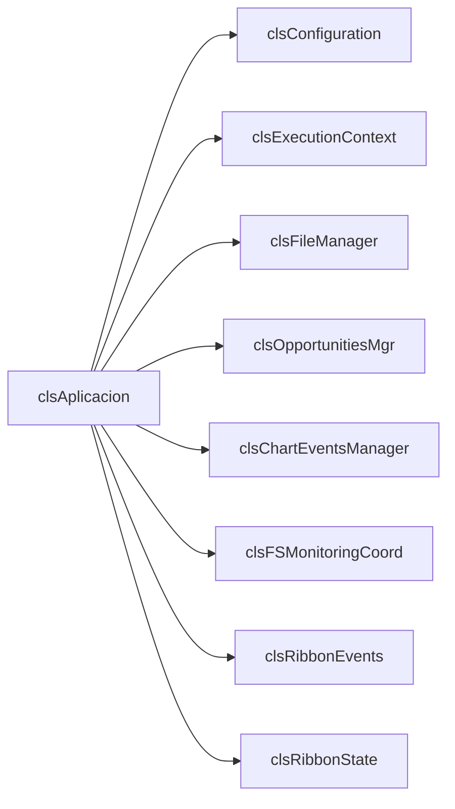
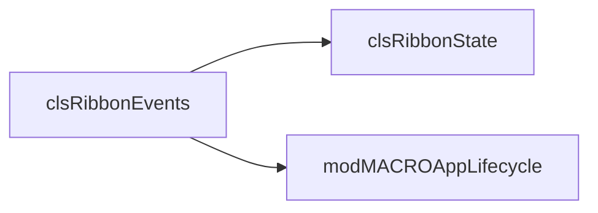
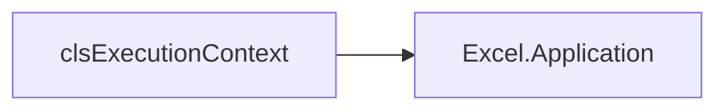
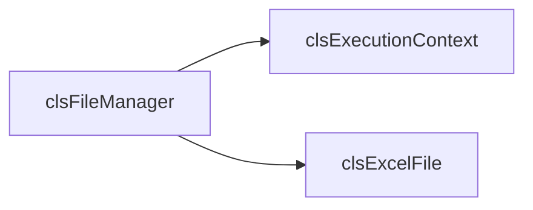

# ANALISIS ARQUITECTONICO - Rama Main

> Documento generado siguiendo plantilla docs/PLANTILLA_ANALISIS.md
> Rama analizada: origin/main

---

## SECCION 1: INVENTARIO DE COMPONENTES

### Resumen Estadistico

| Tipo | Cantidad | Lineas Totales |
|------|----------|----------------|
| Clases (.cls) | 28 | ~5,463 |
| Modulos (.bas) | 27 | ~11,457 |
| Formularios (.frm) | 3 | ~813 |
| **TOTAL** | **58** | **~17,733** |

---

### 1.1. Clases (.cls)

#### clsAplicacion

**Ubicacion:** `clsAplicacion.cls` (lineas 1-608)

**Proposito:**
Coordinador principal de la aplicacion. Crea todos los servicios, suscribe eventos, y expone facade de acceso.

**Responsabilidades:**
- Creacion e inicializacion de todos los servicios
- Suscripcion centralizada a eventos (WithEvents)
- Exposicion de facade para acceso a servicios
- Coordinacion de respuestas a eventos
- Gestion del ciclo de vida de la aplicacion

**Atributos privados:**
```vba
Private mConfiguration As clsConfiguration
Private mExecutionContext As clsExecutionContext
Private mFileManager As clsFileManager
Private mOpportunitiesMgr As clsOpportunitiesMgr
Private mChartEventsManager As clsChartEventsManager
Private mFSMonitoringCoord As clsFSMonitoringCoord
Private mRibbonEvents As clsRibbonEvents
Private mRibbonState As clsRibbonState
Private bChartActive As Boolean
Private bCanInvertAxes As Boolean
```

**WithEvents declarados:**
```vba
Private WithEvents ctx As clsExecutionContext
Private WithEvents mOpportunities As clsOpportunitiesMgr
Private WithEvents mChartMgr As clsChartEventsManager
Private WithEvents mFSMonitoringCoord As clsFSMonitoringCoord
Private WithEvents evRibbon As clsRibbonEvents
Private WithEvents mRibbonState As clsRibbonState
```

**Eventos que escucha:**

| Emisor | Evento | Manejador | Linea |
|--------|--------|-----------|-------|
| clsExecutionContext | WorkbookActivated | ctx_WorkbookActivated | 233 |
| clsExecutionContext | SheetActivated | ctx_SheetActivated | 242 |
| clsExecutionContext | SheetDeactivated | ctx_SheetDeactivated | 258 |
| clsRibbonState | StateChanged | mRibbonState_StateChanged | 217 |
| clsRibbonEvents | GenerarGraficosDesdeCurvasRto | evRibbon_GenerarGraficosDesdeCurvasRto | 398 |
| clsRibbonEvents | InvertirEjes | evRibbon_InvertirEjes | 409 |
| clsRibbonEvents | FormatearCGASING | evRibbon_FormatearCGASING | 418 |
| clsRibbonEvents | Configurador | evRibbon_Configurador | 433 |
| clsRibbonEvents | NuevaOportunidad | evRibbon_NuevaOportunidad | 441 |
| clsRibbonEvents | ReplaceWithNamesInValidations | evRibbon_ReplaceWithNamesInValidations | 446 |
| clsOpportunitiesMgr | OpportunityCollectionUpdate | mOpportunities_OpportunityCollectionUpdate | 273 |
| clsOpportunitiesMgr | currOpportunityChanged | mOpportunities_currOpportunityChanged | 284 |
| clsFSMonitoringCoord | OpportunityCreated | mFSMonitoringCoord_OpportunityCreated | 302 |
| clsFSMonitoringCoord | OpportunityDeleted | mFSMonitoringCoord_OpportunityDeleted | 307 |
| clsFSMonitoringCoord | OpportunityRenamed | mFSMonitoringCoord_OpportunityRenamed | 312 |
| clsFSMonitoringCoord | TemplateCreated | mFSMonitoringCoord_TemplateCreated | 328 |
| clsFSMonitoringCoord | TemplateChanged | mFSMonitoringCoord_TemplateChanged | 333 |
| clsFSMonitoringCoord | GasFileCreated | mFSMonitoringCoord_GasFileCreated | 338 |
| clsFSMonitoringCoord | GasFileChanged | mFSMonitoringCoord_GasFileChanged | 343 |
| clsFSMonitoringCoord | MonitoringError | mFSMonitoringCoord_MonitoringError | 348 |
| clsFSMonitoringCoord | MonitoringReconnected | mFSMonitoringCoord_MonitoringReconnected | 360 |
| clsFSMonitoringCoord | MonitoringFailed | mFSMonitoringCoord_MonitoringFailed | 364 |
| clsChartEventsManager | ChartActivated | mChartManager_ChartActivated | 378 |
| clsChartEventsManager | ChartDeactivated | mChartManager_ChartDeactivated | 388 |

**Eventos que dispara:**
Ninguno (es consumidor final)

**Metodos publicos:**
```vba
Public Property Get Configuration() As clsConfiguration      ' Linea 156
Public Property Get FileManager() As clsFileManager          ' Linea 167
Public Property Get OpportunitiesMgr() As clsOpportunitiesMgr ' Linea 178
Public Property Get Ribbon() As clsRibbonEvents              ' Linea 189
Public Property Get RibbonMgr() As clsRibbonState            ' Linea 200
Public Property Let RibbonHandler(xlRibbon As IRibbonUI)     ' Linea 211
Public Sub ToggleRibbonMode()                                ' Linea 225
```

**Dependencias:**


**Lineas de codigo:** 608
**Complejidad estimada:** Alta (God Object - multiples responsabilidades)

---

#### clsRibbonEvents

**Ubicacion:** `clsRibbonEvents.cls` (lineas 1-277)

**Proposito:**
Gestiona el puntero IRibbonUI y dispara eventos para acciones del Ribbon.

**Responsabilidades:**
- Almacenar y gestionar el puntero IRibbonUI
- Disparar eventos cuando el usuario interactua con el Ribbon
- Invalidar controles del Ribbon
- Evaluar estado enabled de controles
- Recuperacion automatica del Ribbon si se pierde

**Atributos privados:**
```vba
Private mRibbonUI As IRibbonUI
Private mIsRecovering As Boolean
Private mWasEverInitialized As Boolean
```

**WithEvents declarados:**
Ninguno

**Eventos que escucha:**
Ninguno

**Eventos que dispara:**
```vba
Public Event GenerarGraficosDesdeCurvasRto()
Public Event InvertirEjes()
Public Event FormatearCGASING()
Public Event Configurador()
Public Event NuevaOportunidad()
Public Event ReplaceWithNamesInValidations()
```

**Metodos publicos:**
```vba
Public Property Get RibbonUI() As IRibbonUI                  ' Linea 45
Public Sub Init(ByRef ribbonObj As IRibbonUI)                ' Linea 56
Public Sub StopEvents()                                       ' Linea 78
Public Sub OnGenerarGraficosDesdeCurvasRto()                 ' Linea 89
Public Sub OnInvertirEjes()                                   ' Linea 94
Public Sub OnFormatearCGASING()                              ' Linea 99
Public Sub OnConfigurador()                                   ' Linea 104
Public Sub OnNuevaOportunidad()                              ' Linea 109
Public Sub OnReplaceWithNamesInValidations()                 ' Linea 114
Public Function GetRibbonControlEnabled(control As IRibbonControl) As Boolean ' Linea 119
Public Sub InvalidarRibbon()                                  ' Linea 156
Public Sub InvalidarControl(idControl As String)             ' Linea 189
Friend Sub ActivarTab(tabId As String)                       ' Linea 220
```

**Dependencias:**


**Lineas de codigo:** 277
**Complejidad estimada:** Media

---

#### clsExecutionContext

**Ubicacion:** `clsExecutionContext.cls` (lineas 1-156)

**Proposito:**
Wrapper de eventos de Application de Excel, re-emitiendo como eventos propios para desacoplar del COM.

**Responsabilidades:**
- Suscribirse a eventos de Excel.Application
- Re-emitir eventos como eventos propios
- Permitir multiples suscriptores

**Atributos privados:**
```vba
Private WithEvents m_xlApp As Application
```

**WithEvents declarados:**
```vba
Private WithEvents m_xlApp As Application
```

**Eventos que escucha:**

| Emisor | Evento | Manejador | Linea |
|--------|--------|-----------|-------|
| Excel.Application | WorkbookOpen | m_xlApp_WorkbookOpen | 45 |
| Excel.Application | WorkbookActivate | m_xlApp_WorkbookActivate | 52 |
| Excel.Application | WorkbookBeforeClose | m_xlApp_WorkbookBeforeClose | 59 |
| Excel.Application | SheetActivate | m_xlApp_SheetActivate | 67 |
| Excel.Application | SheetDeactivate | m_xlApp_SheetDeactivate | 74 |
| Excel.Application | SheetSelectionChange | m_xlApp_SheetSelectionChange | 81 |

**Eventos que dispara:**
```vba
Public Event WorkbookOpened(ByVal wb As Workbook)
Public Event WorkbookActivated(ByVal wb As Workbook)
Public Event WorkbookBeforeClose(ByVal wb As Workbook, ByRef Cancel As Boolean)
Public Event SheetActivated(ByVal sh As Object)
Public Event SheetDeactivated(ByVal sh As Object)
Public Event SelectionChanged(ByVal Target As Range)
```

**Metodos publicos:**
```vba
Public Sub Initialize()                                       ' Linea 23
Public Sub Terminate()                                        ' Linea 35
```

**Dependencias:**


**Lineas de codigo:** 156
**Complejidad estimada:** Baja

---

#### clsConfiguration

**Ubicacion:** `clsConfiguration.cls` (lineas 1-245)

**Proposito:**
Gestiona configuracion persistente (rutas, parametros) almacenada en el registro de Windows.

**Responsabilidades:**
- Cargar configuracion desde el registro
- Guardar configuracion al registro
- Exponer rutas de carpetas configuradas
- Gestionar diccionario de carpetas a monitorear

**Atributos privados:**
```vba
Private m_RutaOportunidades As String
Private m_RutaPlantillas As String
Private m_RutaGasVBNet As String
Private m_RutaExcelCalcTempl As String
Private m_oDicFoldersToWatch As Object
```

**WithEvents declarados:**
Ninguno

**Eventos que dispara:**
Ninguno

**Metodos publicos:**
```vba
Public Property Get RutaOportunidades() As String            ' Linea 45
Public Property Let RutaOportunidades(value As String)       ' Linea 52
Public Property Get RutaPlantillas() As String               ' Linea 67
Public Property Let RutaPlantillas(value As String)          ' Linea 74
Public Property Get RutaGasVBNet() As String                 ' Linea 89
Public Property Get RutaExcelCalcTempl() As String           ' Linea 104
Public Property Get oDicFoldersToWatch() As Object           ' Linea 119
Public Sub CargarDesdeRegistro()                             ' Linea 134
Public Sub GuardarEnRegistro()                               ' Linea 178
```

**Lineas de codigo:** 245
**Complejidad estimada:** Baja

---

#### clsFileManager

**Ubicacion:** `clsFileManager.cls` (lineas 1-312)

**Proposito:**
Gestiona tracking de archivos Excel abiertos, sincronizacion con el archivo activo.

**Responsabilidades:**
- Mantener indice de archivos supervisados
- Sincronizar con el archivo activo de Excel
- Proveer analisis de archivos

**Atributos privados:**
```vba
Private WithEvents ctx As clsExecutionContext
Private p_trackedFiles As Object
Private p_currentFile As clsExcelFile
```

**WithEvents declarados:**
```vba
Private WithEvents ctx As clsExecutionContext
```

**Eventos que escucha:**

| Emisor | Evento | Manejador | Linea |
|--------|--------|-----------|-------|
| clsExecutionContext | WorkbookActivated | ctx_WorkbookActivated | 89 |
| clsExecutionContext | WorkbookBeforeClose | ctx_WorkbookBeforeClose | 112 |

**Eventos que dispara:**
Ninguno

**Metodos publicos:**
```vba
Public Sub Initialize(execCtx As clsExecutionContext)        ' Linea 45
Public Property Get CurrentFile() As clsExcelFile            ' Linea 67
Public Property Get TrackedFiles() As Object                 ' Linea 78
Public Function GetFileByKey(key As String) As clsExcelFile  ' Linea 134
Public Sub TrackFile(wb As Workbook)                         ' Linea 156
Public Sub UntrackFile(key As String)                        ' Linea 189
```

**Dependencias:**


**Lineas de codigo:** 312
**Complejidad estimada:** Media

---

#### clsOpportunitiesMgr

**Ubicacion:** `clsOpportunitiesMgr.cls` (lineas 1-267)

**Proposito:**
Gestiona lista de oportunidades comerciales desde carpeta configurada.

**Responsabilidades:**
- Cargar lista de oportunidades desde carpeta base
- Mantener oportunidad actual seleccionada
- Notificar cambios en la coleccion

**Atributos privados:**
```vba
Private p_ColOpportunities As Collection
Private p_CurrentIndex As Long
Private p_BaseFolder As String
```

**Eventos que dispara:**
```vba
Public Event currOpportunityChanged(ByVal Index As Long, ByVal Path As String)
Public Event OpportunityCollectionUpdate(ByVal cambios As String)
```

**Metodos publicos:**
```vba
Public Sub SetBaseFolder(path As String)                     ' Linea 45
Public Sub RefreshList()                                     ' Linea 67
Public Property Get Opportunities() As Collection            ' Linea 89
Public Property Get CurrentOpportunity() As clsOpportunity   ' Linea 101
Public Property Get CurrentIndex() As Long                   ' Linea 112
Public Property Let CurrentIndex(value As Long)              ' Linea 119
Public Function GetOpportunityByIndex(idx As Long) As clsOpportunity ' Linea 145
```

**Lineas de codigo:** 267
**Complejidad estimada:** Media

---

#### clsFSMonitoringCoord

**Ubicacion:** `clsFSMonitoringCoord.cls` (lineas 1-389)

**Proposito:**
Coordina monitorizacion de multiples carpetas del sistema de archivos.

**Responsabilidades:**
- Gestionar multiples instancias de clsFSWatcher
- Re-emitir eventos de cambios en carpetas
- Clasificar eventos por tipo (oportunidades, plantillas, gas)

**Atributos privados:**
```vba
Private WithEvents mFolderWatcher As clsFSWatcher
Private m_rutaOportunidades As String
Private m_rutaPlantillas As String
Private m_rutaGasVBNet As String
```

**WithEvents declarados:**
```vba
Private WithEvents mFolderWatcher As clsFSWatcher
```

**Eventos que dispara:**
```vba
Public Event OpportunityCreated(ByVal parentFolder As String, ByVal subfolderName As String)
Public Event OpportunityDeleted(ByVal parentFolder As String, ByVal subfolderName As String)
Public Event OpportunityRenamed(ByVal parentFolder As String, ByVal oldName As String, ByVal newName As String)
Public Event OpportunityItemDeleted(ByVal folder As String, ByVal fileName As String)
Public Event OpportunityItemRenamed(ByVal folder As String, ByVal oldName As String, ByVal newName As String)
Public Event TemplateCreated(ByVal folder As String, ByVal fileName As String)
Public Event TemplateChanged(ByVal folder As String, ByVal fileName As String)
Public Event GasFileCreated(ByVal folder As String, ByVal fileName As String)
Public Event GasFileChanged(ByVal folder As String, ByVal fileName As String)
Public Event MonitoringError(ByVal folder As String, ByVal errorMessage As String)
Public Event MonitoringReconnected(ByVal folder As String, ByVal attempts As Long)
Public Event MonitoringFailed(ByVal folder As String, ByVal reason As String)
```

**Metodos publicos:**
```vba
Public Property Get FolderWatcher() As clsFSWatcher          ' Linea 56
Friend Sub IniciarMonitoreo(ByVal oDicFolders As Object)     ' Linea 67
Public Sub DetenerMonitoreo()                                ' Linea 112
```

**Lineas de codigo:** 389
**Complejidad estimada:** Alta

---

### Clases Adicionales (Resumen)

| Clase | Lineas | Proposito |
|-------|--------|-----------|
| clsRibbonState | 100 | Estado logico del Ribbon (modo actual) |
| clsChartState | 12 | Estado simple de graficos |
| clsChartEvents | 97 | Wrapper de eventos de Chart individual |
| clsChartEventsManager | 148 | Gestion de eventos de graficos en hoja activa |
| clsExcelFile | 412 | Modelo de archivo Excel abierto |
| clsFSWatcher | 713 | Monitorizacion individual de carpeta (usa COM) |
| clsOpportunity | 41 | Modelo de oportunidad comercial |
| clsOferta | 51 | Modelo de oferta individual |
| clsOfertaOtro | 37 | Tipo especial de oferta |
| clsOfertaRepository | 149 | Repository para gestion de ofertas |
| clsVBAProcedure | 430 | Modelo para introspeccion de codigo VBA |
| clsDBContext | 94 | Contexto de base de datos |
| clsPDFFile | 100 | Gestion de archivos PDF |
| clsEventDispatcher | 10 | Dispatcher simple de eventos |
| clsFileState | 12 | Estado de archivo |
| clsOpportunityOfferBudgetTpl | 12 | Template de presupuesto |
| clsOpportunityOfferQuotationTpl | 12 | Template de cotizacion |
| ThisWorkbook | 172 | Entry point, crea instancia de clsAplicacion |
| CRefEdit | 79 | Control personalizado RefEdit |
| IFile | 56 | Interfaz para archivos |
| wshUnidades | 17 | Hoja especial de unidades |

---

### 1.2. Modulos (.bas)

#### modCALLBACKSRibbon

**Ubicacion:** `modCALLBACKSRibbon.bas` (lineas 1-332)

**Proposito:**
Callbacks XML del Ribbon - punto de entrada para acciones de usuario.

**Funciones publicas:**
```vba
Public Sub RibbonOnLoad(xlRibbon As IRibbonUI)               ' Linea 18
Public Sub OnGenerarGraficosDesdeCurvasRto(control As IRibbonControl) ' Linea 104
Public Sub OnInvertirEjes(control As IRibbonControl)         ' Linea 109
Public Sub OnFormatearCGASING(control As IRibbonControl)     ' Linea 114
Public Sub OnNuevaOportunidad(control As IRibbonControl)     ' Linea 119
Public Sub OnReplaceWithNamesInValidations(control As IRibbonControl) ' Linea 124
Public Sub OnConfigurador(control As IRibbonControl)         ' Linea 129
Public Sub GetTabVisible(control As IRibbonControl, ByRef visible) ' Linea 145
Public Sub GetGroupVisible(control As IRibbonControl, ByRef visible) ' Linea 167
Public Sub GetControlEnabled(control As IRibbonControl, ByRef enabled) ' Linea 189
```

**Funciones privadas:** 3 funciones privadas
**Lineas de codigo:** 332

---

#### modMACROAppLifecycle

**Ubicacion:** `modMACROAppLifecycle.bas` (lineas 1-423)

**Proposito:**
Funciones de ciclo de vida de la aplicacion y diagnostico del Ribbon.

**Funciones publicas:**
```vba
Public Function App() As clsAplicacion                       ' Linea 15
Public Sub ReiniciarAplicacion()                             ' Linea 20
Public Sub ToggleRibbonTab()                                 ' Linea 105
Public Sub RecuperarRibbon()                                 ' Linea 122
Public Sub MostrarDiagnosticoRibbon()                        ' Linea 160
Public Function GetRibbonDiagnostics() As String             ' Linea 178
Public Function IsRibbonAvailable() As Boolean               ' Linea 234
Public Function TryRecoverRibbon() As Boolean                ' Linea 267
```

**Funciones privadas:** 5 funciones privadas
**Lineas de codigo:** 423

---

#### modMACROGraficoSensibilidad

**Ubicacion:** `modMACROGraficoSensibilidad.bas` (lineas 1-777)

**Proposito:**
Generacion de graficos de sensibilidad desde curvas de rendimiento.

**Funciones publicas:**
```vba
Public Function EsFicheroOportunidad() As Boolean            ' Linea 7
Public Function EsValidoGenerarGrafico() As Boolean          ' Linea 19
Public Function EsValidoInvertirEjes() As Boolean            ' Linea 64
Public Sub EjecutarGraficoEnLibroActivo()                    ' Linea 115
Public Sub InvertirEjesDelGraficoActivo()                    ' Linea 363
```

**Funciones privadas:** 14 funciones privadas
**Lineas de codigo:** 777

---

#### modMACROFixCGAS

**Ubicacion:** `modMACROFixCGAS.bas` (lineas 1-388)

**Proposito:**
Formateo y correccion de hojas CGASING.

**Funciones publicas:**
```vba
Public Sub FixCGASING()                                      ' Linea 7
```

**Funciones privadas:** 12 funciones privadas
**Lineas de codigo:** 388

---

### Modulos de UDFs

| Modulo | Lineas | UDFs Publicas | Proposito |
|--------|--------|---------------|-----------|
| UDFs_CGASING | 345 | 6 | Funciones para hojas CGASING |
| UDFs_Units | 385 | 3 | Conversion de unidades |
| UDFs_COOLPROP | 146 | 1 | Propiedades termodinamicas |
| UDFs_FileSystem | 150 | 1 | Sistema de archivos |
| UDFs_Utilids | 50 | 1 | Utilidades diversas |
| UDFs_UtilsExcel | 242 | 2 | Utilidades Excel |
| UDFs_UtilsExcelChart | 105 | 1 | Utilidades graficos |
| UDFs_Backups | 330 | 0 | Soporte para backups |

### Modulos de Infraestructura

| Modulo | Lineas | Proposito |
|--------|--------|-----------|
| mod_Logger | 223 | Sistema de logging |
| mod_ConstantsGlobals | 302 | Constantes globales y tipos |
| modAPPFileNames | 303 | Gestion de nombres de archivo |
| modAPPInstallXLAM | 713 | Instalacion/desinstalacion del XLAM |
| modAPPUDFsRegistration | 315 | Registro de UDFs |
| modAPPBudgetQuotesUtilids | 281 | Utilidades presupuestos |
| modAPPFSWatcher | 21 | Wrapper FSWatcher |

### Modulos de Macros Adicionales

| Modulo | Lineas | Proposito |
|--------|--------|-----------|
| modMACROBase64Encoding | 115 | Codificacion Base64 |
| modMACROComparadorHojas | 273 | Comparacion de hojas |
| modMACROImportExportMacros | 286 | Import/export de macros |
| modMACROLeerOfertas | 188 | Lectura de ofertas |
| modMACROListarProyectosVBA | 105 | Listado de proyectos |
| modMACROProceduresToWorksheet | 656 | Export procedimientos a hoja |
| modMACROUnits | 211 | Gestion de unidades |
| modMACROUtilsExcel | 344 | Utilidades Excel |
| modMACROUtilsExcelCheckbox | 268 | Utilidades checkboxes |
| modMACROWbkEditableCleaning | 290 | Limpieza de libros |
| modMACROWbkEditableFormatting | 1177 | Formateo de libros |
| modOfertaTypes | 13 | Tipos de ofertas |
| modUTILSProcedureParsing | 188 | Parsing de procedimientos |
| modUTILSRefEditAPI | 375 | API RefEdit |
| modUTILSShellCmd | 407 | Comandos shell |

---

### 1.3. Formularios (.frm)

#### frmConfiguracion

**Ubicacion:** `frmConfiguracion.frm` (378 lineas)

**Proposito:**
Configuracion de rutas de carpetas y preferencias del sistema.

**Controles principales:**
- txtRutaOportunidades (TextBox) - Ruta carpeta oportunidades
- txtRutaPlantillas (TextBox) - Ruta carpeta plantillas
- txtRutaOfergas (TextBox) - Ruta carpeta ofergas
- txtRutaGasVBNet (TextBox) - Ruta Gas VBNet
- cmdSeleccionar (CommandButton) - Selector de carpeta
- cmdAceptar/cmdCancelar (CommandButton) - Confirmar/cancelar

**Eventos manejados:**
```vba
Private Sub UserForm_Initialize()
Private Sub cmdSeleccionar_Click()
Private Sub cmdAceptar_Click()
Private Sub cmdCancelar_Click()
```

---

#### frmComparadorHojas

**Ubicacion:** `frmComparadorHojas.frm` (321 lineas)

**Proposito:**
Comparacion visual de dos hojas Excel.

**Controles principales:**
- lbxHojas1, lbxHojas2 (ListBox) - Selectores de hojas
- cmdComparar (CommandButton) - Ejecutar comparacion
- cmdExportar (CommandButton) - Exportar resultado

---

#### frmImportExportMacros

**Ubicacion:** `frmImportExportMacros.frm` (114 lineas)

**Proposito:**
Import/export de modulos VBA.

**Controles principales:**
- cmdExportAll (CommandButton) - Exportar todos
- cmdImportFromFile (CommandButton) - Importar desde archivo
- lbxModulos (ListBox) - Lista de modulos

---

### 1.4. Tabla de Eventos (Quien dispara - Quien escucha)

| Clase Emisora | Evento | Clase(s) Receptora(s) | Manejador | Linea |
|---------------|--------|----------------------|-----------|-------|
| clsExecutionContext | WorkbookActivated | clsAplicacion | ctx_WorkbookActivated | 233 |
| clsExecutionContext | SheetActivated | clsAplicacion | ctx_SheetActivated | 242 |
| clsExecutionContext | SheetDeactivated | clsAplicacion | ctx_SheetDeactivated | 258 |
| clsExecutionContext | WorkbookBeforeClose | clsFileManager | ctx_WorkbookBeforeClose | 112 |
| clsRibbonState | StateChanged | clsAplicacion | mRibbonState_StateChanged | 217 |
| clsRibbonEvents | GenerarGraficosDesdeCurvasRto | clsAplicacion | evRibbon_GenerarGraficosDesdeCurvasRto | 398 |
| clsRibbonEvents | InvertirEjes | clsAplicacion | evRibbon_InvertirEjes | 409 |
| clsRibbonEvents | FormatearCGASING | clsAplicacion | evRibbon_FormatearCGASING | 418 |
| clsRibbonEvents | Configurador | clsAplicacion | evRibbon_Configurador | 433 |
| clsRibbonEvents | NuevaOportunidad | clsAplicacion | evRibbon_NuevaOportunidad | 441 |
| clsRibbonEvents | ReplaceWithNamesInValidations | clsAplicacion | evRibbon_ReplaceWithNamesInValidations | 446 |
| clsOpportunitiesMgr | OpportunityCollectionUpdate | clsAplicacion | mOpportunities_OpportunityCollectionUpdate | 273 |
| clsOpportunitiesMgr | currOpportunityChanged | clsAplicacion | mOpportunities_currOpportunityChanged | 284 |
| clsFSMonitoringCoord | OpportunityCreated | clsAplicacion | mFSMonitoringCoord_OpportunityCreated | 302 |
| clsFSMonitoringCoord | OpportunityDeleted | clsAplicacion | mFSMonitoringCoord_OpportunityDeleted | 307 |
| clsFSMonitoringCoord | OpportunityRenamed | clsAplicacion | mFSMonitoringCoord_OpportunityRenamed | 312 |
| clsFSMonitoringCoord | TemplateCreated | clsAplicacion | mFSMonitoringCoord_TemplateCreated | 328 |
| clsFSMonitoringCoord | TemplateChanged | clsAplicacion | mFSMonitoringCoord_TemplateChanged | 333 |
| clsFSMonitoringCoord | GasFileCreated | clsAplicacion | mFSMonitoringCoord_GasFileCreated | 338 |
| clsFSMonitoringCoord | GasFileChanged | clsAplicacion | mFSMonitoringCoord_GasFileChanged | 343 |
| clsFSMonitoringCoord | MonitoringError | clsAplicacion | mFSMonitoringCoord_MonitoringError | 348 |
| clsFSMonitoringCoord | MonitoringReconnected | clsAplicacion | mFSMonitoringCoord_MonitoringReconnected | 360 |
| clsFSMonitoringCoord | MonitoringFailed | clsAplicacion | mFSMonitoringCoord_MonitoringFailed | 364 |
| clsChartEventsManager | ChartActivated | clsAplicacion | mChartManager_ChartActivated | 378 |
| clsChartEventsManager | ChartDeactivated | clsAplicacion | mChartManager_ChartDeactivated | 388 |
| clsFSWatcher | SubfolderCreated | clsFSMonitoringCoord | mFolderWatcher_SubfolderCreated | 134 |
| clsFSWatcher | SubfolderDeleted | clsFSMonitoringCoord | mFolderWatcher_SubfolderDeleted | 156 |
| clsFSWatcher | SubfolderRenamed | clsFSMonitoringCoord | mFolderWatcher_SubfolderRenamed | 178 |
| clsFSWatcher | FileCreated | clsFSMonitoringCoord | mFolderWatcher_FileCreated | 200 |
| clsFSWatcher | FileChanged | clsFSMonitoringCoord | mFolderWatcher_FileChanged | 222 |
| clsFSWatcher | ErrorOccurred | clsFSMonitoringCoord | mFolderWatcher_ErrorOccurred | 266 |

**Total:** 30+ eventos en el sistema

---

### 1.5. UDFs (User Defined Functions)

| Funcion | Modulo | Linea | Proposito |
|---------|--------|-------|-----------|
| `IsDefaultCGasIngSheet()` | UDFs_CGASING | 13 | Verifica si hoja activa es CGASING |
| `IsCGASING(ws As Worksheet)` | UDFs_CGASING | 46 | Verifica si una hoja es CGASING |
| `Gases(r As Range, d As String)` | UDFs_CGASING | 67 | Obtiene lista de gases |
| `strModelName(CGASINGSheet)` | UDFs_CGASING | 165 | Nombre del modelo termodinamico |
| `HojasCGASING(wb As Workbook)` | UDFs_CGASING | 267 | Lista hojas CGASING |
| `MaximaPotencia(CeldaBuscada)` | UDFs_CGASING | 302 | Calcula maxima potencia |
| `ConvertirUnidad(valor, origen, base)` | UDFs_Units | 8 | Conversion de unidades |
| `UdsPorTipo(strTipo As String)` | UDFs_Units | 266 | Unidades por tipo |
| `PropsSI(...)` | UDFs_COOLPROP | - | Propiedades termodinamicas COOLPROP |

---

### 1.6. Macros de Excel

| Macro | Modulo | Trigger | Proposito |
|-------|--------|---------|-----------|
| `OnGenerarGraficosDesdeCurvasRto()` | modCALLBACKSRibbon | Ribbon | Genera graficos sensibilidad |
| `OnInvertirEjes()` | modCALLBACKSRibbon | Ribbon | Invierte ejes de grafico |
| `OnFormatearCGASING()` | modCALLBACKSRibbon | Ribbon | Formatea hoja CGASING |
| `OnNuevaOportunidad()` | modCALLBACKSRibbon | Ribbon | Crea nueva oportunidad |
| `OnConfigurador()` | modCALLBACKSRibbon | Ribbon | Abre configuracion |
| `ReiniciarAplicacion()` | modMACROAppLifecycle | Ribbon | Reinicia aplicacion |
| `ToggleRibbonTab()` | modMACROAppLifecycle | Ctrl+Shift+R | Cambia modo ribbon |
| `RecuperarRibbon()` | modMACROAppLifecycle | Manual | Recupera ribbon perdido |
| `EjecutarGraficoEnLibroActivo()` | modMACROGraficoSensibilidad | Interno | Ejecuta generacion grafico |
| `InvertirEjesDelGraficoActivo()` | modMACROGraficoSensibilidad | Interno | Invierte ejes |
| `FixCGASING()` | modMACROFixCGAS | Interno | Corrige formateo |

---

## FIN SECCION 1 - ENTREGA 1 COMPLETADA

> **Proxima entrega:** Seccion 2 - Grafos de Dependencias
> Esperando confirmacion del usuario para continuar.
