# ANALISIS ARQUITECTONICO - Rama Refactorizada

> Documento generado siguiendo plantilla docs/PLANTILLA_ANALISIS.md
> Rama analizada: `claude/refactor-main-code-YeuB5`
> Fecha de generacion: 2026-01-17

---

## ESTADO CRITICO DE LA RAMA

> **ADVERTENCIA: EL CODIGO DE ESTA RAMA NO COMPILA**

### Estado Actual

| Aspecto | Estado |
|---------|--------|
| **Compilacion** | **NO COMPILA** - Errores multiples |
| **Ejecucion** | **IMPOSIBLE** - No se puede ejecutar |
| **Refactorizacion** | **INCOMPLETA** - Parcialmente implementada |

### Problemas Conocidos

1. **Errores de compilacion:** Existen errores que impiden la compilacion del proyecto VBA.

2. **Refactorizacion incompleta:** Aunque se han creado las 6 clases nuevas (IService, IFormatter, clsServiceManager, clsEventCoordinator, clsApplicationContext, clsRibbonUI), la integracion con el resto del codigo no esta terminada.

3. **Dependencias rotas:** Algunos modulos y clases existentes pueden tener referencias a la estructura anterior (clsAplicacion como God Object) que ya no existe en la forma esperada.

### Trabajo Pendiente para Estabilizar

- [ ] Resolver errores de compilacion
- [ ] Verificar que todos los servicios implementan IService correctamente
- [ ] Verificar que clsEventCoordinator recibe todos los eventos necesarios
- [ ] Verificar que modCALLBACKSRibbon accede correctamente a los servicios via la nueva arquitectura
- [ ] Probar ciclo completo de inicializacion (ThisWorkbook.Open -> clsAplicacion.Initialize)
- [ ] Probar funcionalidades principales (Ribbon, graficos, oportunidades)

---

## SECCION 1: INVENTARIO DE COMPONENTES

> **Objetivo:** Documentar TODOS los componentes del proyecto

### Resumen Estadistico

| Tipo | Cantidad | Lineas Totales |
|------|----------|----------------|
| Clases (.cls) | 34 | ~6,700 |
| Modulos (.bas) | 34 | ~10,700 |
| Formularios (.frm) | 3 | ~810 |
| **TOTAL** | **71** | **~18,200** |

**Clases NUEVAS en esta rama (no existen en main):**
- IService.cls (70 lineas) - Interface para ciclo de vida de servicios
- IFormatter.cls (79 lineas) - Interface para formateadores
- clsServiceManager.cls (282 lineas) - Contenedor DI
- clsEventCoordinator.cls (339 lineas) - Mediator de eventos
- clsApplicationContext.cls (183 lineas) - Contexto de estado
- clsRibbonUI.cls (274 lineas) - Gestion IRibbonUI (extraido de clsRibbonEvents)

---

### 1.1. Clases (.cls)

---

#### clsAplicacion

**Ubicacion:** `clsAplicacion.cls` (lineas 1-278)

**Proposito:**
Composition Root de la aplicacion. Crea infraestructura, registra servicios, y expone facade de acceso.

**Responsabilidades:**
- Crear ApplicationContext (estado compartido)
- Crear ServiceManager e inyectarle ApplicationContext
- Registrar servicios que implementan IService
- Crear EventCoordinator (Mediator)
- Exponer acceso tipado a servicios y contexto
- Gestionar ciclo de vida (Initialize/Terminate)

**Atributos privados:**
```vba
Private mServiceManager As clsServiceManager
Private mEventCoordinator As clsEventCoordinator
Private mAppContext As clsApplicationContext
Private mRibbonState As clsRibbonState
Private mChartState As clsChartState
Private mIsInitialized As Boolean
```

**WithEvents declarados:**
Ninguno (delegados a clsEventCoordinator)

**Eventos que escucha:**
Ninguno (delegados a clsEventCoordinator)

**Eventos que dispara:**
Ninguno (es consumidor final)

**Metodos publicos:**
```vba
Public Sub Initialize()                                    ' Linea 60
Public Sub Terminate()                                     ' Linea 239
Public Property Get Services() As clsServiceManager        ' Linea 169
Public Property Get Context() As clsApplicationContext     ' Linea 174
Public Property Get Events() As clsEventCoordinator        ' Linea 179
Public Property Get IsInitialized() As Boolean             ' Linea 184
Public Property Get Configuration() As clsConfiguration   ' Linea 195
Public Property Get ExecutionContext() As clsExecutionContext ' Linea 199
Public Property Get FileManager() As clsFileManager       ' Linea 203
Public Property Get OpportunitiesMgr() As clsOpportunitiesMgr ' Linea 207
Public Property Get ChartEventsManager() As clsChartEventsManager ' Linea 211
Public Property Get FSMonitoringCoord() As clsFSMonitoringCoord ' Linea 215
Public Property Get RibbonUI() As clsRibbonUI             ' Linea 219
Public Property Get RibbonState() As clsRibbonState       ' Linea 227
Public Property Get ChartState() As clsChartState         ' Linea 231
```

**Dependencias:**
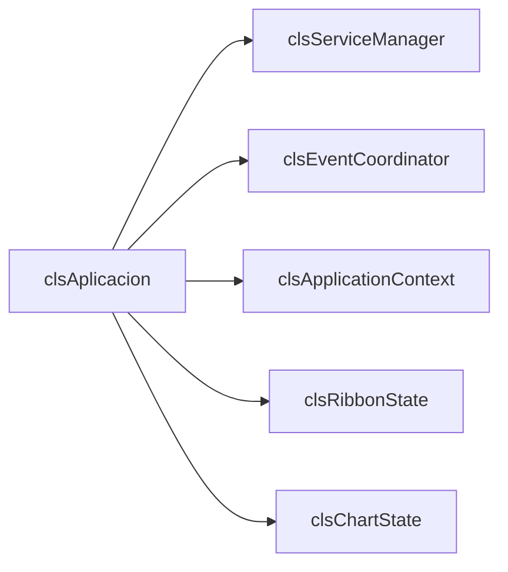

**Lineas de codigo:** 278

**Complejidad estimada:** Media (Composition Root bien estructurado)

**Diferencia con rama main:** En main, clsAplicacion era un God Object con 479 lineas, 8 dependencias directas, 6 WithEvents, y 20+ manejadores de eventos. En esta rama refactorizada tiene 278 lineas, delega eventos a EventCoordinator, y delega creacion de servicios a ServiceManager.

---

#### IService (NUEVO)

**Ubicacion:** `IService.cls` (lineas 1-70)

**Proposito:**
Interfaz que estandariza el ciclo de vida de todos los servicios del sistema.

**Responsabilidades:**
- Definir contrato de inicializacion (Initialize)
- Definir contrato de liberacion de recursos (Dispose)
- Proporcionar introspeccion (IsInitialized, ServiceName)

**Atributos privados:**
Ninguno (es interfaz)

**WithEvents declarados:**
Ninguno

**Eventos que escucha:**
Ninguno

**Eventos que dispara:**
Ninguno

**Metodos publicos (interfaz):**
```vba
Public Sub Initialize(ByVal dependencies As Object)        ' Linea 51
Public Sub Dispose()                                       ' Linea 56
Public Property Get IsInitialized() As Boolean             ' Linea 61
Public Property Get ServiceName() As String                ' Linea 66
```

**Dependencias:**
Ninguna (es interfaz base)

**Lineas de codigo:** 70

**Complejidad estimada:** Baja

**Diferencia con rama main:** NO EXISTE en main. Los servicios en main no tienen interfaz comun ni ciclo de vida estandarizado.

---

#### IFormatter (NUEVO)

**Ubicacion:** `IFormatter.cls` (lineas 1-79)

**Proposito:**
Interfaz que estandariza todos los formateadores del sistema.

**Responsabilidades:**
- Definir contrato de formateo (Format)
- Definir validacion de target (CanFormat)
- Proporcionar nombre descriptivo (FormatterName)

**Atributos privados:**
Ninguno (es interfaz)

**WithEvents declarados:**
Ninguno

**Eventos que escucha:**
Ninguno

**Eventos que dispara:**
Ninguno

**Metodos publicos (interfaz):**
```vba
Public Function Format(ByVal target As Object) As Boolean  ' Linea 63
Public Function CanFormat(ByVal target As Object) As Boolean ' Linea 70
Public Property Get FormatterName() As String              ' Linea 75
```

**Dependencias:**
Ninguna (es interfaz base)

**Lineas de codigo:** 79

**Complejidad estimada:** Baja

**Diferencia con rama main:** NO EXISTE en main. El formateo en main esta disperso en modulos sin interfaz comun.

---

#### clsServiceManager (NUEVO)

**Ubicacion:** `clsServiceManager.cls` (lineas 1-282)

**Proposito:**
Contenedor de Inyeccion de Dependencias con resolucion por tipo y propiedades tipadas.

**Responsabilidades:**
- Registrar servicios Singleton (usando TypeName como clave)
- Resolver servicios mediante propiedades tipadas (sin strings)
- Gestionar ciclo de vida (Initialize/Dispose via IService)
- Inyectar dependencias (ServiceManager se pasa como dependencies)

**Atributos privados:**
```vba
Private mServices As Object                         ' Dictionary: TypeName -> IService
Private mAppContext As clsApplicationContext        ' Contexto compartido (inyectado)
Private mIsInitialized As Boolean
```

**WithEvents declarados:**
Ninguno

**Eventos que escucha:**
Ninguno

**Eventos que dispara:**
Ninguno

**Metodos publicos:**
```vba
Public Sub Initialize(ByVal appContext As clsApplicationContext)  ' Linea 52
Public Sub RegisterSingleton(ByVal instance As IService)          ' Linea 66
Public Sub InitializeAll()                                        ' Linea 104
Public Property Get Configuration() As clsConfiguration          ' Linea 125
Public Property Get ExecutionContext() As clsExecutionContext    ' Linea 136
Public Property Get FileManager() As clsFileManager              ' Linea 147
Public Property Get OpportunitiesMgr() As clsOpportunitiesMgr    ' Linea 158
Public Property Get ChartEventsManager() As clsChartEventsManager ' Linea 169
Public Property Get FSMonitoringCoord() As clsFSMonitoringCoord  ' Linea 180
Public Property Get RibbonUI() As clsRibbonUI                    ' Linea 191
Public Function GetServiceCount() As Long                        ' Linea 207
Public Function IsRegistered(ByVal typeName As String) As Boolean ' Linea 212
Public Property Get AppContext() As clsApplicationContext        ' Linea 217
Public Sub DisposeAll()                                          ' Linea 226
```

**Dependencias:**
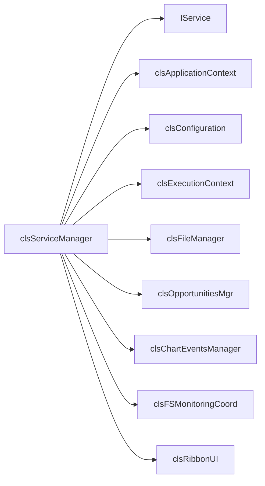

**Lineas de codigo:** 282

**Complejidad estimada:** Media

**Diferencia con rama main:** NO EXISTE en main. En main, clsAplicacion crea y expone servicios directamente (patron God Object).

---

#### clsEventCoordinator (NUEVO)

**Ubicacion:** `clsEventCoordinator.cls` (lineas 1-339)

**Proposito:**
Mediator centralizado que coordina eventos entre servicios, eliminando acoplamiento directo.

**Responsabilidades:**
- Suscribirse a eventos de servicios (WithEvents)
- Coordinar reacciones entre servicios
- Actualizar ApplicationContext cuando proceda
- Exponer RibbonEvents para acceso desde callbacks

**Atributos privados:**
```vba
Private mServiceManager As clsServiceManager
Private mAppContext As clsApplicationContext
Private mRibbonEvents As clsRibbonEvents
```

**WithEvents declarados:**
```vba
Private WithEvents mExecutionContext As clsExecutionContext
Private WithEvents mOpportunities As clsOpportunitiesMgr
Private WithEvents mChartManager As clsChartEventsManager
Private WithEvents mFSMonitoringCoord As clsFSMonitoringCoord
Private WithEvents mRibbonState As clsRibbonState
Private WithEvents mRibbonEvt As clsRibbonEvents
```

**Eventos que escucha:**

| Emisor | Evento | Manejador | Linea |
|--------|--------|-----------|-------|
| clsExecutionContext | WorkbookActivated | mExecutionContext_WorkbookActivated | 88 |
| clsExecutionContext | WorkbookOpened | mExecutionContext_WorkbookOpened | 98 |
| clsExecutionContext | WorkbookBeforeClose | mExecutionContext_WorkbookBeforeClose | 105 |
| clsExecutionContext | SheetActivated | mExecutionContext_SheetActivated | 112 |
| clsExecutionContext | SheetDeactivated | mExecutionContext_SheetDeactivated | 122 |
| clsChartEventsManager | ChartActivated | mChartManager_ChartActivated | 133 |
| clsChartEventsManager | ChartDeactivated | mChartManager_ChartDeactivated | 147 |
| clsChartEventsManager | HojaConGraficosCambiada | mChartManager_HojaConGraficosCambiada | 159 |
| clsOpportunitiesMgr | currOpportunityChanged | mOpportunities_currOpportunityChanged | 173 |
| clsOpportunitiesMgr | OpportunityCollectionUpdate | mOpportunities_OpportunityCollectionUpdate | 180 |
| clsFSMonitoringCoord | OpportunityCreated | mFSMonitoringCoord_OpportunityCreated | 191 |
| clsFSMonitoringCoord | OpportunityDeleted | mFSMonitoringCoord_OpportunityDeleted | 198 |
| clsFSMonitoringCoord | OpportunityRenamed | mFSMonitoringCoord_OpportunityRenamed | 206 |
| clsFSMonitoringCoord | MonitoringError | mFSMonitoringCoord_MonitoringError | 214 |
| clsFSMonitoringCoord | MonitoringReconnected | mFSMonitoringCoord_MonitoringReconnected | 218 |
| clsFSMonitoringCoord | MonitoringFailed | mFSMonitoringCoord_MonitoringFailed | 222 |
| clsRibbonState | StateChanged | mRibbonState_StateChanged | 230 |
| clsRibbonEvents | GenerarGraficosDesdeCurvasRto | mRibbonEvt_GenerarGraficosDesdeCurvasRto | 241 |
| clsRibbonEvents | InvertirEjes | mRibbonEvt_InvertirEjes | 254 |
| clsRibbonEvents | FormatearCGASING | mRibbonEvt_FormatearCGASING | 266 |
| clsRibbonEvents | MostrarConfigurador | mRibbonEvt_MostrarConfigurador | 278 |
| clsRibbonEvents | NuevaOportunidad | mRibbonEvt_NuevaOportunidad | 290 |
| clsRibbonEvents | ToggleRibbonMode | mRibbonEvt_ToggleRibbonMode | 302 |

**Eventos que dispara:**
Ninguno (es consumidor final / Mediator)

**Metodos publicos:**
```vba
Public Sub Initialize(ByVal serviceManager As clsServiceManager, _
                      ByVal appContext As clsApplicationContext)  ' Linea 59
Public Property Get RibbonEvents() As clsRibbonEvents            ' Linea 314
Public Sub Dispose()                                              ' Linea 322
```

**Dependencias:**
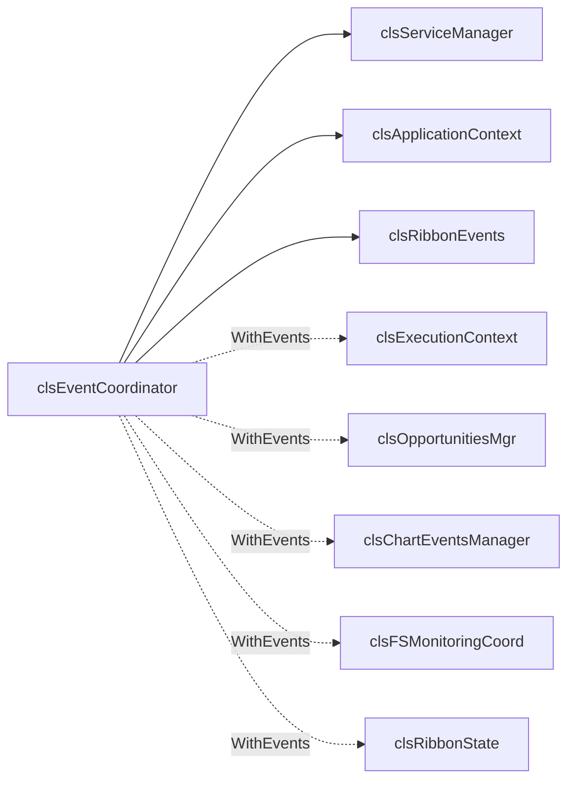

**Lineas de codigo:** 339

**Complejidad estimada:** Alta (pero cumple SRP - solo coordinacion)

**Diferencia con rama main:** NO EXISTE en main. En main, clsAplicacion maneja los 20+ eventos directamente (God Object anti-pattern).

---

#### clsApplicationContext (NUEVO)

**Ubicacion:** `clsApplicationContext.cls` (lineas 1-183)

**Proposito:**
Objeto de estado compartido que agrega sub-estados especializados de la aplicacion.

**Responsabilidades:**
- Agregar/componer sub-estados (RibbonState, ChartState, ExecutionContext)
- Proporcionar acceso compartido al estado de la aplicacion
- Servir como punto central de acceso al estado (no a servicios)

**Atributos privados:**
```vba
Private mRibbonState As clsRibbonState
Private mExecutionContext As clsExecutionContext
Private mChartState As clsChartState
Private m_CurrentOpportunity As Object
Private m_CurrentFile As Object
Private m_ApplicationState As Long
```

**WithEvents declarados:**
Ninguno

**Eventos que escucha:**
Ninguno

**Eventos que dispara:**
Ninguno

**Metodos publicos:**
```vba
Public Sub Initialize(ByVal RibbonState As clsRibbonState, _
                      ByVal execContext As clsExecutionContext, _
                      ByVal ChartState As clsChartState)          ' Linea 46
Public Property Get RibbonState() As clsRibbonState              ' Linea 58
Public Property Get ExecutionContext() As clsExecutionContext    ' Linea 62
Public Property Get ChartState() As clsChartState                ' Linea 66
Public Property Get CurrentOpportunity() As Object               ' Linea 74
Public Property Set CurrentOpportunity(ByVal Value As Object)    ' Linea 78
Public Property Get CurrentFile() As Object                      ' Linea 83
Public Property Set CurrentFile(ByVal Value As Object)           ' Linea 87
Public Property Get ApplicationState() As Long                   ' Linea 92
Public Property Let ApplicationState(ByVal Value As Long)        ' Linea 96
Public Property Get IsChartActive() As Boolean                   ' Linea 105
Public Property Get CanInvertAxes() As Boolean                   ' Linea 109
Public Property Let CanInvertAxes(ByVal Value As Boolean)        ' Linea 113
Public Property Get CanGenerateChart() As Boolean                ' Linea 117
Public Property Let CanGenerateChart(ByVal Value As Boolean)     ' Linea 121
Public Property Get CurrentWorkbook() As Workbook                ' Linea 126
Public Property Get CurrentWorksheet() As Worksheet              ' Linea 130
Public Property Get CurrentChart() As Chart                      ' Linea 134
Public Property Get RibbonMode() As eRibbonMode                  ' Linea 139
Public Sub Reset()                                               ' Linea 148
Public Function GetDebugInfo() As String                         ' Linea 158
```

**Dependencias:**
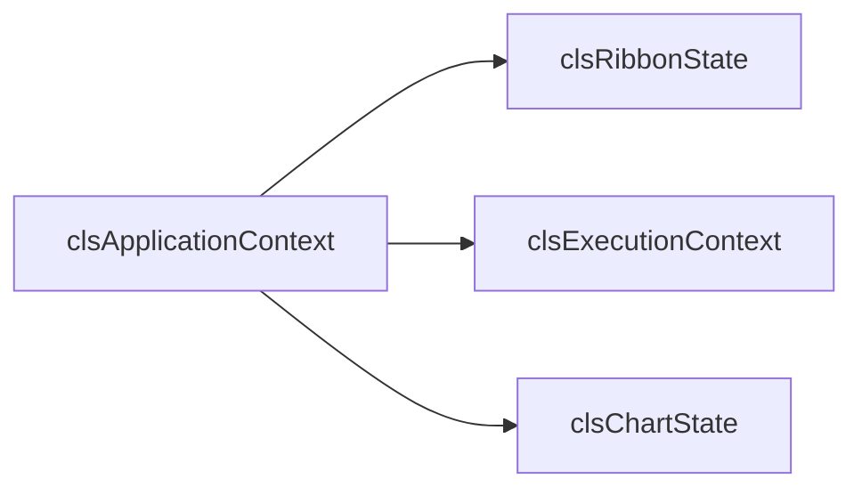

**Lineas de codigo:** 183

**Complejidad estimada:** Baja

**Diferencia con rama main:** NO EXISTE en main. En main, el estado estaba disperso en variables de clsAplicacion.

---

#### clsRibbonUI (NUEVO)

**Ubicacion:** `clsRibbonUI.cls` (lineas 1-274)

**Proposito:**
Servicio dedicado a la gestion del puntero IRibbonUI, extraido de clsRibbonEvents para cumplir SRP.

**Responsabilidades:**
- Gestionar el puntero IRibbonUI (recibido del callback RibbonOnLoad)
- Proporcionar metodos de invalidacion (Invalidate, InvalidateControl)
- Manejar recuperacion automatica si el puntero se pierde
- Diagnostico del estado del Ribbon

**Implements:** IService

**Atributos privados:**
```vba
Private mRibbonUI As IRibbonUI
Private mIsRecovering As Boolean
Private mWasEverInitialized As Boolean
Private mIsInitialized As Boolean
```

**WithEvents declarados:**
Ninguno

**Eventos que escucha:**
Ninguno

**Eventos que dispara:**
Ninguno

**Metodos publicos:**
```vba
' IService Implementation
Private Sub IService_Initialize(ByVal dependencies As Object)    ' Linea 43
Private Sub IService_Dispose()                                    ' Linea 51
Private Property Get IService_IsInitialized() As Boolean          ' Linea 57
Private Property Get IService_ServiceName() As String             ' Linea 61

' Gestion IRibbonUI
Public Property Get RibbonUIPointer() As IRibbonUI               ' Linea 70
Public Sub Init(ByRef ribbonObj As IRibbonUI)                    ' Linea 76
Public Sub StopEvents()                                           ' Linea 89
Public Sub InvalidarRibbon()                                      ' Linea 100
Public Sub InvalidarControl(idControl As String)                  ' Linea 139
Friend Sub ActivarTab(tabId As String)                           ' Linea 171

' Diagnostico
Public Property Get IsRecovering() As Boolean                    ' Linea 223
Public Property Get WasEverInitialized() As Boolean              ' Linea 228
Public Property Get IsAvailable() As Boolean                     ' Linea 233
Public Function GetQuickDiagnostics() As String                  ' Linea 238
```

**Dependencias:**
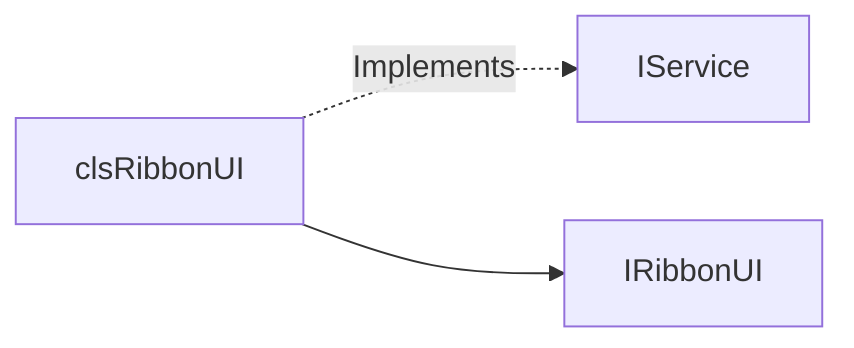

**Lineas de codigo:** 274

**Complejidad estimada:** Media

**Diferencia con rama main:** NO EXISTE en main. En main, la gestion de IRibbonUI estaba mezclada en clsRibbonEvents (violacion SRP).

---

#### clsExecutionContext

**Ubicacion:** `clsExecutionContext.cls` (lineas 1-327)

**Proposito:**
Wrapper de eventos de Application que proporciona acceso seguro al contexto de ejecucion.

**Responsabilidades:**
- Suscribirse a eventos de Excel.Application
- Re-emitir eventos como eventos propios
- Proporcionar acceso seguro a ActiveWorkbook, ActiveSheet, ActiveChart
- Detectar chart activo desde multiples fuentes

**Implements:** IService

**Atributos privados:**
```vba
Private mIsInitialized As Boolean
Private m_xlApp As Application                    ' WithEvents
Private m_lastWorkbookObjKey As Double
Private m_lastWorksheetObjKey As Double
Private m_lastChartObjKey As Double
Private m_lastSelectionObjKey As Double
Private m_cachedChartInfo As T_CachedChartInfo
```

**WithEvents declarados:**
```vba
Private WithEvents m_xlApp As Application
```

**Eventos que escucha:**

| Emisor | Evento | Manejador | Linea |
|--------|--------|-----------|-------|
| Application | WorkbookOpen | m_xlApp_WorkbookOpen | 104 |
| Application | WorkbookActivate | m_xlApp_WorkbookActivate | 109 |
| Application | WorkbookBeforeClose | m_xlApp_WorkbookBeforeClose | 115 |
| Application | SheetActivate | m_xlApp_SheetActivate | 120 |
| Application | SheetDeactivate | m_xlApp_SheetDeactivate | 129 |

**Eventos que dispara:**
```vba
Public Event WorkbookOpened(ByVal wb As Workbook)              ' Linea 27
Public Event WorkbookActivated(ByVal wb As Workbook)           ' Linea 28
Public Event WorkbookBeforeClose(ByVal wb As Workbook, ByRef Cancel As Boolean) ' Linea 29
Public Event WorksheetActivated(ByVal ws As Worksheet)         ' Linea 30
Public Event WorksheetDeactivated(ByVal ws As Worksheet)       ' Linea 31
Public Event SheetActivated(ByVal sh As Object)                ' Linea 32
Public Event SheetDeactivated(ByVal sh As Object)              ' Linea 33
Public Event SelectionChanged(ByVal sel As Object)             ' Linea 34
```

**Metodos publicos:**
```vba
' IService
Private Sub IService_Initialize(ByVal dependencies As Object)    ' Linea 66
Private Sub IService_Dispose()                                    ' Linea 75
Private Property Get IService_IsInitialized() As Boolean          ' Linea 83
Private Property Get IService_ServiceName() As String             ' Linea 87

' API Publica
Public Sub Initialize()                                           ' Linea 94
Public Property Get Workbook() As Workbook                        ' Linea 140
Public Property Get Worksheet() As Worksheet                      ' Linea 156
Public Property Get Selection() As Object                         ' Linea 172
Public Property Get Application() As Application                  ' Linea 181
Public Property Get Chart() As Chart                              ' Linea 188
Public Property Get HasWorkbook() As Boolean                      ' Linea 263
Public Property Get HasWorksheet() As Boolean                     ' Linea 267
Public Property Get HasSelection() As Boolean                     ' Linea 271
Public Property Get HasChart() As Boolean                         ' Linea 275
Public Function GetSelectedRange() As Range                       ' Linea 279
Public Function Diagnostics() As String                           ' Linea 292
```

**Dependencias:**
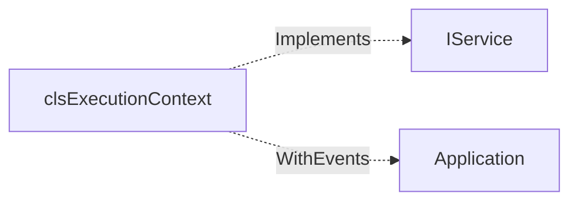

**Lineas de codigo:** 327

**Complejidad estimada:** Media

**Diferencia con rama main:** Ahora implementa IService para ciclo de vida estandarizado.

---

#### clsConfiguration

**Ubicacion:** `clsConfiguration.cls` (lineas 1-379)

**Proposito:**
Servicio de configuracion que carga/guarda rutas y parametros desde el registro de Windows.

**Responsabilidades:**
- Cargar configuracion desde registro de Windows
- Guardar cambios en registro
- Validar rutas configuradas
- Proporcionar diccionario de carpetas a monitorear

**Implements:** IService

**Atributos privados:**
```vba
Private mIsInitialized As Boolean
Private mRutaOportunidades As String
Private mRutaPlantillas As String
Private mRutaOfergas As String
Private mRutaGasVBNet As String
Private mRutaExcelCalcTempl As String
Private mArrComprImgs As Variant
Private mArrComprDrawPIDs As Variant
Private mSAM As Integer
```

**WithEvents declarados:**
Ninguno

**Eventos que escucha:**
Ninguno

**Eventos que dispara:**
Ninguno

**Metodos publicos:**
```vba
' IService
Private Sub IService_Initialize(ByVal dependencies As Object)    ' Linea 122
Private Sub IService_Dispose()                                    ' Linea 135
Private Property Get IService_IsInitialized() As Boolean          ' Linea 140
Private Property Get IService_ServiceName() As String             ' Linea 144

' Propiedades de rutas
Public Property Get RutaOportunidades() As String                 ' Linea 33
Public Property Let RutaOportunidades(newRuta As String)          ' Linea 37
Public Property Get RutaPlantillas() As String                    ' Linea 42
Public Property Let RutaPlantillas(newRuta As String)             ' Linea 46
Public Property Get RutaOfergas() As String                       ' Linea 51
Public Property Let RutaOfergas(newRuta As String)                ' Linea 55
Public Property Get RutaGasVBNet() As String                      ' Linea 60
Public Property Let RutaGasVBNet(newRuta As String)               ' Linea 64
Public Property Get RutaExcelCalcTempl() As String                ' Linea 69
Public Property Let RutaExcelCalcTempl(newRuta As String)         ' Linea 73
Public Property Get ListComprImgs() As Variant                    ' Linea 78
Public Property Let ListComprImgs(arrRutas As Variant)            ' Linea 82
Public Property Get ListComprDrawPIDs() As Variant                ' Linea 87
Public Property Let ListComprDrawPIDs(arrRutas As Variant)        ' Linea 91
Public Property Get SAM() As Integer                              ' Linea 96
Public Property Let SAM(newSAM As Integer)                        ' Linea 100

' Utilidades
Public Property Get oDicFoldersToWatch() As Object                ' Linea 181
Public Function GetConfigSummary() As String                      ' Linea 318
Public Function ValidateAllPaths() As Boolean                     ' Linea 336
```

**Dependencias:**
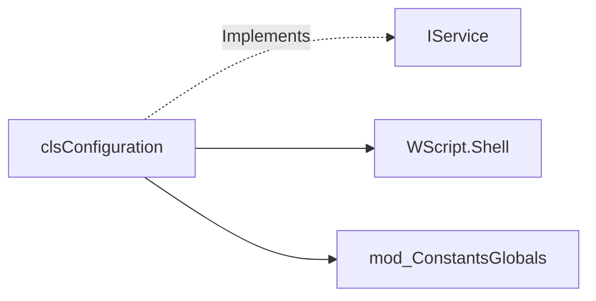

**Lineas de codigo:** 379

**Complejidad estimada:** Media

**Diferencia con rama main:** Ahora implementa IService para ciclo de vida estandarizado.

---

#### clsFileManager

**Ubicacion:** `clsFileManager.cls` (lineas 1-419)

**Proposito:**
Servicio de tracking de archivos Excel abiertos con sincronizacion automatica.

**Responsabilidades:**
- Supervisar archivos Excel abiertos
- Mantener indice de archivos por ObjectKey
- Sincronizar archivo activo con cambios de contexto
- Analizar archivos para obtener metadatos

**Implements:** IService

**Atributos privados:**
```vba
Private mIsInitialized As Boolean
Private p_trackedFiles As Object                 ' Dictionary
Private p_currExcelFile As clsExcelFile
Private WithEvents ctx As clsExecutionContext
```

**WithEvents declarados:**
```vba
Private WithEvents ctx As clsExecutionContext
```

**Eventos que escucha:**

| Emisor | Evento | Manejador | Linea |
|--------|--------|-----------|-------|
| clsExecutionContext | WorkbookActivated | ctx_WorkbookActivated | 402 |
| clsExecutionContext | WorkbookOpened | ctx_WorkbookOpened | 408 |
| clsExecutionContext | WorkbookBeforeClose | ctx_WorkbookBeforeClose | 414 |

**Eventos que dispara:**
Ninguno

**Metodos publicos:**
```vba
' IService
Private Sub IService_Initialize(ByVal dependencies As Object)    ' Linea 47
Private Sub IService_Dispose()                                    ' Linea 66
Private Property Get IService_IsInitialized() As Boolean          ' Linea 77
Private Property Get IService_ServiceName() As String             ' Linea 81

' API Publica
Public Property Get ActiveWb() As clsExcelFile                    ' Linea 107
Friend Property Set ActiveWb(f As clsExcelFile)                   ' Linea 117
Public Property Get TrackedCount() As Long                        ' Linea 144
Public Function GetOrTrackWorkbook(wb As Workbook) As clsExcelFile ' Linea 154
Public Sub UntrackWorkbook(wb As Workbook)                        ' Linea 192
Public Sub TrackFile(f As Object)                                 ' Linea 210
Public Sub UntrackFile(f As Object)                               ' Linea 233
Public Function AnalizarArchivo(fich As Object) As T_InfoArchivo  ' Linea 266
Public Function AnalizarArchivoActivo() As T_InfoArchivo          ' Linea 286
Public Function IsTracked(wb As Workbook) As Boolean              ' Linea 312
Public Function GetTrackedFilesInfo() As String                   ' Linea 376
```

**Dependencias:**
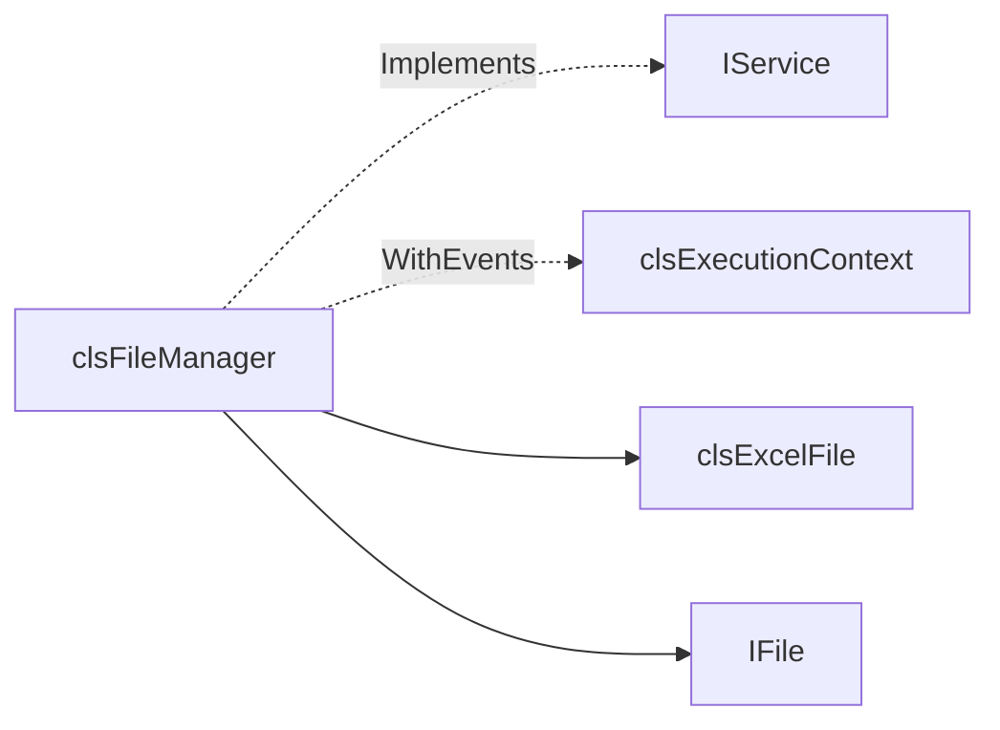

**Lineas de codigo:** 419

**Complejidad estimada:** Alta

**Diferencia con rama main:** Ahora implementa IService y recibe ExecutionContext via inyeccion de dependencias.

---

#### clsOpportunitiesMgr

**Ubicacion:** `clsOpportunitiesMgr.cls` (lineas 1-394)

**Proposito:** Gestiona la lista de oportunidades (subcarpetas) del directorio base configurado.

**Implements:** IService

**Eventos que dispara:**
- `currOpportunityChanged(Index, Path)` - Cambio de oportunidad actual
- `OpportunityCollectionUpdate(cambios)` - Cambios en lista de oportunidades

**Lineas de codigo:** 394

**Diferencia con rama main:** Ahora implementa IService.

---

#### clsFSMonitoringCoord

**Ubicacion:** `clsFSMonitoringCoord.cls` (lineas 1-693)

**Proposito:** Coordinador de monitorizacion del sistema de archivos.

**Implements:** IService

**WithEvents:** clsFSWatcher

**Eventos que dispara:**
- `OpportunityCreated`, `OpportunityDeleted`, `OpportunityRenamed`
- `MonitoringError`, `MonitoringReconnected`, `MonitoringFailed`

**Lineas de codigo:** 693

**Diferencia con rama main:** Ahora implementa IService.

---

#### clsRibbonEvents

**Ubicacion:** `clsRibbonEvents.cls` (lineas 1-121)

**Proposito:** Declarar eventos publicos para acciones del Ribbon.

**Eventos que dispara:**
- `GenerarGraficosDesdeCurvasRto`, `InvertirEjes`, `FormatearCGASING`
- `MostrarConfigurador`, `NuevaOportunidad`, `ToggleRibbonMode`

**Lineas de codigo:** 121

**Diferencia con rama main:** Simplificado - gestion IRibbonUI extraida a clsRibbonUI.

---

#### clsRibbonState

**Ubicacion:** `clsRibbonState.cls` (lineas 1-125)

**Proposito:** Estado logico del Ribbon (modo actual, visibilidad).

**Eventos que dispara:** `StateChanged`

**Lineas de codigo:** 125

---

#### clsChartEventsManager

**Ubicacion:** `clsChartEventsManager.cls` (lineas 1-182)

**Proposito:** Gestor centralizado de eventos de graficos.

**Implements:** IService

**Eventos que dispara:**
- `ChartActivated`, `ChartDeactivated`, `HojaConGraficosCambiada`

**Lineas de codigo:** 182

**Diferencia con rama main:** Ahora implementa IService.

---

#### clsExcelFile

**Ubicacion:** `clsExcelFile.cls` (lineas 1-413)

**Proposito:** Representa un Workbook abierto. Unica capa que conoce directamente al Workbook.

**Implements:** IFile

**Lineas de codigo:** 413

---

#### ThisWorkbook

**Ubicacion:** `ThisWorkbook.cls` (lineas 1-182)

**Proposito:** Entry point de la aplicacion.

**Lineas de codigo:** 182

---

### 1.2. Clases Restantes (Sin Cambios Significativos)

| Clase | Lineas | Proposito |
|-------|--------|-----------|
| clsFSWatcher | ~713 | Monitorizacion carpeta (COM) |
| clsChartEvents | ~97 | Wrapper eventos Chart |
| clsChartState | ~12 | Estado graficos |
| clsOpportunity | ~41 | Modelo oportunidad |
| clsOferta | ~51 | Modelo oferta |
| clsOfertaOtro | ~37 | Tipo especial oferta |
| clsOfertaRepository | ~149 | Repository ofertas |
| clsVBAProcedure | ~430 | Introspeccion VBA |
| clsDBContext | ~94 | Contexto BD |
| clsPDFFile | ~100 | Gestion PDF |
| clsEventDispatcher | ~10 | Dispatcher eventos |
| clsFileState | ~12 | Estado archivo |
| CRefEdit | ~79 | Control RefEdit |
| IFile | ~56 | Interfaz archivos |
| wshUnidades | ~17 | Hoja unidades |

---

### 1.3. Modulos (.bas) - Sin Cambios

34 modulos (~10,700 lineas). Sin cambios respecto a rama main.

---

### 1.4. Formularios (.frm) - Sin Cambios

3 formularios (~810 lineas). Sin cambios respecto a rama main.

---

### 1.5. Tabla Consolidada de Eventos

| Clase Emisora | Eventos | Suscriptor |
|---------------|---------|------------|
| clsExecutionContext | Workbook*, Sheet* | clsEventCoordinator |
| clsChartEventsManager | Chart*, HojaConGraficos* | clsEventCoordinator |
| clsOpportunitiesMgr | currOpportunityChanged, OpportunityCollectionUpdate | clsEventCoordinator |
| clsFSMonitoringCoord | Opportunity*, Monitoring* | clsEventCoordinator |
| clsRibbonState | StateChanged | clsEventCoordinator |
| clsRibbonEvents | GenerarGraficos*, Invertir*, Formatear*, etc. | clsEventCoordinator |

**Observacion:** clsEventCoordinator es el Mediator central (24 eventos).

---

### 1.6. Servicios que Implementan IService

| Servicio | Dependencias |
|----------|--------------|
| clsConfiguration | Ninguna |
| clsExecutionContext | Ninguna |
| clsFileManager | ServiceManager |
| clsOpportunitiesMgr | ServiceManager |
| clsChartEventsManager | Ninguna |
| clsFSMonitoringCoord | ServiceManager |
| clsRibbonUI | Ninguna |

---

## FIN SECCION 1

---

## SECCION 2: GRAFOS DE DEPENDENCIAS

> **Objetivo:** Visualizar relaciones entre componentes

### 2.1. Diagrama de Arquitectura General

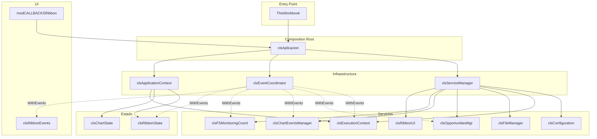

---

### 2.2. Diagrama de Clases UML

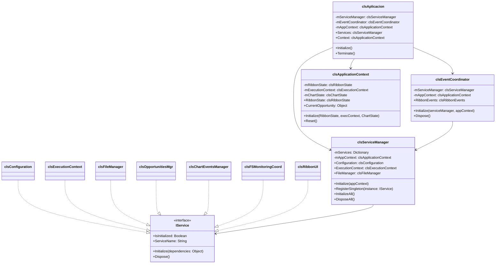

---

### 2.3. Matriz de Dependencias

|                         | ServiceMgr | EventCoord | AppContext | Config | ExecCtx | FileMgr | OppMgr | ChartMgr | FSMon | RibbonUI |
|-------------------------|:----------:|:----------:|:----------:|:------:|:-------:|:-------:|:------:|:--------:|:-----:|:--------:|
| **clsAplicacion**       |     ✓      |     ✓      |     ✓      |        |         |         |        |          |       |          |
| **clsServiceManager**   |            |            |     ✓      |   ✓    |    ✓    |    ✓    |   ✓    |    ✓     |   ✓   |    ✓     |
| **clsEventCoordinator** |     ✓      |            |     ✓      |        |   WE    |         |   WE   |    WE    |  WE   |          |
| **clsFileManager**      |            |            |            |        |   WE    |         |        |          |       |          |
| **clsOpportunitiesMgr** |            |            |            |   ✓    |   WE    |         |        |          |       |          |
| **clsFSMonitoringCoord**|            |            |            |   ✓    |         |         |        |          |       |          |

**Leyenda:** ✓ = Dependencia directa | WE = WithEvents

---

### 2.4. Diagrama de Secuencia: Inicializacion

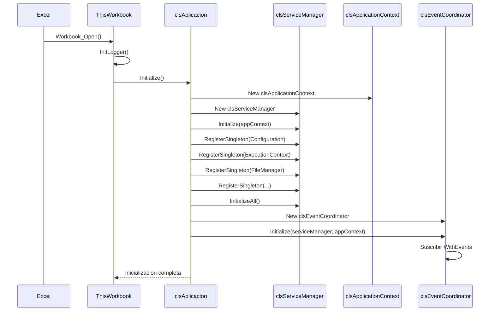

---

### 2.5. Diagrama de Secuencia: Evento de Usuario

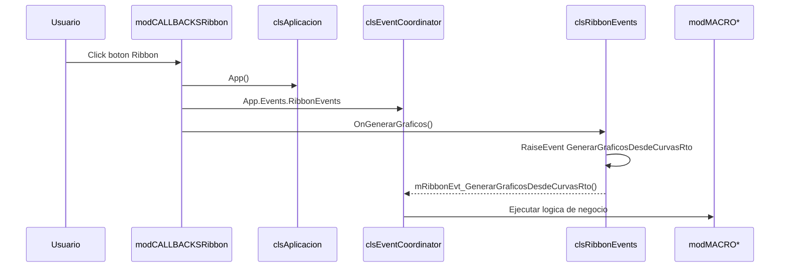

---

### 2.6. Diagrama de Flujo: Resolucion de Servicios

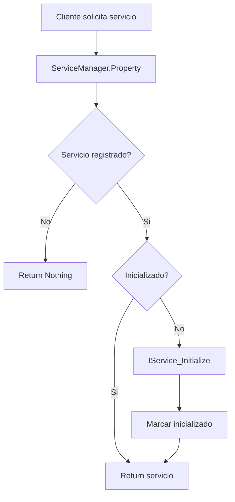

---

### 2.7. Maquina de Estados: Ciclo de Vida IService

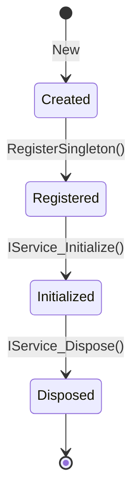

---

### 2.8. Flujo de Eventos

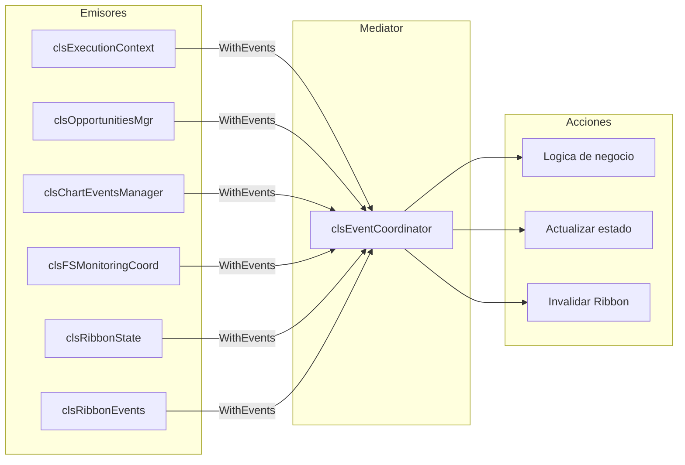

---

## FIN SECCION 2

---

## CHANGELOG

| Fecha | Version | Cambios | Autor |
|-------|---------|---------|-------|
| 2026-01-17 | 0.3 | Seccion 2 completa - Grafos de Dependencias | Claude |
| 2026-01-17 | 0.2 | Seccion 1 completa + Estado Critico documentado | Claude |
| 2026-01-17 | 0.1 | Inicio Seccion 1 | Claude |

---

> **Esperando aprobacion para continuar con Entrega 3: Secciones 3-6**
