# ANALISIS ARQUITECTONICO - Rama Refactorizada

> Documento generado siguiendo plantilla docs/PLANTILLA_ANALISIS.md
> Rama analizada: claude/refactor-main-code-YeuB5

---

## DIFERENCIAS CON RAMA MAIN

Esta rama contiene **6 clases nuevas** que implementan patrones de diseño para mejorar la arquitectura:

| Clase Nueva | Lineas | Patron Implementado | Proposito |
|-------------|--------|---------------------|-----------|
| IService.cls | 70 | Interface | Interfaz base para ciclo de vida de servicios |
| IFormatter.cls | 79 | Interface | Interfaz para formateadores estandarizados |
| clsServiceManager.cls | 282 | DI Container | Gestor de servicios con resolucion por tipo |
| clsEventCoordinator.cls | 339 | Mediator | Coordinador centralizado de eventos |
| clsApplicationContext.cls | 183 | Context Object | Estado compartido de la aplicacion |
| clsRibbonUI.cls | 274 | SRP Extraction | Gestion IRibbonUI (extraido de clsRibbonEvents) |

**Total lineas nuevas:** 1,227

---

## SECCION 1: INVENTARIO DE COMPONENTES

### Resumen Estadistico

| Tipo | Rama Main | Rama Refactorizada | Diferencia |
|------|-----------|-------------------|------------|
| Clases (.cls) | 28 (~5,463 lineas) | 34 (6,711 lineas) | **+6 clases, +1,248 lineas** |
| Modulos (.bas) | 34 (~10,743 lineas) | 34 (10,743 lineas) | Sin cambios |
| Formularios (.frm) | 3 (~813 lineas) | 3 (813 lineas) | Sin cambios |
| **TOTAL** | **65** (~17,019 lineas) | **71** (18,267 lineas) | **+6 archivos, +1,248 lineas** |

---

### 1.1. Clases NUEVAS (Solo en rama refactorizada)

#### IService (NUEVO)

**Ubicacion:** `IService.cls` (lineas 1-70)

**Proposito:**
Interfaz base que estandariza el ciclo de vida de todos los servicios del sistema.

**Responsabilidades:**
- Definir contrato de inicializacion (Initialize)
- Definir contrato de liberacion de recursos (Dispose)
- Proporcionar introspección (IsInitialized, ServiceName)

**Metodos de interfaz:**
```vba
Public Sub Initialize(ByVal dependencies As Object)           ' Linea 51
Public Sub Dispose()                                          ' Linea 56
Public Property Get IsInitialized() As Boolean                ' Linea 61
Public Property Get ServiceName() As String                   ' Linea 66
```

**Patron formal:** Interface Pattern (Gang of Four)

**Diferencia con rama main:** 🆕 **NO EXISTE EN MAIN** - Servicios en main no tienen interfaz comun

**Lineas de codigo:** 70
**Complejidad estimada:** Baja

---

#### IFormatter (NUEVO)

**Ubicacion:** `IFormatter.cls` (lineas 1-79)

**Proposito:**
Interfaz que estandariza todos los formateadores (CGASING, Oferta, Reporte, etc.).

**Responsabilidades:**
- Definir contrato de formateo (Format)
- Definir validacion de target (CanFormat)
- Proporcionar nombre descriptivo (FormatterName)

**Metodos de interfaz:**
```vba
Public Function Format(ByVal target As Object) As Boolean     ' Linea 63
Public Function CanFormat(ByVal target As Object) As Boolean  ' Linea 70
Public Property Get FormatterName() As String                 ' Linea 75
```

**Patron formal:** Strategy Pattern (Interface-based)

**Diferencia con rama main:** 🆕 **NO EXISTE EN MAIN** - Formateo disperso en modulos sin interfaz comun

**Lineas de codigo:** 79
**Complejidad estimada:** Baja

---

#### clsServiceManager (NUEVO)

**Ubicacion:** `clsServiceManager.cls` (lineas 1-282)

**Proposito:**
Gestor de servicios con resolucion por tipo. Implementa patron Dependency Injection Container.

**Responsabilidades:**
- Registrar servicios Singleton (usando TypeName como clave)
- Resolver servicios mediante propiedades tipadas
- Gestionar ciclo de vida (Initialize/Dispose via IService)
- Inyectar dependencias (ApplicationContext + ServiceManager)

**Atributos privados:**
```vba
Private mServices As Object                         ' Dictionary: TypeName -> IService
Private mAppContext As clsApplicationContext        ' Contexto compartido (inyectado)
Private mIsInitialized As Boolean
```

**Metodos publicos:**
```vba
Public Sub Initialize(ByVal appContext As clsApplicationContext)  ' Linea 52
Public Sub RegisterSingleton(ByVal instance As IService)          ' Linea 66
Public Sub InitializeAll()                                        ' Linea 104
Public Property Get Configuration() As clsConfiguration          ' Linea 125
Public Property Get ExecutionContext() As clsExecutionContext    ' Linea 136
Public Property Get FileManager() As clsFileManager              ' Linea 147
Public Property Get OpportunitiesMgr() As clsOpportunitiesMgr    ' Linea 158
Public Property Get ChartEventsManager() As clsChartEventsManager ' Linea 169
Public Property Get FSMonitoringCoord() As clsFSMonitoringCoord  ' Linea 180
Public Property Get RibbonUI() As clsRibbonUI                    ' Linea 191
Public Function GetServiceCount() As Long                        ' Linea 207
Public Function IsRegistered(ByVal typeName As String) As Boolean ' Linea 212
Public Property Get AppContext() As clsApplicationContext        ' Linea 217
Public Sub DisposeAll()                                          ' Linea 226
Public Function GetService(ByVal serviceName As String) As Object ' Linea 255 (DEPRECATED)
```

**Dependencias:**


**Patron formal:** Dependency Injection Container / Service Locator

**Diferencia con rama main:** 🆕 **NO EXISTE EN MAIN** - En main, clsAplicacion crea y expone servicios directamente (God Object)

**Lineas de codigo:** 282
**Complejidad estimada:** Media

---

#### clsEventCoordinator (NUEVO)

**Ubicacion:** `clsEventCoordinator.cls` (lineas 1-339)

**Proposito:**
Mediator centralizado que coordina eventos entre servicios, eliminando acoplamiento directo.

**Responsabilidades:**
- Suscribirse a eventos de servicios (WithEvents)
- Coordinar reacciones entre servicios
- Actualizar ApplicationContext cuando proceda
- Ser el punto unico de coordinacion (Mediator Pattern)

**Atributos privados:**
```vba
Private mServiceManager As clsServiceManager
Private mAppContext As clsApplicationContext
```

**WithEvents declarados:**
```vba
Private WithEvents mExecutionContext As clsExecutionContext
Private WithEvents mOpportunities As clsOpportunitiesMgr
Private WithEvents mChartManager As clsChartEventsManager
Private WithEvents mFSMonitoringCoord As clsFSMonitoringCoord
Private WithEvents mRibbonState As clsRibbonState
Private WithEvents mRibbonEvents As clsRibbonEvents
```

**Eventos que escucha:**

| Emisor | Evento | Manejador | Linea |
|--------|--------|-----------|-------|
| clsExecutionContext | WorkbookActivated | mExecutionContext_WorkbookActivated | 88 |
| clsExecutionContext | WorkbookOpened | mExecutionContext_WorkbookOpened | 98 |
| clsExecutionContext | WorkbookBeforeClose | mExecutionContext_WorkbookBeforeClose | 105 |
| clsExecutionContext | SheetActivated | mExecutionContext_SheetActivated | 112 |
| clsExecutionContext | SheetDeactivated | mExecutionContext_SheetDeactivated | 122 |
| clsChartEventsManager | ChartActivated | mChartManager_ChartActivated | 133 |
| clsChartEventsManager | ChartDeactivated | mChartManager_ChartDeactivated | 147 |
| clsChartEventsManager | HojaConGraficosCambiada | mChartManager_HojaConGraficosCambiada | 159 |
| clsOpportunitiesMgr | currOpportunityChanged | mOpportunities_currOpportunityChanged | 173 |
| clsOpportunitiesMgr | OpportunityCollectionUpdate | mOpportunities_OpportunityCollectionUpdate | 180 |
| clsFSMonitoringCoord | OpportunityCreated | mFSMonitoringCoord_OpportunityCreated | 191 |
| clsFSMonitoringCoord | OpportunityDeleted | mFSMonitoringCoord_OpportunityDeleted | 198 |
| clsFSMonitoringCoord | OpportunityRenamed | mFSMonitoringCoord_OpportunityRenamed | 206 |
| clsFSMonitoringCoord | MonitoringError | mFSMonitoringCoord_MonitoringError | 214 |
| clsFSMonitoringCoord | MonitoringReconnected | mFSMonitoringCoord_MonitoringReconnected | 218 |
| clsFSMonitoringCoord | MonitoringFailed | mFSMonitoringCoord_MonitoringFailed | 222 |
| clsRibbonState | StateChanged | mRibbonState_StateChanged | 230 |
| clsRibbonEvents | GenerarGraficosDesdeCurvasRto | mRibbonEvents_GenerarGraficosDesdeCurvasRto | 241 |
| clsRibbonEvents | InvertirEjes | mRibbonEvents_InvertirEjes | 254 |
| clsRibbonEvents | FormatearCGASING | mRibbonEvents_FormatearCGASING | 266 |
| clsRibbonEvents | MostrarConfigurador | mRibbonEvents_MostrarConfigurador | 278 |
| clsRibbonEvents | NuevaOportunidad | mRibbonEvents_NuevaOportunidad | 290 |
| clsRibbonEvents | ToggleRibbonMode | mRibbonEvents_ToggleRibbonMode | 302 |

**Metodos publicos:**
```vba
Public Sub Initialize(ByVal serviceManager As clsServiceManager, _
                      ByVal appContext As clsApplicationContext)  ' Linea 59
Public Property Get RibbonEvents() As clsRibbonEvents            ' Linea 314
Public Sub Dispose()                                              ' Linea 322
```

**Dependencias:**


**Patron formal:** Mediator Pattern (Gang of Four)

**Diferencia con rama main:** 🆕 **NO EXISTE EN MAIN** - En main, clsAplicacion maneja los 20+ eventos directamente (God Object anti-pattern)

**Lineas de codigo:** 339
**Complejidad estimada:** Alta (pero SRP - solo coordinacion)

---

#### clsApplicationContext (NUEVO)

**Ubicacion:** `clsApplicationContext.cls` (lineas 1-183)

**Proposito:**
Objeto de estado compartido que agrega sub-estados especializados de la aplicacion.

**Responsabilidades:**
- Agregar/componer sub-estados (RibbonState, ChartState, ExecutionContext)
- Proporcionar acceso compartido al estado de la aplicacion
- Servir como punto central de acceso al estado (no a servicios)

**Atributos privados:**
```vba
Private mRibbonState As clsRibbonState
Private mExecutionContext As clsExecutionContext
Private mChartState As clsChartState
Private m_CurrentOpportunity As Object     ' clsOpportunity
Private m_CurrentFile As Object            ' clsExcelFile
Private m_ApplicationState As Long         ' Enum: Running, Initializing, ShuttingDown
```

**Metodos publicos:**
```vba
Public Sub Initialize(ByVal RibbonState As clsRibbonState, _
                      ByVal execContext As clsExecutionContext, _
                      ByVal ChartState As clsChartState)          ' Linea 46
Public Property Get RibbonState() As clsRibbonState              ' Linea 58
Public Property Get ExecutionContext() As clsExecutionContext    ' Linea 62
Public Property Get ChartState() As clsChartState                ' Linea 66
Public Property Get CurrentOpportunity() As Object               ' Linea 74
Public Property Set CurrentOpportunity(ByVal Value As Object)    ' Linea 78
Public Property Get CurrentFile() As Object                      ' Linea 83
Public Property Set CurrentFile(ByVal Value As Object)           ' Linea 87
Public Property Get ApplicationState() As Long                   ' Linea 92
Public Property Let ApplicationState(ByVal Value As Long)        ' Linea 96
Public Property Get IsChartActive() As Boolean                   ' Linea 105
Public Property Get CanInvertAxes() As Boolean                   ' Linea 109
Public Property Let CanInvertAxes(ByVal Value As Boolean)        ' Linea 113
Public Property Get CanGenerateChart() As Boolean                ' Linea 117
Public Property Let CanGenerateChart(ByVal Value As Boolean)     ' Linea 121
Public Property Get CurrentWorkbook() As Workbook                ' Linea 126
Public Property Get CurrentWorksheet() As Worksheet              ' Linea 130
Public Property Get CurrentChart() As Chart                      ' Linea 134
Public Property Get RibbonMode() As eRibbonMode                  ' Linea 139
Public Sub Reset()                                               ' Linea 148
Public Function GetDebugInfo() As String                         ' Linea 158
```

**Dependencias:**


**Patron formal:** Context Object Pattern

**Diferencia con rama main:** 🆕 **NO EXISTE EN MAIN** - En main, estado disperso en variables de clsAplicacion

**Lineas de codigo:** 183
**Complejidad estimada:** Baja

---

#### clsRibbonUI (NUEVO)

**Ubicacion:** `clsRibbonUI.cls` (lineas 1-274)

**Proposito:**
Servicio dedicado a la gestion del puntero IRibbonUI, extraido de clsRibbonEvents para cumplir SRP.

**Responsabilidades:**
- Gestionar el puntero IRibbonUI (recibido del callback RibbonOnLoad)
- Proporcionar metodos de invalidacion (Invalidate, InvalidateControl)
- Manejar recuperacion automatica si el puntero se pierde
- Diagnostico del estado del Ribbon

**Implements:** IService

**Atributos privados:**
```vba
Private mRibbonUI As IRibbonUI
Private mIsRecovering As Boolean              ' Flag para evitar recursion
Private mWasEverInitialized As Boolean        ' Flag para distinguir "nunca inicializado" de "perdido"
Private mIsInitialized As Boolean
```

**Metodos publicos:**
```vba
' IService Implementation
Private Sub IService_Initialize(ByVal dependencies As Object)    ' Linea 43
Private Sub IService_Dispose()                                    ' Linea 51
Private Property Get IService_IsInitialized() As Boolean          ' Linea 57
Private Property Get IService_ServiceName() As String             ' Linea 61

' Gestion IRibbonUI
Public Property Get RibbonUIPointer() As IRibbonUI               ' Linea 70
Public Sub Init(ByRef ribbonObj As IRibbonUI)                    ' Linea 76
Public Sub StopEvents()                                           ' Linea 89
Public Sub InvalidarRibbon()                                      ' Linea 100
Public Sub InvalidarControl(idControl As String)                  ' Linea 139
Friend Sub ActivarTab(tabId As String)                           ' Linea 171

' Diagnostico
Public Property Get IsRecovering() As Boolean                    ' Linea 223
Public Property Get WasEverInitialized() As Boolean              ' Linea 228
Public Property Get IsAvailable() As Boolean                     ' Linea 233
Public Function GetQuickDiagnostics() As String                  ' Linea 238
```

**Dependencias:**


**Patron formal:** Single Responsibility Principle (Extraction)

**Diferencia con rama main:** 🆕 **NO EXISTE EN MAIN** - En main, esta funcionalidad esta mezclada en clsRibbonEvents (violacion SRP)

**Lineas de codigo:** 274
**Complejidad estimada:** Media

---

### 1.2. Clases EXISTENTES (Presentes en ambas ramas)

> Las siguientes clases existen en ambas ramas. Se documenta solo cambios significativos.

#### clsAplicacion

**Ubicacion:** `clsAplicacion.cls` (lineas 1-479)

**Diferencias con rama main:**

| Aspecto | Rama Main | Rama Refactorizada |
|---------|-----------|-------------------|
| **Lineas** | 479 | 479 (sin cambios) |
| **Responsabilidades** | 3 (God Object) | 3 (pendiente refactorizar) |
| **Manejadores eventos** | 20+ directos | 20+ (delegacion pendiente a clsEventCoordinator) |

**Estado de migracion:** ⚠️ Pendiente - clsEventCoordinator creado pero clsAplicacion aun no delegado

**Lineas de codigo:** 479
**Complejidad estimada:** Alta (God Object - multiples responsabilidades)

---

#### clsRibbonEvents

**Ubicacion:** `clsRibbonEvents.cls` (lineas 1-277)

**Diferencias con rama main:**

| Aspecto | Rama Main | Rama Refactorizada |
|---------|-----------|-------------------|
| **Responsabilidades** | 2 (IRibbonUI + Eventos) | 1 (Solo Eventos) |
| **Gestion IRibbonUI** | Incluida | Extraida a clsRibbonUI |

**Estado de migracion:** ✅ Parcialmente migrado - clsRibbonUI extrae gestion IRibbonUI

**Lineas de codigo:** 277
**Complejidad estimada:** Media (mejorada - ahora SRP)

---

### Clases sin cambios (Resumen)

Las siguientes clases permanecen **identicas** a la rama main:

| Clase | Lineas | Proposito |
|-------|--------|-----------|
| clsExecutionContext | 289 | Wrapper eventos Excel.Application |
| clsConfiguration | 254 | Configuracion persistente (registro Windows) |
| clsFileManager | 378 | Tracking archivos Excel abiertos |
| clsOpportunitiesMgr | 347 | Gestion lista de oportunidades |
| clsFSMonitoringCoord | 647 | Coordinacion monitorizacion carpetas |
| clsFSWatcher | 713 | Monitorizacion individual carpeta (COM) |
| clsRibbonState | 100 | Estado logico del Ribbon |
| clsChartState | 12 | Estado de graficos |
| clsChartEvents | 97 | Wrapper eventos Chart individual |
| clsChartEventsManager | 148 | Gestion eventos graficos en hoja |
| clsExcelFile | 412 | Modelo archivo Excel abierto |
| clsOpportunity | 41 | Modelo oportunidad comercial |
| clsOferta | 51 | Modelo oferta individual |
| clsOfertaOtro | 37 | Tipo especial de oferta |
| clsOfertaRepository | 149 | Repository gestion ofertas |
| clsVBAProcedure | 430 | Modelo introspeccion codigo VBA |
| clsDBContext | 94 | Contexto base de datos |
| clsPDFFile | 100 | Gestion archivos PDF |
| clsEventDispatcher | 10 | Dispatcher simple eventos |
| clsFileState | 12 | Estado de archivo |
| clsOpportunityOfferBudgetTpl | 12 | Template presupuesto |
| clsOpportunityOfferQuotationTpl | 12 | Template cotizacion |
| ThisWorkbook | 172 | Entry point aplicacion |
| CRefEdit | 79 | Control personalizado RefEdit |
| IFile | 56 | Interfaz para archivos |
| wshUnidades | 17 | Hoja especial unidades |

---

### 1.3. Modulos (.bas)

> **Sin cambios respecto a rama main** - Los 34 modulos permanecen identicos.

| Modulo | Lineas | Proposito |
|--------|--------|-----------|
| modCALLBACKSRibbon | 332 | Callbacks XML del Ribbon |
| modMACROAppLifecycle | 423 | Funciones ciclo vida aplicacion |
| modMACROGraficoSensibilidad | 777 | Generacion graficos sensibilidad |
| modMACROFixCGAS | 388 | Formateo hojas CGASING |
| UDFs_CGASING | 345 | UDFs para hojas CGASING |
| UDFs_Units | 385 | Conversion unidades |
| UDFs_COOLPROP | 146 | Propiedades termodinamicas |
| UDFs_FileSystem | 150 | Sistema de archivos |
| UDFs_Utilids | 50 | Utilidades diversas |
| UDFs_UtilsExcel | 242 | Utilidades Excel |
| UDFs_UtilsExcelChart | 105 | Utilidades graficos |
| UDFs_Backups | 330 | Soporte backups |
| mod_Logger | 223 | Sistema logging |
| mod_ConstantsGlobals | 302 | Constantes globales |
| modAPPFileNames | 303 | Gestion nombres archivo |
| modAPPInstallXLAM | 713 | Instalacion/desinstalacion XLAM |
| modAPPUDFsRegistration | 315 | Registro UDFs |
| modAPPBudgetQuotesUtilids | 281 | Utilidades presupuestos |
| modAPPFSWatcher | 21 | Wrapper FSWatcher |
| modMACROBase64Encoding | 115 | Codificacion Base64 |
| modMACROComparadorHojas | 273 | Comparacion hojas |
| modMACROImportExportMacros | 286 | Import/export macros |
| modMACROLeerOfertas | 188 | Lectura ofertas |
| modMACROListarProyectosVBA | 105 | Listado proyectos |
| modMACROProceduresToWorksheet | 656 | Export procedimientos a hoja |
| modMACROUnits | 211 | Gestion unidades |
| modMACROUtilsExcel | 344 | Utilidades Excel |
| modMACROUtilsExcelCheckbox | 268 | Utilidades checkboxes |
| modMACROWbkEditableCleaning | 290 | Limpieza libros |
| modMACROWbkEditableFormatting | 1177 | Formateo libros |
| modOfertaTypes | 13 | Tipos ofertas |
| modUTILSProcedureParsing | 188 | Parsing procedimientos |
| modUTILSRefEditAPI | 375 | API RefEdit |
| modUTILSShellCmd | 407 | Comandos shell |

---

### 1.4. Formularios (.frm)

> **Sin cambios respecto a rama main** - Los 3 formularios permanecen identicos.

| Formulario | Lineas | Proposito |
|------------|--------|-----------|
| frmConfiguracion | 378 | Configuracion rutas y parametros |
| frmComparadorHojas | 321 | Comparacion visual hojas Excel |
| frmImportExportMacros | 114 | Import/export modulos VBA |

---

### 1.5. Tabla de Eventos (Diferencias)

#### Eventos NUEVOS (Solo en rama refactorizada)

| Clase Emisora | Evento | Clase Receptora | Manejador |
|---------------|--------|-----------------|-----------|
| clsRibbonEvents | ToggleRibbonMode | clsEventCoordinator | mRibbonEvents_ToggleRibbonMode |
| clsRibbonEvents | MostrarConfigurador | clsEventCoordinator | mRibbonEvents_MostrarConfigurador |

#### Eventos REUBICADOS (de clsAplicacion a clsEventCoordinator)

> En rama main, clsAplicacion escucha 24 eventos directamente.
> En rama refactorizada, clsEventCoordinator asume esta responsabilidad.

| Evento | Emisor | Main: Receptor | Refactorizado: Receptor |
|--------|--------|----------------|------------------------|
| WorkbookActivated | clsExecutionContext | clsAplicacion | clsEventCoordinator |
| SheetActivated | clsExecutionContext | clsAplicacion | clsEventCoordinator |
| ChartActivated | clsChartEventsManager | clsAplicacion | clsEventCoordinator |
| OpportunityCreated | clsFSMonitoringCoord | clsAplicacion | clsEventCoordinator |
| *... (20+ eventos mas)* | | | |

**Impacto:** Reduce acoplamiento de clsAplicacion de 8 dependencias WithEvents a 0 (delegacion al Mediator)

---

### 1.6. UDFs y Macros

> **Sin cambios respecto a rama main** - Mismas UDFs y macros disponibles.

---

## FIN SECCION 1 - ENTREGA 1

### Resumen de Entrega 1

**Componentes documentados:**
- 6 clases NUEVAS con analisis detallado
- 28 clases existentes (resumen de cambios)
- 34 modulos (sin cambios)
- 3 formularios (sin cambios)

**Diferencias clave identificadas:**
1. **+6 clases nuevas** implementando patrones DI, Mediator, Context Object
2. **clsRibbonUI** extrae responsabilidad de gestion IRibbonUI (SRP)
3. **clsEventCoordinator** centraliza 24 manejadores de eventos (Mediator)
4. **clsServiceManager** implementa contenedor DI con propiedades tipadas
5. **IService/IFormatter** estandarizan interfaces de servicios

**Estado de migracion:** ⚠️ Parcial - Clases nuevas creadas pero clsAplicacion aun no delega completamente

---

## CHANGELOG

| Fecha | Version | Cambios | Autor |
|-------|---------|---------|-------|
| 2026-01-16 | 1.0 | Seccion 1 completa - Inventario rama refactorizada | Claude |

---

---

## SECCION 2: GRAFOS DE DEPENDENCIAS

> Objetivo: Visualizar la nueva arquitectura y compararla con rama main

### 2.1. DIAGRAMAS ESTRUCTURALES

#### 2.1.1. Diagrama UML - Arquitectura Refactorizada


**Leyenda:**
- `--|>` : Implementa interface
- `-->` : Dependencia directa (usa, crea)
- `..>` : Dependencia de eventos (WithEvents)
- Clases NUEVAS: IService, IFormatter, clsServiceManager, clsEventCoordinator, clsApplicationContext, clsRibbonUI

---

#### 2.1.2. Comparacion de Arquitecturas: Main vs Refactorizada

##### Arquitectura MAIN (God Object)

```mermaid
graph TD
    subgraph "Nivel 0 - Entry Point"
        TW[ThisWorkbook]
    end

    subgraph "Nivel 1 - GOD OBJECT"
        APP[clsAplicacion<br/>479 lineas<br/>🔴 8 dependencias<br/>🔴 20+ manejadores<br/>🔴 3 responsabilidades]
    end

    subgraph "Nivel 2 - Servicios"
        CFG[clsConfiguration]
        EXEC[clsExecutionContext]
        FM[clsFileManager]
        OPP[clsOpportunitiesMgr]
        CHART[clsChartEventsManager]
        FS[clsFSMonitoringCoord]
    end

    subgraph "Nivel 3 - UI"
        RIBBONEV[clsRibbonEvents<br/>🟠 2 responsabilidades]
        RIBBONST[clsRibbonState]
    end

    TW --> APP
    APP --> CFG
    APP --> EXEC
    APP --> FM
    APP --> OPP
    APP --> CHART
    APP --> FS
    APP --> RIBBONEV
    APP --> RIBBONST

    APP -.WithEvents.-> EXEC
    APP -.WithEvents.-> OPP
    APP -.WithEvents.-> CHART
    APP -.WithEvents.-> FS
    APP -.WithEvents.-> RIBBONEV
    APP -.WithEvents.-> RIBBONST

    style APP fill:#ff6b6b
    style RIBBONEV fill:#ffa500
```



##### Arquitectura REFACTORIZADA (Patrones aplicados)

```mermaid
graph TD
    subgraph "Nivel 0 - Entry Point"
        TW[ThisWorkbook]
    end

    subgraph "Nivel 1 - Facade"
        APP[clsAplicacion<br/>🟢 Facade simplificado]
    end

    subgraph "Nivel 2 - Infraestructura NUEVA"
        SM[clsServiceManager<br/>🆕 DI Container]
        EC[clsEventCoordinator<br/>🆕 Mediator]
        AC[clsApplicationContext<br/>🆕 Context Object]
    end

    subgraph "Nivel 3 - Servicios"
        CFG[clsConfiguration]
        EXEC[clsExecutionContext]
        FM[clsFileManager]
        OPP[clsOpportunitiesMgr]
        CHART[clsChartEventsManager]
        FS[clsFSMonitoringCoord]
    end

    subgraph "Nivel 4 - UI"
        RUI[clsRibbonUI<br/>🆕 SRP]
        REV[clsRibbonEvents<br/>🟢 Solo eventos]
        RST[clsRibbonState]
    end

    subgraph "Nivel 5 - Interfaces NUEVAS"
        IS[IService<br/>🆕]
        IF[IFormatter<br/>🆕]
    end

    TW --> APP
    APP --> SM

    SM --> AC
    SM --> CFG
    SM --> EXEC
    SM --> FM
    SM --> OPP
    SM --> CHART
    SM --> FS
    SM --> RUI

    EC --> SM
    EC --> AC
    EC -.WithEvents.-> EXEC
    EC -.WithEvents.-> OPP
    EC -.WithEvents.-> CHART
    EC -.WithEvents.-> FS
    EC -.WithEvents.-> REV
    EC -.WithEvents.-> RST

    AC --> RST
    AC --> EXEC

    RUI -.implements.-> IS

    style SM fill:#90EE90
    style EC fill:#90EE90
    style AC fill:#90EE90
    style RUI fill:#90EE90
    style IS fill:#87CEEB
    style IF fill:#87CEEB
    style APP fill:#98FB98
    style REV fill:#98FB98
```



**Cambios arquitectonicos clave:**

| Aspecto | Main | Refactorizada | Mejora |
|---------|------|---------------|--------|
| **Creacion servicios** | clsAplicacion (directo) | clsServiceManager (DI) | Desacoplamiento |
| **Manejo eventos** | clsAplicacion (20+ handlers) | clsEventCoordinator (Mediator) | SRP |
| **Estado compartido** | Variables en clsAplicacion | clsApplicationContext | Cohesion |
| **Gestion IRibbonUI** | clsRibbonEvents (mezclado) | clsRibbonUI (separado) | SRP |
| **Ciclo de vida servicios** | Ad-hoc | IService interface | Estandarizacion |

---

#### 2.1.3. Matriz de Dependencias - Rama Refactorizada

|                         | IService | ServiceMgr | EventCoord | AppContext | RibbonUI | Config | ExecCtx | OppMgr | ChartMgr | FSMon |
|-------------------------|:--------:|:----------:|:----------:|:----------:|:--------:|:------:|:-------:|:------:|:--------:|:-----:|
| **clsServiceManager**   |    ✓     |            |            |     ✓      |    ✓     |   ✓    |    ✓    |   ✓    |    ✓     |   ✓   |
| **clsEventCoordinator** |          |     ✓      |            |     ✓      |          |        | WithEv  | WithEv |  WithEv  |WithEv |
| **clsApplicationContext**|         |            |            |            |          |        |    ✓    |        |          |       |
| **clsRibbonUI**         |  Impl    |            |            |            |          |        |         |        |          |       |
| **clsAplicacion**       |          |     ✓      |            |            |          |        |         |        |          |       |

**Leyenda:**
- ✓ : Usa directamente
- Impl : Implementa interface
- WithEv : Suscripcion via WithEvents

**Analisis de acoplamiento:**
- ✅ **clsServiceManager:** Acoplamiento controlado - es el DI Container (debe conocer todos los servicios)
- ✅ **clsEventCoordinator:** Solo WithEvents - acoplamiento por eventos (desacoplado)
- ✅ **clsAplicacion:** Reducido de 8 a 1 dependencia (solo ServiceManager)
- ✅ **clsRibbonUI:** Solo implementa IService - bajo acoplamiento

---

### 2.2. DIAGRAMAS DE COMPORTAMIENTO

#### 2.2.1. Diagrama de Secuencia: Inicializacion REFACTORIZADA


**Diferencias con rama main:**
- Main: clsAplicacion crea todo directamente en Class_Initialize
- Refactorizada: ServiceManager registra y luego inicializa (Lazy Init posible)

---

#### 2.2.2. Diagrama de Secuencia: Manejo de Evento (Comparado)

##### En MAIN (clsAplicacion maneja directamente)


##### En REFACTORIZADA (clsEventCoordinator como Mediator)


**Ventajas del patron Mediator:**
- clsAplicacion no necesita WithEvents (reduccion acoplamiento)
- Facil agregar nuevas reacciones sin modificar emisor
- Testeo mas sencillo (mockear EventCoordinator)

---

#### 2.2.3. Diagrama de Secuencia: Accion Usuario (Generar Graficos)


---

#### 2.2.4. Diagrama de Flujo: Resolucion de Servicios


**Patron:** Lazy Initialization + Dependency Injection

---

#### 2.2.5. Maquina de Estados: Ciclo de Vida de Servicio (IService)


**Estados de IService:**
| Estado | IsInitialized | Descripcion |
|--------|---------------|-------------|
| Created | False | Instancia creada, no registrada |
| Registered | False | En ServiceManager, no inicializada |
| Initialized | True | Lista para usar |
| Disposed | False | Recursos liberados |

---

### 2.3. RESUMEN DE CAMBIOS EN DEPENDENCIAS

#### Reduccion de Acoplamiento

| Clase | Dependencias en Main | Dependencias en Refactorizada | Reduccion |
|-------|---------------------|------------------------------|-----------|
| clsAplicacion | 8 (directas) + 6 (WithEvents) | 1 (ServiceManager) | **-13** |
| clsRibbonEvents | 2 responsabilidades | 1 responsabilidad | SRP ✅ |
| Callbacks Ribbon | App.Ribbon.XXX | SM.EventCoordinator.RibbonEvents | Indirecto ✅ |

#### Nuevos Patrones Implementados

| Patron | Clase | Beneficio |
|--------|-------|-----------|
| DI Container | clsServiceManager | Desacopla creacion de uso |
| Mediator | clsEventCoordinator | Centraliza coordinacion eventos |
| Context Object | clsApplicationContext | Agrupa estado relacionado |
| Interface | IService | Estandariza ciclo de vida |
| SRP Extraction | clsRibbonUI | Separa gestion IRibbonUI |

---

## FIN SECCION 2 - ENTREGA 2

### Resumen de Entrega 2

**Diagramas creados:**
- 1 Diagrama UML de clases (arquitectura refactorizada)
- 2 Diagramas de componentes (comparacion Main vs Refactorizada)
- 1 Matriz de dependencias
- 4 Diagramas de secuencia (inicializacion, eventos, acciones)
- 2 Diagramas de flujo/estados (resolucion servicios, ciclo IService)

**Diferencias arquitectonicas clave visualizadas:**
1. **God Object eliminado:** clsAplicacion pasa de 14 dependencias a 1
2. **Mediator Pattern:** clsEventCoordinator centraliza 24 manejadores
3. **DI Container:** clsServiceManager gestiona ciclo de vida
4. **SRP aplicado:** clsRibbonUI extrae gestion IRibbonUI
5. **Interfaces:** IService estandariza servicios

---

## CHANGELOG

| Fecha | Version | Cambios | Autor |
|-------|---------|---------|-------|
| 2026-01-16 | 1.1 | Seccion 2 completa - Grafos de Dependencias | Claude |
| 2026-01-16 | 1.0 | Seccion 1 completa - Inventario rama refactorizada | Claude |

---

> **Esperando aprobacion para continuar con Entrega 3: Seccion 3 - Inventario de Funcionalidad**
