# ANALISIS ARQUITECTONICO - Rama Main

> Documento generado siguiendo plantilla docs/PLANTILLA_ANALISIS.md
> Rama analizada: origin/main

---

## SECCION 1: INVENTARIO DE COMPONENTES

### Resumen Estadistico

| Tipo | Cantidad | Lineas Totales |
|------|----------|----------------|
| Clases (.cls) | 28 | ~5,463 |
| Modulos (.bas) | 27 | ~11,457 |
| Formularios (.frm) | 3 | ~813 |
| **TOTAL** | **58** | **~17,733** |

---

### 1.1. Clases (.cls)

#### clsAplicacion

**Ubicacion:** `clsAplicacion.cls` (lineas 1-479)

**Proposito:**
Coordinador principal de la aplicacion. Crea todos los servicios, suscribe eventos, y expone facade de acceso.

**Responsabilidades:**
- Creacion e inicializacion de todos los servicios
- Suscripcion centralizada a eventos (WithEvents)
- Exposicion de facade para acceso a servicios
- Coordinacion de respuestas a eventos
- Gestion del ciclo de vida de la aplicacion

**Atributos privados:**
```vba
Private mConfiguration As clsConfiguration
Private mExecutionContext As clsExecutionContext
Private mFileManager As clsFileManager
Private mOpportunitiesMgr As clsOpportunitiesMgr
Private mChartEventsManager As clsChartEventsManager
Private mFSMonitoringCoord As clsFSMonitoringCoord
Private mRibbonEvents As clsRibbonEvents
Private mRibbonState As clsRibbonState
Private bChartActive As Boolean
Private bCanInvertAxes As Boolean
```

**WithEvents declarados:**
```vba
Private WithEvents ctx As clsExecutionContext
Private WithEvents mOpportunities As clsOpportunitiesMgr
Private WithEvents mChartMgr As clsChartEventsManager
Private WithEvents mFSMonitoringCoord As clsFSMonitoringCoord
Private WithEvents evRibbon As clsRibbonEvents
Private WithEvents mRibbonState As clsRibbonState
```

**Eventos que escucha:**

| Emisor | Evento | Manejador | Linea |
|--------|--------|-----------|-------|
| clsExecutionContext | WorkbookActivated | ctx_WorkbookActivated | 233 |
| clsExecutionContext | SheetActivated | ctx_SheetActivated | 242 |
| clsExecutionContext | SheetDeactivated | ctx_SheetDeactivated | 258 |
| clsRibbonState | StateChanged | mRibbonState_StateChanged | 217 |
| clsRibbonEvents | GenerarGraficosDesdeCurvasRto | evRibbon_GenerarGraficosDesdeCurvasRto | 398 |
| clsRibbonEvents | InvertirEjes | evRibbon_InvertirEjes | 409 |
| clsRibbonEvents | FormatearCGASING | evRibbon_FormatearCGASING | 418 |
| clsRibbonEvents | Configurador | evRibbon_Configurador | 433 |
| clsRibbonEvents | NuevaOportunidad | evRibbon_NuevaOportunidad | 441 |
| clsRibbonEvents | ReplaceWithNamesInValidations | evRibbon_ReplaceWithNamesInValidations | 446 |
| clsOpportunitiesMgr | OpportunityCollectionUpdate | mOpportunities_OpportunityCollectionUpdate | 273 |
| clsOpportunitiesMgr | currOpportunityChanged | mOpportunities_currOpportunityChanged | 284 |
| clsFSMonitoringCoord | OpportunityCreated | mFSMonitoringCoord_OpportunityCreated | 302 |
| clsFSMonitoringCoord | OpportunityDeleted | mFSMonitoringCoord_OpportunityDeleted | 307 |
| clsFSMonitoringCoord | OpportunityRenamed | mFSMonitoringCoord_OpportunityRenamed | 312 |
| clsFSMonitoringCoord | TemplateCreated | mFSMonitoringCoord_TemplateCreated | 328 |
| clsFSMonitoringCoord | TemplateChanged | mFSMonitoringCoord_TemplateChanged | 333 |
| clsFSMonitoringCoord | GasFileCreated | mFSMonitoringCoord_GasFileCreated | 338 |
| clsFSMonitoringCoord | GasFileChanged | mFSMonitoringCoord_GasFileChanged | 343 |
| clsFSMonitoringCoord | MonitoringError | mFSMonitoringCoord_MonitoringError | 348 |
| clsFSMonitoringCoord | MonitoringReconnected | mFSMonitoringCoord_MonitoringReconnected | 360 |
| clsFSMonitoringCoord | MonitoringFailed | mFSMonitoringCoord_MonitoringFailed | 364 |
| clsChartEventsManager | ChartActivated | mChartManager_ChartActivated | 378 |
| clsChartEventsManager | ChartDeactivated | mChartManager_ChartDeactivated | 388 |

**Eventos que dispara:**
Ninguno (es consumidor final)

**Metodos publicos:**
```vba
Public Property Get Configuration() As clsConfiguration      ' Linea 156
Public Property Get FileManager() As clsFileManager          ' Linea 167
Public Property Get OpportunitiesMgr() As clsOpportunitiesMgr ' Linea 178
Public Property Get Ribbon() As clsRibbonEvents              ' Linea 189
Public Property Get RibbonMgr() As clsRibbonState            ' Linea 200
Public Property Let RibbonHandler(xlRibbon As IRibbonUI)     ' Linea 211
Public Sub ToggleRibbonMode()                                ' Linea 225
```

**Dependencias:**


**Lineas de codigo:** 479
**Complejidad estimada:** Alta (God Object - multiples responsabilidades)

---

#### clsRibbonEvents

**Ubicacion:** `clsRibbonEvents.cls` (lineas 1-277)

**Proposito:**
Gestiona el puntero IRibbonUI y dispara eventos para acciones del Ribbon.

**Responsabilidades:**
- Almacenar y gestionar el puntero IRibbonUI
- Disparar eventos cuando el usuario interactua con el Ribbon
- Invalidar controles del Ribbon
- Evaluar estado enabled de controles
- Recuperacion automatica del Ribbon si se pierde

**Atributos privados:**
```vba
Private mRibbonUI As IRibbonUI
Private mIsRecovering As Boolean
Private mWasEverInitialized As Boolean
```

**WithEvents declarados:**
Ninguno

**Eventos que escucha:**
Ninguno

**Eventos que dispara:**
```vba
Public Event GenerarGraficosDesdeCurvasRto()
Public Event InvertirEjes()
Public Event FormatearCGASING()
Public Event Configurador()
Public Event NuevaOportunidad()
Public Event ReplaceWithNamesInValidations()
```

**Metodos publicos:**
```vba
Public Property Get RibbonUI() As IRibbonUI                  ' Linea 45
Public Sub Init(ByRef ribbonObj As IRibbonUI)                ' Linea 56
Public Sub StopEvents()                                       ' Linea 78
Public Sub OnGenerarGraficosDesdeCurvasRto()                 ' Linea 89
Public Sub OnInvertirEjes()                                   ' Linea 94
Public Sub OnFormatearCGASING()                              ' Linea 99
Public Sub OnConfigurador()                                   ' Linea 104
Public Sub OnNuevaOportunidad()                              ' Linea 109
Public Sub OnReplaceWithNamesInValidations()                 ' Linea 114
Public Function GetRibbonControlEnabled(control As IRibbonControl) As Boolean ' Linea 119
Public Sub InvalidarRibbon()                                  ' Linea 156
Public Sub InvalidarControl(idControl As String)             ' Linea 189
Friend Sub ActivarTab(tabId As String)                       ' Linea 220
```

**Dependencias:**


**Lineas de codigo:** 277
**Complejidad estimada:** Media

---

#### clsExecutionContext

**Ubicacion:** `clsExecutionContext.cls` (lineas 1-289)

**Proposito:**
Wrapper de eventos de Application de Excel, re-emitiendo como eventos propios para desacoplar del COM.

**Responsabilidades:**
- Suscribirse a eventos de Excel.Application
- Re-emitir eventos como eventos propios
- Permitir multiples suscriptores

**Atributos privados:**
```vba
Private WithEvents m_xlApp As Application
```

**WithEvents declarados:**
```vba
Private WithEvents m_xlApp As Application
```

**Eventos que escucha:**

| Emisor | Evento | Manejador | Linea |
|--------|--------|-----------|-------|
| Excel.Application | WorkbookOpen | m_xlApp_WorkbookOpen | 45 |
| Excel.Application | WorkbookActivate | m_xlApp_WorkbookActivate | 52 |
| Excel.Application | WorkbookBeforeClose | m_xlApp_WorkbookBeforeClose | 59 |
| Excel.Application | SheetActivate | m_xlApp_SheetActivate | 67 |
| Excel.Application | SheetDeactivate | m_xlApp_SheetDeactivate | 74 |
| Excel.Application | SheetSelectionChange | m_xlApp_SheetSelectionChange | 81 |

**Eventos que dispara:**
```vba
Public Event WorkbookOpened(ByVal wb As Workbook)
Public Event WorkbookActivated(ByVal wb As Workbook)
Public Event WorkbookBeforeClose(ByVal wb As Workbook, ByRef Cancel As Boolean)
Public Event SheetActivated(ByVal sh As Object)
Public Event SheetDeactivated(ByVal sh As Object)
Public Event SelectionChanged(ByVal Target As Range)
```

**Metodos publicos:**
```vba
Public Sub Initialize()                                       ' Linea 23
Public Sub Terminate()                                        ' Linea 35
```

**Dependencias:**


**Lineas de codigo:** 289
**Complejidad estimada:** Media

---

#### clsConfiguration

**Ubicacion:** `clsConfiguration.cls` (lineas 1-254)

**Proposito:**
Gestiona configuracion persistente (rutas, parametros) almacenada en el registro de Windows.

**Responsabilidades:**
- Cargar configuracion desde el registro
- Guardar configuracion al registro
- Exponer rutas de carpetas configuradas
- Gestionar diccionario de carpetas a monitorear

**Atributos privados:**
```vba
Private m_RutaOportunidades As String
Private m_RutaPlantillas As String
Private m_RutaGasVBNet As String
Private m_RutaExcelCalcTempl As String
Private m_oDicFoldersToWatch As Object
```

**WithEvents declarados:**
Ninguno

**Eventos que dispara:**
Ninguno

**Metodos publicos:**
```vba
Public Property Get RutaOportunidades() As String            ' Linea 45
Public Property Let RutaOportunidades(value As String)       ' Linea 52
Public Property Get RutaPlantillas() As String               ' Linea 67
Public Property Let RutaPlantillas(value As String)          ' Linea 74
Public Property Get RutaGasVBNet() As String                 ' Linea 89
Public Property Get RutaExcelCalcTempl() As String           ' Linea 104
Public Property Get oDicFoldersToWatch() As Object           ' Linea 119
Public Sub CargarDesdeRegistro()                             ' Linea 134
Public Sub GuardarEnRegistro()                               ' Linea 178
```

**Lineas de codigo:** 254
**Complejidad estimada:** Baja

---

#### clsFileManager

**Ubicacion:** `clsFileManager.cls` (lineas 1-378)

**Proposito:**
Gestiona tracking de archivos Excel abiertos, sincronizacion con el archivo activo.

**Responsabilidades:**
- Mantener indice de archivos supervisados
- Sincronizar con el archivo activo de Excel
- Proveer analisis de archivos

**Atributos privados:**
```vba
Private WithEvents ctx As clsExecutionContext
Private p_trackedFiles As Object
Private p_currentFile As clsExcelFile
```

**WithEvents declarados:**
```vba
Private WithEvents ctx As clsExecutionContext
```

**Eventos que escucha:**

| Emisor | Evento | Manejador | Linea |
|--------|--------|-----------|-------|
| clsExecutionContext | WorkbookActivated | ctx_WorkbookActivated | 89 |
| clsExecutionContext | WorkbookBeforeClose | ctx_WorkbookBeforeClose | 112 |

**Eventos que dispara:**
Ninguno

**Metodos publicos:**
```vba
Public Sub Initialize(execCtx As clsExecutionContext)        ' Linea 45
Public Property Get CurrentFile() As clsExcelFile            ' Linea 67
Public Property Get TrackedFiles() As Object                 ' Linea 78
Public Function GetFileByKey(key As String) As clsExcelFile  ' Linea 134
Public Sub TrackFile(wb As Workbook)                         ' Linea 156
Public Sub UntrackFile(key As String)                        ' Linea 189
```

**Dependencias:**


**Lineas de codigo:** 378
**Complejidad estimada:** Media

---

#### clsOpportunitiesMgr

**Ubicacion:** `clsOpportunitiesMgr.cls` (lineas 1-347)

**Proposito:**
Gestiona lista de oportunidades comerciales desde carpeta configurada.

**Responsabilidades:**
- Cargar lista de oportunidades desde carpeta base
- Mantener oportunidad actual seleccionada
- Notificar cambios en la coleccion

**Atributos privados:**
```vba
Private p_ColOpportunities As Collection
Private p_CurrentIndex As Long
Private p_BaseFolder As String
```

**Eventos que dispara:**
```vba
Public Event currOpportunityChanged(ByVal Index As Long, ByVal Path As String)
Public Event OpportunityCollectionUpdate(ByVal cambios As String)
```

**Metodos publicos:**
```vba
Public Sub SetBaseFolder(path As String)                     ' Linea 45
Public Sub RefreshList()                                     ' Linea 67
Public Property Get Opportunities() As Collection            ' Linea 89
Public Property Get CurrentOpportunity() As clsOpportunity   ' Linea 101
Public Property Get CurrentIndex() As Long                   ' Linea 112
Public Property Let CurrentIndex(value As Long)              ' Linea 119
Public Function GetOpportunityByIndex(idx As Long) As clsOpportunity ' Linea 145
```

**Lineas de codigo:** 347
**Complejidad estimada:** Media

---

#### clsFSMonitoringCoord

**Ubicacion:** `clsFSMonitoringCoord.cls` (lineas 1-647)

**Proposito:**
Coordina monitorizacion de multiples carpetas del sistema de archivos.

**Responsabilidades:**
- Gestionar multiples instancias de clsFSWatcher
- Re-emitir eventos de cambios en carpetas
- Clasificar eventos por tipo (oportunidades, plantillas, gas)

**Atributos privados:**
```vba
Private WithEvents mFolderWatcher As clsFSWatcher
Private m_rutaOportunidades As String
Private m_rutaPlantillas As String
Private m_rutaGasVBNet As String
```

**WithEvents declarados:**
```vba
Private WithEvents mFolderWatcher As clsFSWatcher
```

**Eventos que dispara:**
```vba
Public Event OpportunityCreated(ByVal parentFolder As String, ByVal subfolderName As String)
Public Event OpportunityDeleted(ByVal parentFolder As String, ByVal subfolderName As String)
Public Event OpportunityRenamed(ByVal parentFolder As String, ByVal oldName As String, ByVal newName As String)
Public Event OpportunityItemDeleted(ByVal folder As String, ByVal fileName As String)
Public Event OpportunityItemRenamed(ByVal folder As String, ByVal oldName As String, ByVal newName As String)
Public Event TemplateCreated(ByVal folder As String, ByVal fileName As String)
Public Event TemplateChanged(ByVal folder As String, ByVal fileName As String)
Public Event GasFileCreated(ByVal folder As String, ByVal fileName As String)
Public Event GasFileChanged(ByVal folder As String, ByVal fileName As String)
Public Event MonitoringError(ByVal folder As String, ByVal errorMessage As String)
Public Event MonitoringReconnected(ByVal folder As String, ByVal attempts As Long)
Public Event MonitoringFailed(ByVal folder As String, ByVal reason As String)
```

**Metodos publicos:**
```vba
Public Property Get FolderWatcher() As clsFSWatcher          ' Linea 56
Friend Sub IniciarMonitoreo(ByVal oDicFolders As Object)     ' Linea 67
Public Sub DetenerMonitoreo()                                ' Linea 112
```

**Lineas de codigo:** 647
**Complejidad estimada:** Alta

---

### Clases Adicionales (Resumen)

| Clase | Lineas | Proposito |
|-------|--------|-----------|
| clsRibbonState | 100 | Estado logico del Ribbon (modo actual) |
| clsChartState | 12 | Estado simple de graficos |
| clsChartEvents | 97 | Wrapper de eventos de Chart individual |
| clsChartEventsManager | 148 | Gestion de eventos de graficos en hoja activa |
| clsExcelFile | 412 | Modelo de archivo Excel abierto |
| clsFSWatcher | 713 | Monitorizacion individual de carpeta (usa COM) |
| clsOpportunity | 41 | Modelo de oportunidad comercial |
| clsOferta | 51 | Modelo de oferta individual |
| clsOfertaOtro | 37 | Tipo especial de oferta |
| clsOfertaRepository | 149 | Repository para gestion de ofertas |
| clsVBAProcedure | 430 | Modelo para introspeccion de codigo VBA |
| clsDBContext | 94 | Contexto de base de datos |
| clsPDFFile | 100 | Gestion de archivos PDF |
| clsEventDispatcher | 10 | Dispatcher simple de eventos |
| clsFileState | 12 | Estado de archivo |
| clsOpportunityOfferBudgetTpl | 12 | Template de presupuesto |
| clsOpportunityOfferQuotationTpl | 12 | Template de cotizacion |
| ThisWorkbook | 172 | Entry point, crea instancia de clsAplicacion |
| CRefEdit | 79 | Control personalizado RefEdit |
| IFile | 56 | Interfaz para archivos |
| wshUnidades | 17 | Hoja especial de unidades |

---

### 1.2. Modulos (.bas)

#### modCALLBACKSRibbon

**Ubicacion:** `modCALLBACKSRibbon.bas` (lineas 1-332)

**Proposito:**
Callbacks XML del Ribbon - punto de entrada para acciones de usuario.

**Funciones publicas:**
```vba
Public Sub RibbonOnLoad(xlRibbon As IRibbonUI)               ' Linea 18
Public Sub OnGenerarGraficosDesdeCurvasRto(control As IRibbonControl) ' Linea 104
Public Sub OnInvertirEjes(control As IRibbonControl)         ' Linea 109
Public Sub OnFormatearCGASING(control As IRibbonControl)     ' Linea 114
Public Sub OnNuevaOportunidad(control As IRibbonControl)     ' Linea 119
Public Sub OnReplaceWithNamesInValidations(control As IRibbonControl) ' Linea 124
Public Sub OnConfigurador(control As IRibbonControl)         ' Linea 129
Public Sub GetTabVisible(control As IRibbonControl, ByRef visible) ' Linea 145
Public Sub GetGroupVisible(control As IRibbonControl, ByRef visible) ' Linea 167
Public Sub GetControlEnabled(control As IRibbonControl, ByRef enabled) ' Linea 189
```

**Funciones privadas:** 3 funciones privadas
**Lineas de codigo:** 332

---

#### modMACROAppLifecycle

**Ubicacion:** `modMACROAppLifecycle.bas` (lineas 1-423)

**Proposito:**
Funciones de ciclo de vida de la aplicacion y diagnostico del Ribbon.

**Funciones publicas:**
```vba
Public Function App() As clsAplicacion                       ' Linea 15
Public Sub ReiniciarAplicacion()                             ' Linea 20
Public Sub ToggleRibbonTab()                                 ' Linea 105
Public Sub RecuperarRibbon()                                 ' Linea 122
Public Sub MostrarDiagnosticoRibbon()                        ' Linea 160
Public Function GetRibbonDiagnostics() As String             ' Linea 178
Public Function IsRibbonAvailable() As Boolean               ' Linea 234
Public Function TryRecoverRibbon() As Boolean                ' Linea 267
```

**Funciones privadas:** 5 funciones privadas
**Lineas de codigo:** 423

---

#### modMACROGraficoSensibilidad

**Ubicacion:** `modMACROGraficoSensibilidad.bas` (lineas 1-777)

**Proposito:**
Generacion de graficos de sensibilidad desde curvas de rendimiento.

**Funciones publicas:**
```vba
Public Function EsFicheroOportunidad() As Boolean            ' Linea 7
Public Function EsValidoGenerarGrafico() As Boolean          ' Linea 19
Public Function EsValidoInvertirEjes() As Boolean            ' Linea 64
Public Sub EjecutarGraficoEnLibroActivo()                    ' Linea 115
Public Sub InvertirEjesDelGraficoActivo()                    ' Linea 363
```

**Funciones privadas:** 14 funciones privadas
**Lineas de codigo:** 777

---

#### modMACROFixCGAS

**Ubicacion:** `modMACROFixCGAS.bas` (lineas 1-388)

**Proposito:**
Formateo y correccion de hojas CGASING.

**Funciones publicas:**
```vba
Public Sub FixCGASING()                                      ' Linea 7
```

**Funciones privadas:** 12 funciones privadas
**Lineas de codigo:** 388

---

### Modulos de UDFs

| Modulo | Lineas | UDFs Publicas | Proposito |
|--------|--------|---------------|-----------|
| UDFs_CGASING | 345 | 6 | Funciones para hojas CGASING |
| UDFs_Units | 385 | 3 | Conversion de unidades |
| UDFs_COOLPROP | 146 | 1 | Propiedades termodinamicas |
| UDFs_FileSystem | 150 | 1 | Sistema de archivos |
| UDFs_Utilids | 50 | 1 | Utilidades diversas |
| UDFs_UtilsExcel | 242 | 2 | Utilidades Excel |
| UDFs_UtilsExcelChart | 105 | 1 | Utilidades graficos |
| UDFs_Backups | 330 | 0 | Soporte para backups |

### Modulos de Infraestructura

| Modulo | Lineas | Proposito |
|--------|--------|-----------|
| mod_Logger | 223 | Sistema de logging |
| mod_ConstantsGlobals | 302 | Constantes globales y tipos |
| modAPPFileNames | 303 | Gestion de nombres de archivo |
| modAPPInstallXLAM | 713 | Instalacion/desinstalacion del XLAM |
| modAPPUDFsRegistration | 315 | Registro de UDFs |
| modAPPBudgetQuotesUtilids | 281 | Utilidades presupuestos |
| modAPPFSWatcher | 21 | Wrapper FSWatcher |

### Modulos de Macros Adicionales

| Modulo | Lineas | Proposito |
|--------|--------|-----------|
| modMACROBase64Encoding | 115 | Codificacion Base64 |
| modMACROComparadorHojas | 273 | Comparacion de hojas |
| modMACROImportExportMacros | 286 | Import/export de macros |
| modMACROLeerOfertas | 188 | Lectura de ofertas |
| modMACROListarProyectosVBA | 105 | Listado de proyectos |
| modMACROProceduresToWorksheet | 656 | Export procedimientos a hoja |
| modMACROUnits | 211 | Gestion de unidades |
| modMACROUtilsExcel | 344 | Utilidades Excel |
| modMACROUtilsExcelCheckbox | 268 | Utilidades checkboxes |
| modMACROWbkEditableCleaning | 290 | Limpieza de libros |
| modMACROWbkEditableFormatting | 1177 | Formateo de libros |
| modOfertaTypes | 13 | Tipos de ofertas |
| modUTILSProcedureParsing | 188 | Parsing de procedimientos |
| modUTILSRefEditAPI | 375 | API RefEdit |
| modUTILSShellCmd | 407 | Comandos shell |

---

### 1.3. Formularios (.frm)

#### frmConfiguracion

**Ubicacion:** `frmConfiguracion.frm` (378 lineas)

**Proposito:**
Configuracion de rutas de carpetas y preferencias del sistema.

**Controles principales:**
- txtRutaOportunidades (TextBox) - Ruta carpeta oportunidades
- txtRutaPlantillas (TextBox) - Ruta carpeta plantillas
- txtRutaOfergas (TextBox) - Ruta carpeta ofergas
- txtRutaGasVBNet (TextBox) - Ruta Gas VBNet
- cmdSeleccionar (CommandButton) - Selector de carpeta
- cmdAceptar/cmdCancelar (CommandButton) - Confirmar/cancelar

**Eventos manejados:**
```vba
Private Sub UserForm_Initialize()
Private Sub cmdSeleccionar_Click()
Private Sub cmdAceptar_Click()
Private Sub cmdCancelar_Click()
```

---

#### frmComparadorHojas

**Ubicacion:** `frmComparadorHojas.frm` (321 lineas)

**Proposito:**
Comparacion visual de dos hojas Excel.

**Controles principales:**
- lbxHojas1, lbxHojas2 (ListBox) - Selectores de hojas
- cmdComparar (CommandButton) - Ejecutar comparacion
- cmdExportar (CommandButton) - Exportar resultado

---

#### frmImportExportMacros

**Ubicacion:** `frmImportExportMacros.frm` (114 lineas)

**Proposito:**
Import/export de modulos VBA.

**Controles principales:**
- cmdExportAll (CommandButton) - Exportar todos
- cmdImportFromFile (CommandButton) - Importar desde archivo
- lbxModulos (ListBox) - Lista de modulos

---

### 1.4. Tabla de Eventos (Quien dispara - Quien escucha)

| Clase Emisora | Evento | Clase(s) Receptora(s) | Manejador | Linea |
|---------------|--------|----------------------|-----------|-------|
| clsExecutionContext | WorkbookActivated | clsAplicacion | ctx_WorkbookActivated | 233 |
| clsExecutionContext | SheetActivated | clsAplicacion | ctx_SheetActivated | 242 |
| clsExecutionContext | SheetDeactivated | clsAplicacion | ctx_SheetDeactivated | 258 |
| clsExecutionContext | WorkbookBeforeClose | clsFileManager | ctx_WorkbookBeforeClose | 112 |
| clsRibbonState | StateChanged | clsAplicacion | mRibbonState_StateChanged | 217 |
| clsRibbonEvents | GenerarGraficosDesdeCurvasRto | clsAplicacion | evRibbon_GenerarGraficosDesdeCurvasRto | 398 |
| clsRibbonEvents | InvertirEjes | clsAplicacion | evRibbon_InvertirEjes | 409 |
| clsRibbonEvents | FormatearCGASING | clsAplicacion | evRibbon_FormatearCGASING | 418 |
| clsRibbonEvents | Configurador | clsAplicacion | evRibbon_Configurador | 433 |
| clsRibbonEvents | NuevaOportunidad | clsAplicacion | evRibbon_NuevaOportunidad | 441 |
| clsRibbonEvents | ReplaceWithNamesInValidations | clsAplicacion | evRibbon_ReplaceWithNamesInValidations | 446 |
| clsOpportunitiesMgr | OpportunityCollectionUpdate | clsAplicacion | mOpportunities_OpportunityCollectionUpdate | 273 |
| clsOpportunitiesMgr | currOpportunityChanged | clsAplicacion | mOpportunities_currOpportunityChanged | 284 |
| clsFSMonitoringCoord | OpportunityCreated | clsAplicacion | mFSMonitoringCoord_OpportunityCreated | 302 |
| clsFSMonitoringCoord | OpportunityDeleted | clsAplicacion | mFSMonitoringCoord_OpportunityDeleted | 307 |
| clsFSMonitoringCoord | OpportunityRenamed | clsAplicacion | mFSMonitoringCoord_OpportunityRenamed | 312 |
| clsFSMonitoringCoord | TemplateCreated | clsAplicacion | mFSMonitoringCoord_TemplateCreated | 328 |
| clsFSMonitoringCoord | TemplateChanged | clsAplicacion | mFSMonitoringCoord_TemplateChanged | 333 |
| clsFSMonitoringCoord | GasFileCreated | clsAplicacion | mFSMonitoringCoord_GasFileCreated | 338 |
| clsFSMonitoringCoord | GasFileChanged | clsAplicacion | mFSMonitoringCoord_GasFileChanged | 343 |
| clsFSMonitoringCoord | MonitoringError | clsAplicacion | mFSMonitoringCoord_MonitoringError | 348 |
| clsFSMonitoringCoord | MonitoringReconnected | clsAplicacion | mFSMonitoringCoord_MonitoringReconnected | 360 |
| clsFSMonitoringCoord | MonitoringFailed | clsAplicacion | mFSMonitoringCoord_MonitoringFailed | 364 |
| clsChartEventsManager | ChartActivated | clsAplicacion | mChartManager_ChartActivated | 378 |
| clsChartEventsManager | ChartDeactivated | clsAplicacion | mChartManager_ChartDeactivated | 388 |
| clsFSWatcher | SubfolderCreated | clsFSMonitoringCoord | mFolderWatcher_SubfolderCreated | 134 |
| clsFSWatcher | SubfolderDeleted | clsFSMonitoringCoord | mFolderWatcher_SubfolderDeleted | 156 |
| clsFSWatcher | SubfolderRenamed | clsFSMonitoringCoord | mFolderWatcher_SubfolderRenamed | 178 |
| clsFSWatcher | FileCreated | clsFSMonitoringCoord | mFolderWatcher_FileCreated | 200 |
| clsFSWatcher | FileChanged | clsFSMonitoringCoord | mFolderWatcher_FileChanged | 222 |
| clsFSWatcher | ErrorOccurred | clsFSMonitoringCoord | mFolderWatcher_ErrorOccurred | 266 |

**Total:** 30+ eventos en el sistema

---

### 1.5. UDFs (User Defined Functions)

| Funcion | Modulo | Linea | Proposito |
|---------|--------|-------|-----------|
| `IsDefaultCGasIngSheet()` | UDFs_CGASING | 13 | Verifica si hoja activa es CGASING |
| `IsCGASING(ws As Worksheet)` | UDFs_CGASING | 46 | Verifica si una hoja es CGASING |
| `Gases(r As Range, d As String)` | UDFs_CGASING | 67 | Obtiene lista de gases |
| `strModelName(CGASINGSheet)` | UDFs_CGASING | 165 | Nombre del modelo termodinamico |
| `HojasCGASING(wb As Workbook)` | UDFs_CGASING | 267 | Lista hojas CGASING |
| `MaximaPotencia(CeldaBuscada)` | UDFs_CGASING | 302 | Calcula maxima potencia |
| `ConvertirUnidad(valor, origen, base)` | UDFs_Units | 8 | Conversion de unidades |
| `UdsPorTipo(strTipo As String)` | UDFs_Units | 266 | Unidades por tipo |
| `PropsSI(...)` | UDFs_COOLPROP | - | Propiedades termodinamicas COOLPROP |

---

### 1.6. Macros de Excel

| Macro | Modulo | Trigger | Proposito |
|-------|--------|---------|-----------|
| `OnGenerarGraficosDesdeCurvasRto()` | modCALLBACKSRibbon | Ribbon | Genera graficos sensibilidad |
| `OnInvertirEjes()` | modCALLBACKSRibbon | Ribbon | Invierte ejes de grafico |
| `OnFormatearCGASING()` | modCALLBACKSRibbon | Ribbon | Formatea hoja CGASING |
| `OnNuevaOportunidad()` | modCALLBACKSRibbon | Ribbon | Crea nueva oportunidad |
| `OnConfigurador()` | modCALLBACKSRibbon | Ribbon | Abre configuracion |
| `ReiniciarAplicacion()` | modMACROAppLifecycle | Ribbon | Reinicia aplicacion |
| `ToggleRibbonTab()` | modMACROAppLifecycle | Ctrl+Shift+R | Cambia modo ribbon |
| `RecuperarRibbon()` | modMACROAppLifecycle | Manual | Recupera ribbon perdido |
| `EjecutarGraficoEnLibroActivo()` | modMACROGraficoSensibilidad | Interno | Ejecuta generacion grafico |
| `InvertirEjesDelGraficoActivo()` | modMACROGraficoSensibilidad | Interno | Invierte ejes |
| `FixCGASING()` | modMACROFixCGAS | Interno | Corrige formateo |

---

---

## SECCION 2: GRAFOS DE DEPENDENCIAS

> Objetivo: Visualizar relaciones entre componentes

### 2.1. DIAGRAMAS ESTRUCTURALES

#### 2.1.1. Diagrama UML de Clases


**Convenciones:**
- `-->` : Dependencia directa (usa, crea instancia)
- `..>` : Dependencia de eventos (WithEvents)

---

#### 2.1.2. Diagrama de Componentes por Nivel

```mermaid
graph TD
    subgraph "Nivel 0 - Entry Point"
        TW[ThisWorkbook<br/>172 lineas]
    end

    subgraph "Nivel 1 - Coordinador"
        APP[clsAplicacion<br/>479 lineas<br/>🔴 God Object<br/>20+ manejadores]
    end

    subgraph "Nivel 2 - Servicios Core"
        CFG[clsConfiguration<br/>254 lineas]
        EXEC[clsExecutionContext<br/>289 lineas<br/>6 eventos]
    end

    subgraph "Nivel 3 - Servicios de Dominio"
        FILEMGR[clsFileManager<br/>378 lineas]
        OPP[clsOpportunitiesMgr<br/>347 lineas<br/>2 eventos]
        CHART[clsChartEventsManager<br/>148 lineas<br/>3 eventos]
        FS[clsFSMonitoringCoord<br/>647 lineas<br/>11 eventos]
    end

    subgraph "Nivel 4 - UI / Ribbon"
        RIBBONEV[clsRibbonEvents<br/>277 lineas<br/>🟠 2 responsabilidades<br/>6 eventos]
        RIBBONST[clsRibbonState<br/>100 lineas<br/>1 evento]
    end

    subgraph "Nivel 5 - Callbacks y Utilidades"
        CALLBACKS[modCALLBACKSRibbon<br/>332 lineas<br/>12 callbacks]
        LIFECYCLE[modMACROAppLifecycle<br/>423 lineas]
    end

    subgraph "Nivel 6 - Componentes de Bajo Nivel"
        FSWATCHER[clsFSWatcher<br/>713 lineas<br/>7 eventos<br/>COM Wrapper]
        CHARTEV[clsChartEvents<br/>97 lineas]
    end

    TW --> APP
    APP --> CFG
    APP --> EXEC
    APP --> FILEMGR
    APP --> OPP
    APP --> CHART
    APP --> FS
    APP --> RIBBONEV
    APP --> RIBBONST

    APP -.WithEvents.-> EXEC
    APP -.WithEvents.-> OPP
    APP -.WithEvents.-> CHART
    APP -.WithEvents.-> FS
    APP -.WithEvents.-> RIBBONEV
    APP -.WithEvents.-> RIBBONST

    FILEMGR -.WithEvents.-> EXEC
    FS --> FSWATCHER
    FS -.WithEvents.-> FSWATCHER
    CHART --> CHARTEV
    CHART -.WithEvents.-> CHARTEV

    RIBBONEV --> RIBBONST
    CALLBACKS --> APP
    LIFECYCLE --> APP

    style APP fill:#ff6b6b
    style RIBBONEV fill:#ffa500
    style FSWATCHER fill:#87ceeb
```



**Leyenda:**
- 🔴 Rojo: God Object / Problema arquitectonico critico
- 🟠 Naranja: Code smell / Responsabilidades mezcladas
- 🔵 Azul: Wrapper de componente COM externo
- Flecha solida: Dependencia directa
- Flecha punteada: WithEvents

---

#### 2.1.3. Matriz de Dependencias (Tabla de Acoplamiento)

|                         | Config | ExecCtx | FileMgr | OppMgr | ChartMgr | FSMon | RibbonEv | RibbonSt | FSWatcher |
|-------------------------|:------:|:-------:|:-------:|:------:|:--------:|:-----:|:--------:|:--------:|:---------:|
| **clsAplicacion**       |   ✓    | WithEv  |    ✓    | WithEv |  WithEv  |WithEv |  WithEv  |  WithEv  |           |
| **clsFileManager**      |        | WithEv  |         |        |          |       |          |          |           |
| **clsOpportunitiesMgr** |   ✓    |         |         |        |          |       |          |          |           |
| **clsFSMonitoringCoord**|   ✓    |         |         |        |          |       |          |          |  WithEv   |
| **clsRibbonEvents**     |        |         |         |        |          |       |          |    ✓     |           |
| **clsChartEventsManager**|       |         |         |        |          |       |          |          |           |
| **modCALLBACKSRibbon**  |        |         |         |        |          |       |    ✓     |          |           |

**Leyenda:**
- ✓ : Usa directamente (llama metodos, lee properties)
- WithEv : Suscripcion a eventos via WithEvents

**Analisis de acoplamiento:**
- ⚠️ **clsAplicacion:** Acoplado a 8 clases (alto acoplamiento aferente - God Object)
- ⚠️ **clsFileManager <-> clsExecutionContext:** Dependencia de eventos (no circular, pero fuerte acoplamiento)
- ✅ **clsConfiguration:** Bajo acoplamiento (0 dependencias de otras clases)
- ✅ **clsRibbonState:** Solo es consultado, no depende de nada

---

### 2.2. DIAGRAMAS DE COMPORTAMIENTO

#### 2.2.1. Diagramas de Secuencia

##### Escenario 1: Inicializacion de la Aplicacion


---

##### Escenario 2: Cierre de la Aplicacion


---

##### Escenario 3: Deteccion de Cambio en Sistema de Archivos (Subcarpeta Creada)


---

##### Escenario 4: Perdida y Recuperacion del Ribbon


---

##### Escenario 5: Accion de Usuario desde Ribbon (Generar Graficos)


---

#### 2.2.2. Diagramas de Maquina de Estados

##### Estado del Ribbon (clsRibbonState)


**Estados del Ribbon:**
| Estado | mModoRibbon | Tab Visible | Grupo Admin | Condicion |
|--------|-------------|-------------|-------------|-----------|
| OpportunityOnly | 0 | Condicional | No | EsFicheroOportunidad() |
| User | 1 | Siempre | No | - |
| Admin | 2 | Siempre | Si | - |
| Hidden | 3 | Nunca | No | - |

**Transiciones:**
- Todas activadas por `Ctrl+Shift+R` (atajo de teclado)
- Cada transicion dispara `RaiseEvent StateChanged`
- Esto causa `InvalidarRibbon()` para actualizar visibilidad

---

##### Ciclo de Vida de una Oportunidad (clsOpportunity)


**Estados de Oportunidad:**
| Estado | Descripcion | Evento Trigger |
|--------|-------------|----------------|
| NoExiste | Carpeta no existe en filesystem | - |
| CarpetaCreada | Carpeta existe, no detectada | Accion usuario en explorador |
| Detectada | FSWatcher detecto creacion | SubfolderCreated |
| EnColeccion | Presente en p_ColOpportunities | RefreshList() |
| Seleccionada | p_CurrentIndex = indice | currOpportunityChanged |
| Renombrada | Nombre cambio | SubfolderRenamed |
| Eliminada | Carpeta eliminada | SubfolderDeleted |

---

## SECCION 3: INVENTARIO DE FUNCIONALIDAD

> Objetivo: Documentar QUE hace el sistema (agnostico de implementacion)

### 3.1. Tabla de Funcionalidades Esperadas

| ID | Funcionalidad | Actor/Trigger | Resultado Esperado |
|----|---------------|---------------|-------------------|
| **F001** | Generar graficos de sensibilidad | Usuario: clic "Generar Graficos" en Ribbon | Se crean graficos de sensibilidad en hoja activa basados en curvas de rendimiento |
| **F002** | Invertir ejes de grafico activo | Usuario: clic "Invertir Ejes" con grafico seleccionado | Los ejes X e Y del grafico se intercambian |
| **F003** | Formatear hoja CGASING | Usuario: clic "Formatear CGASING" estando en hoja CGASING | Aplica formato estandar a la hoja (colores, anchos, etc.) |
| **F004** | Abrir configuracion | Usuario: clic "Configurador" en Ribbon | Se abre formulario frmConfiguracion con rutas y parametros |
| **F005** | Crear nueva oportunidad | Usuario: clic "Nueva Oportunidad" en Ribbon | Se crea carpeta de oportunidad con estructura de plantilla |
| **F006** | Seleccionar oportunidad | Usuario: selecciona item en dropdown "Oportunidades" | Cambia la oportunidad activa del sistema |
| **F007** | Cambiar modo ribbon | Usuario: presiona Ctrl+Shift+R | Ribbon cambia entre modos: OpportunityOnly → User → Admin → Hidden |
| **F008** | Mostrar/ocultar tab ribbon segun modo | Cambio de modo ribbon | Tab "Ofertas Especial" visible/oculto segun modo y contexto |
| **F009** | Mostrar/ocultar grupo Admin | Cambio de modo ribbon | Grupo "Admin" visible solo en modo Admin |
| **F010** | Habilitar/deshabilitar boton "Generar Graficos" | Cambio de hoja activa | Boton habilitado solo si es fichero oportunidad Y hoja valida |
| **F011** | Habilitar/deshabilitar boton "Invertir Ejes" | Activar/desactivar grafico | Boton habilitado solo si hay grafico activo Y es invertible |
| **F012** | Reemplazar validaciones con nombres | Usuario: clic "Replace Names" en Ribbon | Reemplaza referencias en validaciones de datos con nombres definidos |
| **F101** | Detectar nueva carpeta de oportunidad | Sistema de archivos crea carpeta en ruta monitoreada | Lista de oportunidades se actualiza automaticamente |
| **F102** | Detectar eliminacion de oportunidad | Sistema de archivos elimina carpeta monitoreada | Lista de oportunidades se actualiza |
| **F103** | Detectar renombrado de oportunidad | Sistema de archivos renombra carpeta monitoreada | Lista de oportunidades se actualiza con nuevo nombre |
| **F104** | Detectar cambio en plantilla | Sistema de archivos modifica archivo de plantilla | Evento capturado y logueado |
| **F105** | Detectar cambio en archivo Gas | Sistema de archivos modifica archivo .gas | Evento capturado y logueado |
| **F106** | Manejar errores de monitoreo | Error en FileSystemWatcher COM | Log del error y reintento automatico |
| **F107** | Reconexion de monitoreo | Watcher se reconecta tras desconexion | Log de reconexion exitosa |
| **F201** | Verificar hoja CGASING | UDF: `=IsDefaultCGasIngSheet()` | Devuelve True/False si hoja activa es CGASING |
| **F202** | Verificar worksheet CGASING | UDF: `=IsCGASING(ws)` | Devuelve True/False si worksheet es CGASING |
| **F203** | Obtener lista de gases | UDF: `=Gases(r, d)` | Devuelve lista de gases desde rango especificado |
| **F204** | Obtener nombre de modelo | UDF: `=strModelName(sheet)` | Devuelve nombre del modelo termodinamico de la hoja |
| **F205** | Listar hojas CGASING | UDF: `=HojasCGASING(wb)` | Devuelve coleccion de hojas CGASING en el libro |
| **F206** | Calcular maxima potencia | UDF: `=MaximaPotencia(celda)` | Calcula maxima potencia desde celda especificada |
| **F207** | Convertir unidades | UDF: `=ConvertirUnidad(valor, origen, base)` | Devuelve valor convertido entre unidades |
| **F208** | Obtener unidades por tipo | UDF: `=UdsPorTipo(strTipo)` | Devuelve lista de unidades disponibles por tipo |
| **F209** | Propiedades termodinamicas | UDF: `=PropsSI(prop, input1, val1, input2, val2, fluid)` | Devuelve propiedad de CoolProp |
| **F301** | Track de archivo Excel abierto | Evento WorkbookOpen | FileManager agrega archivo a diccionario de tracking |
| **F302** | Sincronizar archivo activo | Evento WorkbookActivate | FileManager actualiza CurrentFile al libro activo |
| **F303** | Dejar de trackear archivo cerrado | Evento WorkbookBeforeClose | FileManager elimina archivo del diccionario |
| **F304** | Detectar activacion de hoja | Evento SheetActivate | ChartEventsManager empieza a monitorear graficos de la hoja |
| **F305** | Detectar desactivacion de hoja | Evento SheetDeactivate | ChartEventsManager deja de monitorear graficos |
| **F306** | Detectar activacion de grafico | Evento ChartActivated | App actualiza bChartActive y bCanInvertAxes |
| **F307** | Detectar desactivacion de grafico | Evento ChartDeactivated | App resetea bChartActive a False |
| **F401** | Comparar hojas Excel | Usuario: ejecuta frmComparadorHojas | Muestra diferencias entre dos hojas seleccionadas |
| **F402** | Importar/exportar macros VBA | Usuario: ejecuta frmImportExportMacros | Permite exportar/importar modulos VBA del proyecto |
| **F403** | Recuperar ribbon perdido | Usuario: ejecuta RecuperarRibbon() | Intenta recuperar puntero IRibbonUI perdido |
| **F404** | Mostrar diagnostico ribbon | Usuario: ejecuta MostrarDiagnosticoRibbon() | Muestra estado detallado del ribbon |

**Total funcionalidades documentadas:** 41

**Convencion de IDs:**
- `F001-F099`: Funcionalidades de usuario (Ribbon, menus)
- `F100-F199`: Funcionalidades automaticas (monitorizacion, eventos filesystem)
- `F200-F299`: UDFs por categoria
- `F300-F399`: Eventos internos del sistema
- `F400-F499`: Utilidades y herramientas

---

### 3.2. Implementacion Actual de Cada Funcionalidad

#### Implementacion de F001 - Generar graficos de sensibilidad

**Flujo tecnico paso a paso:**

1. Ribbon XML define: `<button id="btnGenerarGraficos" onAction="OnGenerarGraficosDesdeCurvasRto"/>`
2. Excel invoca callback: `modCALLBACKSRibbon.OnGenerarGraficosDesdeCurvasRto(control)` (linea 104)
3. Callback delega a App: `App.Ribbon.OnGenerarGraficosDesdeCurvasRto()` (linea 106)
4. clsRibbonEvents dispara evento: `RaiseEvent GenerarGraficosDesdeCurvasRto` (linea 91)
5. clsAplicacion maneja evento: `evRibbon_GenerarGraficosDesdeCurvasRto()` (linea 398)
6. Ejecuta logica: `modMACROGraficoSensibilidad.EjecutarGraficoEnLibroActivo()` (linea 115)
7. Valida prerequisitos: `EsValidoGenerarGrafico()` (linea 19)
8. Genera graficos con datos de curvas de rendimiento

**Archivos involucrados:**
- `modCALLBACKSRibbon.bas` linea 104
- `clsRibbonEvents.cls` lineas 89-93
- `clsAplicacion.cls` lineas 398-407
- `modMACROGraficoSensibilidad.bas` lineas 115-361

**Estado:** ✅ Funciona correctamente

---

#### Implementacion de F002 - Invertir ejes de grafico activo

**Flujo tecnico:**

1. Ribbon XML: `<button id="btnInvertirEjes" onAction="OnInvertirEjes" getEnabled="GetControlEnabled"/>`
2. Callback: `modCALLBACKSRibbon.OnInvertirEjes(control)` (linea 109)
3. Delega: `App.Ribbon.OnInvertirEjes()` → RaiseEvent
4. Manejador: `evRibbon_InvertirEjes()` (linea 409)
5. Ejecuta: `modMACROGraficoSensibilidad.InvertirEjesDelGraficoActivo()` (linea 363)

**Archivos involucrados:**
- `modCALLBACKSRibbon.bas` linea 109
- `clsRibbonEvents.cls` lineas 94-97
- `clsAplicacion.cls` lineas 409-416
- `modMACROGraficoSensibilidad.bas` lineas 363-777

**Estado:** ✅ Funciona correctamente

---

#### Implementacion de F003 - Formatear hoja CGASING

**Flujo tecnico:**

1. Callback: `OnFormatearCGASING(control)` (linea 114)
2. Delega: `App.Ribbon.OnFormatearCGASING()` → RaiseEvent
3. Manejador: `evRibbon_FormatearCGASING()` (linea 418)
4. Ejecuta: `modMACROFixCGAS.FixCGASING()` (linea 7)

**Archivos involucrados:**
- `modCALLBACKSRibbon.bas` linea 114
- `clsRibbonEvents.cls` lineas 99-102
- `clsAplicacion.cls` lineas 418-431
- `modMACROFixCGAS.bas` lineas 7-388

**Estado:** ✅ Funciona correctamente

---

#### Implementacion de F004 - Abrir configuracion

**Flujo tecnico:**

1. Callback: `OnConfigurador(control)` (linea 129)
2. Delega: `App.Ribbon.OnConfigurador()` → RaiseEvent
3. Manejador: `evRibbon_Configurador()` (linea 433)
4. Muestra formulario: `frmConfiguracion.Show vbModal`
5. Al aceptar: `clsConfiguration.GuardarEnRegistro()`

**Archivos involucrados:**
- `modCALLBACKSRibbon.bas` linea 129
- `clsRibbonEvents.cls` lineas 104-107
- `clsAplicacion.cls` lineas 433-439
- `frmConfiguracion.frm` lineas 1-378
- `clsConfiguration.cls` lineas 178-245

**Estado:** ✅ Funciona correctamente

---

#### Implementacion de F007 - Cambiar modo ribbon

**Flujo tecnico:**

1. Usuario presiona `Ctrl+Shift+R`
2. Excel invoca: `modMACROAppLifecycle.ToggleRibbonTab()` (linea 105)
3. Delega: `App.ToggleRibbonMode()` (linea 225)
4. Cambia estado: `mRibbonState.ToggleModo()` (clsRibbonState)
5. Dispara evento: `RaiseEvent StateChanged(nuevoModo)`
6. Manejador: `mRibbonState_StateChanged(nuevoModo)` (linea 217)
7. Invalida ribbon: `evRibbon.InvalidarRibbon()`

**Archivos involucrados:**
- `modMACROAppLifecycle.bas` lineas 105-120
- `clsAplicacion.cls` lineas 225-231
- `clsRibbonState.cls` (todo el modulo)
- `clsRibbonEvents.cls` lineas 156-188

**Estado:** ✅ Funciona correctamente

---

#### Implementacion de F010 - Habilitar/deshabilitar boton "Generar Graficos"

**Flujo tecnico:**

1. Ribbon XML: `<button ... getEnabled="GetControlEnabled"/>`
2. Callback: `GetControlEnabled(control, ByRef enabled)` (linea 189)
3. Delega: `enabled = App.Ribbon.GetRibbonControlEnabled(control)`
4. Evalua: `clsRibbonEvents.GetRibbonControlEnabled()` (linea 119)
5. Para "btnGenerarGraficos": Llama `EsFicheroOportunidad()` y `EsValidoGenerarGrafico()`

**Archivos involucrados:**
- `modCALLBACKSRibbon.bas` lineas 189-220
- `clsRibbonEvents.cls` lineas 119-155
- `modMACROGraficoSensibilidad.bas` lineas 7-17 (EsFicheroOportunidad), 19-64 (EsValidoGenerarGrafico)

**Estado:** ⚠️ Logica de negocio en callback (ver Seccion 4.2)

---

#### Implementacion de F101 - Detectar nueva carpeta de oportunidad

**Flujo tecnico:**

1. Usuario crea carpeta en ruta monitoreada (via explorador Windows)
2. FolderWatcher COM detecta cambio
3. Callback COM: `clsFSWatcher.fw_FolderCreated()` (interno)
4. Dispara: `RaiseEvent SubfolderCreated(parentPath, folderName)`
5. Manejador: `clsFSMonitoringCoord.mFolderWatcher_SubfolderCreated()` (linea 134)
6. Clasifica por ruta: Si es `m_rutaOportunidades` → `RaiseEvent OpportunityCreated`
7. Manejador: `clsAplicacion.mFSMonitoringCoord_OpportunityCreated()` (linea 302)
8. Actualiza: `mOpportunitiesMgr.actualizarColeccionOportunidades()`
9. Invalida dropdown

**Archivos involucrados:**
- `clsFSWatcher.cls` lineas 200-266
- `clsFSMonitoringCoord.cls` lineas 134-200
- `clsAplicacion.cls` lineas 302-327
- `clsOpportunitiesMgr.cls` lineas 67-100

**Estado:** ✅ Funciona correctamente

---

#### Implementacion de F301 - Track de archivo Excel abierto

**Flujo tecnico:**

1. Usuario abre archivo Excel
2. Excel dispara evento: `Application.WorkbookOpen(wb)`
3. clsExecutionContext captura: `m_xlApp_WorkbookOpen(wb)` (linea 45)
4. Re-emite: `RaiseEvent WorkbookOpened(wb)`
5. clsFileManager escucha (via WithEvents): `ctx_WorkbookOpened(wb)` (no existe explicitamente)
6. FileManager agrega a diccionario: `TrackFile(wb)`

**Archivos involucrados:**
- `clsExecutionContext.cls` lineas 45-50
- `clsFileManager.cls` lineas 89-111, 156-188

**Estado:** ✅ Funciona correctamente

---

#### Implementacion de F207 - Convertir unidades

**Flujo tecnico:**

1. Usuario escribe formula en celda: `=ConvertirUnidad(100, "m", "ft")`
2. Excel evalua UDF: `UDFs_Units.ConvertirUnidad()` (linea 8)
3. Busca factores de conversion en tablas internas
4. Devuelve valor convertido

**Archivos involucrados:**
- `UDFs_Units.bas` lineas 8-265

**Estado:** ✅ Funciona correctamente (UDF independiente)

---

#### Implementacion de F209 - Propiedades termodinamicas (CoolProp)

**Flujo tecnico:**

1. Usuario escribe formula: `=PropsSI("P", "T", 300, "Q", 1, "Water")`
2. Excel evalua UDF: `UDFs_COOLPROP.PropsSI()` (modulo completo)
3. Llama a DLL externa CoolProp via COM
4. Devuelve propiedad calculada

**Archivos involucrados:**
- `UDFs_COOLPROP.bas` lineas 1-146

**Dependencia externa:** CoolProp.dll (COM)

**Estado:** ✅ Funciona si CoolProp.dll disponible, devuelve #VALUE! si no

---

## SECCION 4: ARQUITECTURA, PATRONES Y ANTI-PATRONES ACTUALES

> Objetivo: Identificar patrones de diseno y problemas arquitectonicos

### 4.1. Patrones Correctos Identificados

#### Patron 1: Wrapper de Eventos COM (Adapter Pattern)

**Ubicacion:** clsExecutionContext

**Descripcion:**
Encapsula eventos de Excel.Application y los re-emite como eventos propios, permitiendo multiples suscriptores y desacoplando el codigo de la API COM de Excel.

**Ejemplo de codigo:**
```vba
' En clsExecutionContext
Private WithEvents m_xlApp As Application

Private Sub m_xlApp_WorkbookOpen(ByVal Wb As Workbook)
    ' Re-emitir como evento propio
    RaiseEvent WorkbookOpened(Wb)
End Sub

Private Sub m_xlApp_SheetActivate(ByVal Sh As Object)
    RaiseEvent SheetActivated(Sh)
End Sub
```

**Ventajas observadas:**
- ✅ Desacopla codigo de COM
- ✅ Permite multiples suscriptores (Application solo permite 1)
- ✅ Facilita testing (se puede mockear clsExecutionContext)
- ✅ Centraliza manejo de eventos de Excel

---

#### Patron 2: Facade Pattern

**Ubicacion:** clsAplicacion

**Descripcion:**
Proporciona interfaz simplificada de acceso a todos los servicios del sistema. Los clientes (modulos, formularios) acceden via `App.Servicio` sin conocer detalles de creacion.

**Ejemplo de codigo:**
```vba
' En clsAplicacion
Public Property Get Configuration() As clsConfiguration
    Set Configuration = mConfiguration
End Property

Public Property Get FileManager() As clsFileManager
    Set FileManager = mFileManager
End Property

' Uso desde cualquier parte del codigo
strRutaBase = App.Configuration.RutaOportunidades
Set archivo = App.FileManager.CurrentFile
```

**Ventajas observadas:**
- ✅ Acceso sencillo sin exponer detalles de creacion
- ✅ Punto unico de acceso a servicios
- ✅ Facilita cambios internos sin afectar clientes

---

#### Patron 3: Observer Pattern (via WithEvents)

**Ubicacion:** Multiples clases

**Descripcion:**
Usa WithEvents de VBA para implementar patron Observer. Clases emisoras declaran eventos publicos, clases receptoras se suscriben via `WithEvents`.

**Ejemplo de codigo:**
```vba
' Emisor: clsOpportunitiesMgr
Public Event currOpportunityChanged(ByVal Index As Long, ByVal Path As String)

Private Sub CambiarOportunidad(idx As Long)
    p_CurrentIndex = idx
    RaiseEvent currOpportunityChanged(idx, GetPath(idx))
End Sub

' Receptor: clsAplicacion
Private WithEvents mOpportunities As clsOpportunitiesMgr

Private Sub mOpportunities_currOpportunityChanged(ByVal Index As Long, ByVal Path As String)
    ' Reaccionar al cambio
    evRibbon.InvalidarControl "ddlOportunidades"
End Sub
```

**Ventajas observadas:**
- ✅ Desacoplamiento entre emisor y receptor
- ✅ Un emisor puede tener multiples suscriptores
- ✅ Mecanismo nativo de VBA (no requiere infraestructura adicional)

---

#### Patron 4: Composition Root

**Ubicacion:** clsAplicacion + ThisWorkbook

**Descripcion:**
Toda la creacion de objetos se concentra en un punto unico (clsAplicacion.Initialize). Los servicios no crean sus propias dependencias, las reciben del Composition Root.

**Ejemplo de codigo:**
```vba
' En clsAplicacion.Initialize()
Set mConfiguration = New clsConfiguration
mConfiguration.CargarDesdeRegistro

Set mExecutionContext = New clsExecutionContext
mExecutionContext.Initialize

Set mFileManager = New clsFileManager
mFileManager.Initialize mExecutionContext  ' Inyeccion de dependencia

Set mOpportunitiesMgr = New clsOpportunitiesMgr
mOpportunitiesMgr.SetBaseFolder mConfiguration.RutaOportunidades
```

**Ventajas observadas:**
- ✅ Control total sobre orden de creacion
- ✅ Dependencias explicitas y visibles
- ✅ Facilita testeo (se pueden inyectar mocks)

---

#### Patron 5: State Pattern (simplificado)

**Ubicacion:** clsRibbonState

**Descripcion:**
Encapsula estado del Ribbon en clase dedicada. El estado determina comportamiento (visibilidad de controles). Transiciones controladas por metodo ToggleModo().

**Ejemplo de codigo:**
```vba
' clsRibbonState
Private mModoRibbon As RibbonModeEnum ' 0=OpportunityOnly, 1=User, 2=Admin, 3=Hidden

Public Sub ToggleModo()
    mModoRibbon = (mModoRibbon + 1) Mod 4
    RaiseEvent StateChanged(mModoRibbon)
End Sub

Public Function TabVisible() As Boolean
    Select Case mModoRibbon
        Case rmOpportunityOnly: TabVisible = EsFicheroOportunidad()
        Case rmUser, rmAdmin: TabVisible = True
        Case rmHidden: TabVisible = False
    End Select
End Function
```

**Ventajas observadas:**
- ✅ Estado encapsulado en clase dedicada
- ✅ Logica de visibilidad centralizada
- ✅ Transiciones controladas y predecibles

---

### 4.2. Anti-Patrones Identificados

#### Anti-Patron 1: God Object

**Ubicacion:** clsAplicacion

**Sintomas:**
- 479 lineas de codigo
- 8 dependencias directas (clsConfiguration, clsExecutionContext, ...)
- 20+ manejadores de eventos
- Mezcla 3 responsabilidades:
  1. Creacion de servicios (Composition Root)
  2. Coordinacion de eventos (Mediator)
  3. Exposicion de facade (Facade Pattern)

**Evidencia en codigo:**
```vba
' clsAplicacion hace DEMASIADO

' 1. Crea servicios (Composition Root)
Private Sub Class_Initialize()
    Set mConfiguration = New clsConfiguration
    Set mExecutionContext = New clsExecutionContext
    ' ... 6 mas
End Sub

' 2. Coordina 20+ eventos (Mediator)
Private Sub ctx_SheetActivated(ByVal Sh As Object)
    ' Logica de coordinacion
End Sub

Private Sub mOpportunities_currOpportunityChanged(...)
    ' Mas coordinacion
End Sub

' ... 18 manejadores mas ...

' 3. Expone facade
Public Property Get FileManager() As clsFileManager
    Set FileManager = mFileManager
End Property
```

**Consecuencias:**
- ❌ Dificil de testear (necesitas TODO para testear UNA cosa)
- ❌ Viola SRP (Single Responsibility Principle)
- ❌ Cualquier cambio requiere tocar esta clase (violacion OCP)
- ❌ Alta complejidad ciclomatica

**Solucion objetivo:**
Split en 3 clases separadas:
- `clsCompositionRoot` - Solo creacion de servicios
- `clsEventCoordinator` - Solo coordinacion de eventos
- `clsAplicacion` - Solo facade (propiedades Get)

**Severidad:** 🔴 **CRITICA** (bloquea escalabilidad)

---

#### Anti-Patron 2: Responsabilidad Mezclada (Mixed Responsibilities)

**Ubicacion:** clsRibbonEvents

**Sintomas:**
- Mezcla 2 responsabilidades distintas:
  1. Gestion del puntero IRibbonUI (Init, Invalidar, Recuperar)
  2. Disparar eventos de acciones de usuario

**Evidencia en codigo:**
```vba
' clsRibbonEvents

' Responsabilidad 1: Gestion IRibbonUI
Private mRibbonUI As IRibbonUI

Public Sub Init(ByRef ribbonObj As IRibbonUI)
    Set mRibbonUI = ribbonObj
End Sub

Public Sub InvalidarRibbon()
    If IsRibbonUIAvailable() Then mRibbonUI.Invalidate
End Sub

Private Function TryAutoRecover() As Boolean
    ' Logica de recuperacion
End Function

' Responsabilidad 2: Eventos de acciones
Public Event GenerarGraficosDesdeCurvasRto()
Public Event InvertirEjes()

Public Sub OnGenerarGraficosDesdeCurvasRto()
    RaiseEvent GenerarGraficosDesdeCurvasRto
End Sub
```

**Consecuencias:**
- ❌ Clase tiene dos razones para cambiar (violacion SRP)
- ❌ Dificil de testear cada responsabilidad por separado
- ❌ Nombre de clase no refleja todas sus responsabilidades

**Solucion objetivo:**
- `clsRibbonUI`: Solo gestion de IRibbonUI
- `clsRibbonEvents`: Solo eventos de acciones

**Severidad:** 🟠 **ALTA**

---

#### Anti-Patron 3: Logica de Negocio en Callback UI

**Ubicacion:** clsRibbonEvents.GetRibbonControlEnabled

**Sintomas:**
- Callback de UI contiene logica de dominio
- Llama a funciones de modulos de negocio directamente

**Evidencia en codigo:**
```vba
Public Function GetRibbonControlEnabled(control As IRibbonControl) As Boolean
    Dim enabled As Boolean
    enabled = True

    Select Case control.id
        Case "btnInvertirSeries"
            enabled = EsFicheroOportunidad()  ' <- Logica de negocio aqui
            If enabled Then enabled = EsValidoInvertirEjes()  ' <- Y aqui

        Case "btnGenerarGraficosRto"
            enabled = EsFicheroOportunidad()  ' <- Y aqui
            If enabled Then enabled = EsValidoGenerarGrafico()  ' <- Y aqui
    End Select

    GetRibbonControlEnabled = enabled
End Function
```

**Consecuencias:**
- ❌ UI acoplada a logica de negocio
- ❌ Imposible testear logica sin cargar UI
- ❌ Cambios de negocio requieren tocar clase de UI

**Solucion objetivo:**
- Callback solo consulta estado: `App.Context.CanInvertAxes`
- Logica se mueve a servicio de dominio
- Estado pre-calculado en eventos de cambio

**Severidad:** 🟡 **MEDIA**

---

#### Anti-Patron 4: Acoplamiento Fuerte entre Servicios

**Ubicacion:** clsFileManager <-> clsExecutionContext

**Sintomas:**
- FileManager depende directamente de ExecutionContext
- La dependencia se establece en Initialize
- Sin FileManager, ExecutionContext funciona, pero no viceversa

**Evidencia en codigo:**
```vba
' clsFileManager
Private WithEvents ctx As clsExecutionContext

Public Sub Initialize(ByVal execCtx As clsExecutionContext)
    Set ctx = execCtx  ' Dependencia directa
End Sub

Private Sub ctx_WorkbookActivated(ByVal wb As Workbook)
    ' Logica que depende de ExecutionContext
End Sub
```

**Consecuencias:**
- ❌ Orden de inicializacion critico (ExecutionContext ANTES de FileManager)
- ❌ Imposible testear FileManager sin ExecutionContext real
- ❌ Cambios en ExecutionContext pueden romper FileManager

**Solucion objetivo:**
- Invertir dependencia con EventCoordinator como intermediario
- FileManager suscribe a eventos via coordinador, no directamente

**Severidad:** 🟡 **MEDIA**

---

### 4.3. Tabla de Deuda Tecnica

| ID | Problema | Ubicacion | Anti-patron Formal | Severidad | Esfuerzo | Prioridad |
|----|----------|-----------|-------------------|-----------|----------|-----------|
| TD-001 | God Object | clsAplicacion | God Object | 🔴 Critica | Alto (16-24h) | Sprint 1 |
| TD-002 | Responsabilidad mezclada | clsRibbonEvents | Mixed Responsibilities | 🟠 Alta | Medio (6h) | Sprint 2 |
| TD-003 | Logica en callback UI | clsRibbonEvents.GetRibbonControlEnabled | Business Logic in UI | 🟡 Media | Bajo (2h) | Sprint 3 |
| TD-004 | Acoplamiento fuerte | clsFileManager <-> clsExecutionContext | Tight Coupling | 🟡 Media | Medio (4h) | Sprint 2 |
| TD-005 | Modulo muy largo | modMACROWbkEditableFormatting (1177 lineas) | Large Class | 🟢 Baja | Medio (8h) | Sprint 4 |
| TD-006 | Modulo muy largo | clsFSWatcher (713 lineas) | Large Class | 🟢 Baja | Medio (8h) | Sprint 4 |
| TD-007 | Sin interfaz explicita | Servicios sin IService | Missing Interface | 🟡 Media | Medio (6h) | Sprint 2 |

**Criterios de severidad:**
- 🔴 Critica: Bloquea escalabilidad / Alta probabilidad de bugs
- 🟠 Alta: Dificulta mantenimiento significativamente
- 🟡 Media: Mejora recomendada pero no urgente
- 🟢 Baja: Optimizacion / Mejora marginal

**Criterios de esfuerzo:**
- Bajo: < 4 horas
- Medio: 4-16 horas
- Alto: > 16 horas

---

## SECCION 5: REGLAS Y RESTRICCIONES

> Objetivo: Documentar reglas de codificacion y limitaciones tecnicas

### 5.1. Reglas de Codificacion VBA del Proyecto

#### 5.1.1. Codificacion de Archivos

⚠️ **CRITICO - OBLIGATORIO**
- Todos los ficheros `.cls`, `.bas`, `.frm` en **ANSI (Windows-1252)**
- **NO** usar UTF-8 (incompatible con editor VBA de Office 365)
- Acentos y n funcionan correctamente en ANSI
- Verificar codificacion antes de commit Git

#### 5.1.2. Convenciones de Nombres

**Variables:**
```vba
' Formato: [ambito][tipo]NombreDescriptivo

' Correctos:
Dim lstrNombre As String        ' local, string
Dim mcolOportunidades As Collection  ' modulo, collection
Dim gdblTasa As Double          ' global, double

' Incorrectos:
Dim nombre As String            ' Falta ambito y tipo
Dim m_strNombre As String       ' NO usar guion bajo
```

**Tipos comunes:**
| Prefijo | Tipo |
|---------|------|
| str | String |
| lng | Long |
| dbl | Double |
| bln | Boolean |
| obj | Object |
| col | Collection |
| dic | Dictionary |
| rng | Range |
| ws | Worksheet |
| wb | Workbook |

**Procedimientos:**
```vba
' NO usar guiones bajos (excepto eventos VBA)
Public Sub CalcularTotal()      ' Correcto
Public Sub Calcular_Total()     ' Incorrecto

' Eventos VBA SI usan guion bajo
Private Sub Workbook_Open()     ' Correcto (evento)
```

#### 5.1.3. Gestion de Errores

**Template obligatorio:**
```vba
Public Sub/Function NombreProcedimiento(params)
    Const PROC_NAME As String = "NombreProcedimiento"
    On Error GoTo ErrorHandler

    ' ... codigo principal ...

CleanExit:
    ' Liberar objetos en orden inverso
    Set obj3 = Nothing
    Set obj2 = Nothing
    Set obj1 = Nothing
    Exit Sub/Function

ErrorHandler:
    LogError MODULE_NAME, PROC_NAME, Err.Number, Err.Description
    Resume CleanExit
End Sub/Function
```

**NUNCA hacer esto:**
```vba
On Error Resume Next
' ... 50 lineas de codigo sin restaurar manejo de errores ...
```

**En su lugar:**
```vba
On Error Resume Next
operacionQuePuedeFallar
Dim errNum As Long: errNum = Err.Number
On Error GoTo 0  ' <- Restaurar

If errNum <> 0 Then
    ' Manejar error
End If
```

---

### 5.2. Limitaciones de VBA

#### 5.2.1. Limitaciones del Lenguaje

```vba
' NO existe en VBA:
' - Namespaces
' - Genericos (Generics)
' - LINQ
' - Async/Await
' - Destructuring
' - Null coalescing operator (??)
' - String interpolation

' Alternativas:
' - Namespaces → Prefijos (cls*, mod*)
' - Genericos → Object + Late Binding
' - LINQ → Bucles + Collections
```

#### 5.2.2. Limitaciones de Eventos

```vba
' NO se puede:
' - WithEvents en modulos .bas (solo .cls)
' - WithEvents de interfaces (solo clases concretas)
' - Eventos con mas de 8 parametros
' - Eventos con parametros ByRef Object

' Workarounds:
' - Callbacks ribbon → .bas delega a .cls
' - Interfaces → Usar clase concreta con WithEvents
' - Multiples parametros → Usar Type/Class contenedor
```

#### 5.2.3. Limitaciones de COM

```vba
' Problemas conocidos:

' 1. IRibbonUI puede perderse (bug de Excel)
'    Solucion: Recuperacion automatica (ver clsRibbonEvents)

' 2. FileSystemWatcher falla si carpeta no existe
'    Solucion: Validar ruta antes de iniciar

' 3. Application.WorkbookOpen NO se dispara para el add-in
'    Solucion: Inicializar en ThisWorkbook_Open
```

---

### 5.3. Restricciones de Arquitectura

#### 5.3.1. Orden de Inicializacion CRITICO

```vba
' OBLIGATORIO respetar este orden:

' 1. Logger (primero de todo)
InitLogger LOG_DEBUG, True, ruta

' 2. Configuration (lee registro Windows)
Set mConfiguration = New clsConfiguration

' 3. Servicios sin dependencias
Set mExecutionContext = New clsExecutionContext
mExecutionContext.Initialize

' 4. Servicios con dependencias
Set mFileManager = New clsFileManager
mFileManager.Initialize  ' Necesita ExecutionContext

' 5. RibbonEvents (ULTIMO)
' Se inicializa en callback RibbonOnLoad, NO en Initialize

' NUNCA inicializar RibbonEvents antes que otros servicios
```

**Razon:** Eventos pueden dispararse antes de que servicios esten listos.

#### 5.3.2. Registro de Add-In

```vba
' Rutas en registro Windows:
' HKEY_CURRENT_USER\Software\ABC\Ofertas\
'   - RutaBase (String)
'   - RutaPlantillas (String)
'   - SAM (String)

' clsConfiguration lee estas rutas
' Si no existen → mostrar frmConfiguracion
```

#### 5.3.3. Dependencias Externas

| Dependencia | Version | Ubicacion | Si no disponible |
|-------------|---------|-----------|------------------|
| CoolProp.dll | 6.4.1 | Carpeta .xlam o system32 | UDFs devuelven #VALUE! |
| FileSystemWatcher | .NET Framework | Windows 7+ | clsFSWatcher falla |

---

## SECCION 6: COMO USAR ESTE DOCUMENTO

> Objetivo: Guias de uso para desarrolladores

### 6.1. Escenarios de Consulta

#### "Que hace clsXXX?"
1. Ir a Seccion 1.1 (Inventario de Clases)
2. Buscar clsXXX
3. Leer: Responsabilidad + Metodos publicos + Eventos

#### "Como funciona la funcionalidad Y?"
1. Ir a Seccion 3.1 (Funcionalidades Esperadas)
2. Buscar por descripcion
3. Anotar el ID (ej: F001)
4. Ir a Seccion 3.2 con ese ID
5. Ver implementacion detallada

#### "Quien escucha el evento Z?"
1. Ir a Seccion 1.4 (Tabla de Eventos)
2. Buscar el evento en columna "Evento"
3. Ver clase receptora + nombre del manejador
4. Si necesitas ver el codigo → Seccion 1.1 con numero de linea

#### "Que esta mal con este componente?"
1. Ir a Seccion 1.1 (Inventario)
2. Buscar el componente
3. Leer seccion de complejidad/observaciones
4. Para mas contexto → Seccion 4 (Patrones y Anti-Patrones)

#### "Necesito entender la arquitectura general"
1. Leer Seccion 2.1 (Diagrama UML)
2. Luego Seccion 2.1.2 (Diagrama por niveles)
3. Identificar componentes criticos
4. Para cada uno → Seccion 1.1 (detalles)

### 6.2. Referencias Cruzadas

| Si estas en... | Y necesitas... | Ve a... |
|----------------|----------------|---------|
| Seccion 1 | Ver dependencias visuales | Seccion 2 |
| Seccion 2 | Detalles de una clase | Seccion 1.1 |
| Seccion 3 | Problemas de implementacion | Seccion 4 |
| Seccion 4 | Restricciones tecnicas | Seccion 5 |
| Cualquier | Entender un evento | Seccion 1.4 |

---

## CHANGELOG

| Fecha | Version | Cambios | Autor |
|-------|---------|---------|-------|
| 2026-01-16 | 1.1 | Correccion de numeros de linea verificados contra codigo fuente | Claude |
| 2026-01-15 | 1.0 | Analisis arquitectonico completo (Secciones 1-6) | Claude |

---

## FIN DEL ANALISIS ARQUITECTONICO
