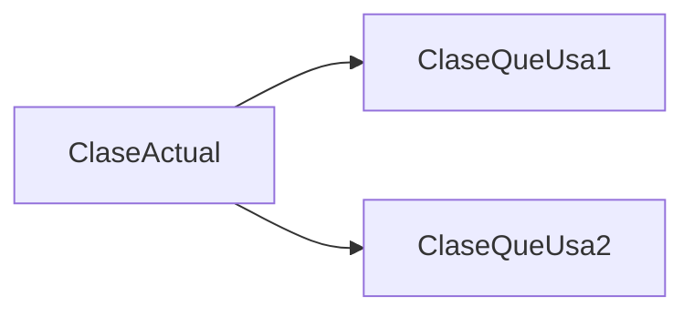
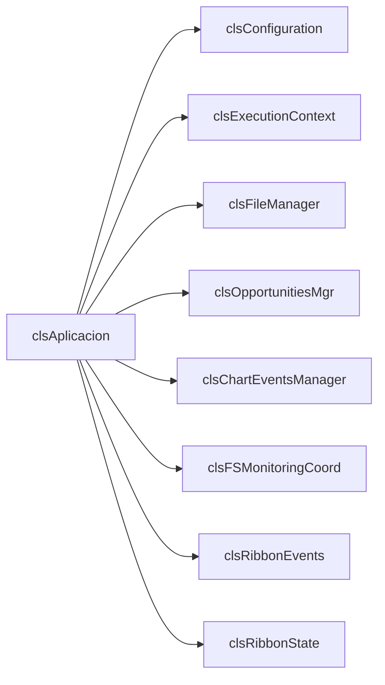
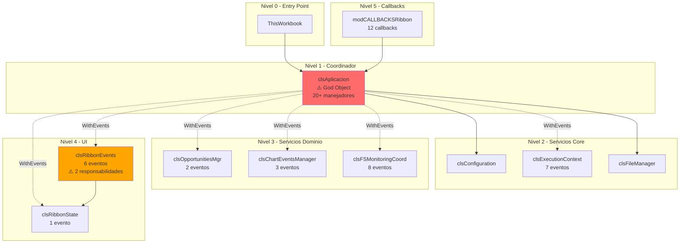
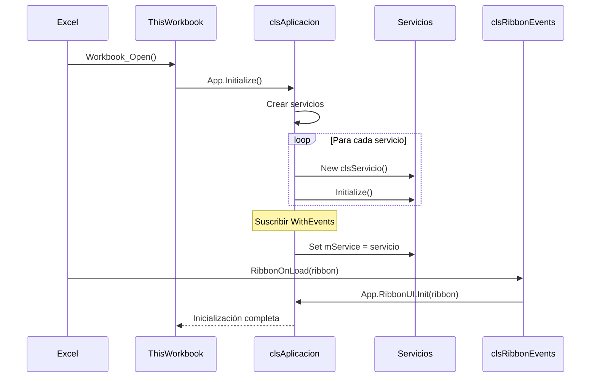
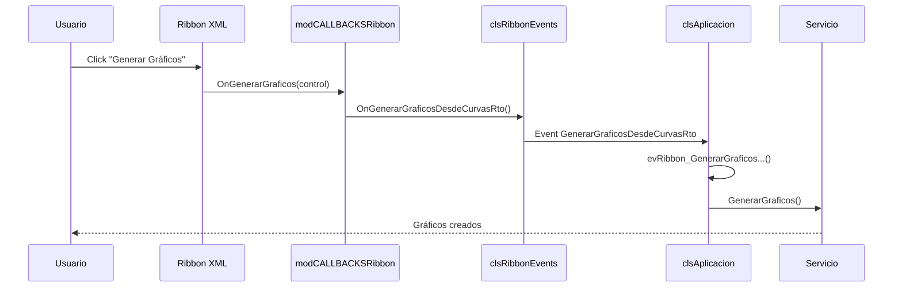
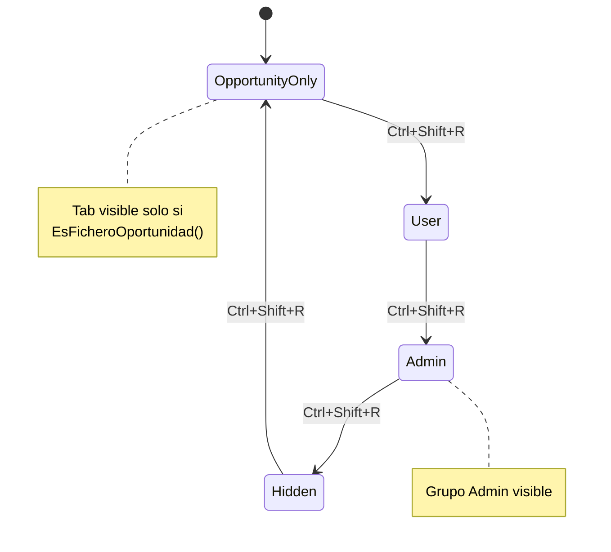
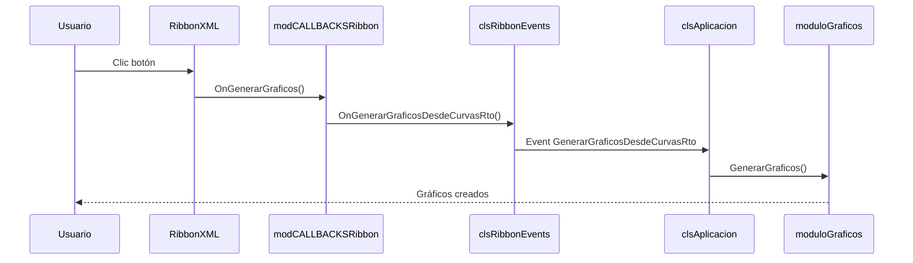
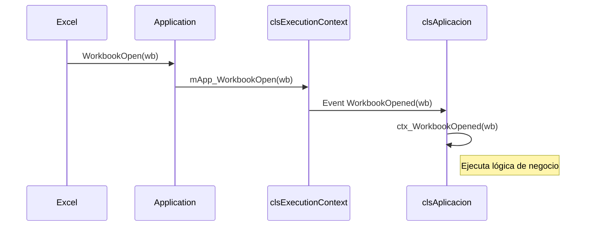

# INSTRUCCIONES PARA ANÁLISIS DE CÓDIGO (Agente @explore)

## 🎯 Objetivo

Documentar exhaustivamente la arquitectura **ACTUAL** del código VBA en este proyecto, generando información estructurada que será volcada en `CLAUDE.md`.

**IMPORTANTE:**

- ❌ NO modificar código
- ❌ NO proponer cambios aún
- ✅ SOLO documentar lo que existe

---

## 📖 ÍNDICE DE SECCIONES

1. [Inventario de Componentes](#sección-1-inventario-de-componentes)
2. [Grafos de Dependencias](#sección-2-grafos-de-dependencias)
3. [Inventario de Funcionalidad](#sección-3-inventario-de-funcionalidad)
4. [Patrones y Anti-Patrones](#sección-4-patrones-y-anti-patrones)
5. [Reglas y Restricciones](#sección-5-reglas-y-restricciones)
6. [Cómo Usar Este Documento](#sección-6-cómo-usar-este-documento)

---

## 📋 SECCIÓN 1: INVENTARIO DE COMPONENTES

> **Objetivo:** Documentar TODOS los componentes del proyecto con análisis crítico

### Prerequisito: Indexación de Archivos

**Antes de comenzar el inventario:**

1. Listar TODOS los archivos de código en el repositorio
2. Considerar solo archivos con extensiones: `.cls`, `.bas`, `.frm`
3. **TODOS los archivos del proyecto están en una sola carpeta**

**Comando sugerido:**

```bash
# Listar archivos por tipo
find . -name "*.cls" -o -name "*.bas" -o -name "*.frm"
```

---

### 1.1. Clases (.cls)

**Template a completar POR CADA CLASE:**

````markdown
#### 📦 [NombreClase]

**Ubicación:** `[NombreClase].cls` (líneas X-Y)

**Propósito:**
[Descripción en 1-2 frases de QUÉ hace esta clase]

**Responsabilidades:**
[Enumerar cada responsabilidad como item de lista]

- Responsabilidad 1
- Responsabilidad 2
- ...

**Atributos privados:**

```vba
[Copiar declaraciones Private completas, incluyendo tipos]
```

**WithEvents declarados:**

```vba
[Copiar líneas Private WithEvents ... si existen]
[Si no hay, escribir: "Ninguno"]
```

**Eventos que escucha:**
[Si tiene WithEvents, listar cada evento con formato:]

| Emisor | Evento  | Manejador         | Línea |
| ------ | ------- | ----------------- | ----- |
| clsX   | EventoY | nombreSub_EventoY | XXX   |

[Si no escucha eventos: "Ninguno"]

**Eventos que dispara:**
[Si tiene Public Event, listar:]

```vba
Public Event NombreEvento(params)
```

[Si no dispara eventos: "Ninguno (es consumidor final)"]

**Métodos públicos:**
[Listar TODOS con formato:]

```vba
Public Sub/Function Nombre(params) As TipoRetorno  ' Línea XXX
```

**Dependencias:**
[Diagrama Mermaid mostrando clases de las que depende:]



**Líneas de código:** [Número total de líneas de la clase]

**Complejidad estimada:** [Baja/Media/Alta]
[Criterio: Baja < 100 líneas, Media 100-300, Alta > 300]
````

**Ejemplo aplicado al código (rama main):**

````markdown
#### 📦 clsAplicacion

**Ubicación:** `clsAplicacion.cls` (líneas 1-456)

**Propósito:**
Coordinador principal de la aplicación. Crea todos los servicios, suscribe eventos, y expone facade de acceso.

**Responsabilidades:**

- Creación e inicialización de todos los servicios
- Suscripción centralizada a eventos (WithEvents)
- Exposición de facade para acceso a servicios
- Coordinación de respuestas a eventos
- Gestión del ciclo de vida de la aplicación

**Atributos privados:**

```vba
Private mExecutionContext As clsExecutionContext
Private mFileManager As clsFileManager
Private mOpportunitiesMgr As clsOpportunitiesMgr
Private mChartEventsManager As clsChartEventsManager
Private mFSMonitoringCoord As clsFSMonitoringCoord
Private mRibbonEvents As clsRibbonEvents
Private mRibbonState As clsRibbonState
Private mConfiguration As clsConfiguration
```

**WithEvents declarados:**

```vba
Private WithEvents ctx As clsExecutionContext
Private WithEvents mOpportunities As clsOpportunitiesMgr
Private WithEvents mChartMgr As clsChartEventsManager
Private WithEvents mFSMon As clsFSMonitoringCoord
Private WithEvents evRibbon As clsRibbonEvents
Private WithEvents mRibbonSt As clsRibbonState
```

**Eventos que escucha:**

| Emisor                | Evento                        | Manejador                              | Línea |
| --------------------- | ----------------------------- | -------------------------------------- | ----- |
| clsExecutionContext   | WorkbookOpened                | ctx_WorkbookOpened                     | 234   |
| clsExecutionContext   | SheetActivated                | ctx_SheetActivated                     | 245   |
| clsOpportunitiesMgr   | currOpportunityChanged        | mOpportunities_currOpportunityChanged  | 256   |
| clsChartEventsManager | ChartActivated                | mChartMgr_ChartActivated               | 278   |
| clsRibbonEvents       | GenerarGraficosDesdeCurvasRto | evRibbon_GenerarGraficosDesdeCurvasRto | 312   |

**Eventos que dispara:**
Ninguno (es consumidor final)

**Métodos públicos:**

```vba
Public Sub Initialize()                                    ' Línea 45
Public Sub Terminate()                                     ' Línea 123
Public Property Get Configuration() As clsConfiguration   ' Línea 156
Public Property Get FileManager() As clsFileManager       ' Línea 167
Public Property Get OpportunitiesMgr() As clsOpportunitiesMgr ' Línea 178
```

**Métodos privados:**
15 métodos privados (líneas 189-420)

**Dependencias:**



**Líneas de código:** 456

**Complejidad estimada:** Alta (God Object - múltiples responsabilidades)
````

---

### 1.2. Módulos (.bas)

**Template POR CADA MÓDULO:**

````markdown
#### 📄 [NombreModulo]

**Ubicación:** `[NombreModulo].bas` (líneas X-Y)

**Propósito:**
[Qué hace este módulo en 1 frase o 1 párrafo]

**Funciones públicas:**
[Listar TODAS:]

```vba
Public Sub/Function Nombre(params) As TipoRetorno  ' Línea XXX
```

**Funciones privadas (solo cantidad):**
[Ejemplo: "3 funciones privadas"]

**Dependencias / Patrón de delegación:**
[Si llama a clases/módulos, especificar:]

- Llama a: [clase/módulo] → [método]
- Patrón: [ej: "Callback XML → Delegación a clsAplicacion"]

**Líneas de código:** [Total]
````

---

### 1.3. Formularios (.frm)

**Template POR CADA FORMULARIO:**

````markdown
#### 🖼️ [NombreFormulario]

**Ubicación:** `[NombreFormulario].frm`

**Propósito / Responsabilidad:**
[Para qué se usa este formulario]

**Controles principales:**
[Listar controles importantes:]

- txtNombre (TextBox) - Entrada de nombre
- cmbOpciones (ComboBox) - Selector de opciones
- btnAceptar (CommandButton) - Confirma acción

**Eventos manejados:**
[Listar eventos como:]

```vba
Private Sub btnAceptar_Click()  ' Línea XX
Private Sub cmbOpciones_Change()  ' Línea YY
```

**Dependencias:**
[Si llama a clases/módulos para lógica de negocio]
````


---

### 1.4. Tabla de Eventos (Quién dispara → Quién escucha)

**Objetivo:** Vista global de TODOS los eventos del sistema

| Clase Emisora | Evento | Clase(s) Receptora(s) | Manejador | Línea |
|---------------|--------|----------------------|-----------|-------|
| clsExecutionContext | WorkbookOpened | clsAplicacion | ctx_WorkbookOpened | 234 |
| clsOpportunitiesMgr | currOpportunityChanged | clsAplicacion | mOpportunities_currOpportunityChanged | 256 |
| ... | ... | ... | ... | ... |

**Instrucciones:**
- Consolidar TODOS los eventos identificados en secciones 1.1-1.3
- Ordenar por clase emisora
- Incluir número de línea del manejador

---

### 1.5. UDFs (User Defined Functions)

**Objetivo:** Identificar funciones accesibles desde hojas de Excel

**Criterio de identificación:**
- Funciones `Public Function` en módulos `.bas`
- Con tipo de retorno (no `Sub`)
- Sin parámetros `ByRef` (Excel no los soporta en UDFs)

**Tabla de UDFs:**

| Función (firma completa) | Módulo | Línea | Dependencias Externas | Propósito |
|--------------------------|--------|-------|-----------------------|-----------|
| `Public Function ConvertUnits(valor As Double, from As String, to As String) As Double` | UDFs_Units | 45 | Ninguna | Conversión de unidades |
| `Public Function PropsSI(prop As String, input1 As String, ...) As Double` | UDFs_COOLPROP | 78 | CoolProp.dll (COM) | Propiedades termodinámicas |
| ... | ... | ... | ... | ... |

**Dependencias externas posibles:**
- Componentes COM (ActiveX)
- DLLs externas (ej: CoolProp.dll)
- Otros módulos VBA
- APIs de Windows

---

### 1.6. Macros de Excel

**Objetivo:** Identificar macros ejecutables (no UDFs)

**Criterio de identificación:**
- Procedimientos `Public Sub` en módulos `.bas`
- Sin parámetros O con parámetros simples
- Ejecutables desde: Ribbon, Botones, Atajos de teclado

**Tabla de Macros:**

| Macro (firma completa) | Módulo | Línea | Trigger | Dependencias | Propósito |
|------------------------|--------|-------|---------|--------------|-----------|
| `Public Sub GenerarGraficosSensibilidad()` | modMacrosGraficos | 123 | Botón Ribbon | clsChartManager | Genera gráficos |
| `Public Sub ToggleRibbonTab()` | modCALLBACKSRibbon | 456 | Ctrl+Shift+R | clsRibbonState | Cambia modo ribbon |
| ... | ... | ... | ... | ... | ... |

---

## 📊 SECCIÓN 2: GRAFOS DE DEPENDENCIAS

> **Objetivo:** Visualizar relaciones entre componentes

### 2.1. DIAGRAMAS ESTRUCTURALES

#### 2.1.1. Diagrama UML de Clases

**Generar diagrama Mermaid con TODAS las clases identificadas en Sección 1.1**

**Formato:**
````mermaid
classDiagram
	class NombreClase1 {
		-atributoPrivado1 Tipo
		-atributoPrivado2 Tipo
		+metodoPublico1() TipoRetorno
		+metodoPublico2() void
	}
	class NombreClase2 {
		-atributoPrivado Tipo
		+metodoPublico() TipoRetorno
	}

	NombreClase1 --> NombreClase2 : usa
	NombreClase1 ..> NombreClase3 : WithEvents
	NombreClase2 --|> IInterfaz : implementa
````

**Convenciones (CRÍTICAS):**

- `-->` : Dependencia directa (usa, crea instancia, llama métodos)
- `..>` : Dependencia de eventos (WithEvents)
- `--|>` : Implementa interfaz
- `-` : Atributo/método privado
- `+` : Atributo/método público

**Notas:**

- Incluir SOLO atributos y métodos públicos relevantes (no todos)
- Para clases muy grandes (>20 métodos), mostrar solo los principales

---

#### 2.1.2. Diagrama de Componentes por Nivel

**Agrupar componentes por nivel de abstracción**

**Criterio de niveles:**

- Nivel 0: Entry points (ThisWorkbook)
- Nivel 1: Coordinadores/Facades (clsAplicacion)
- Nivel 2: Servicios core (Configuration, ExecutionContext)
- Nivel 3: Servicios de dominio (OpportunitiesMgr, ChartManager)
- Nivel 4: UI (RibbonEvents, Formularios)
- Nivel 5: Callbacks/Utilidades (modCALLBACKSRibbon, modUtils)

**Ejemplo:**



**Leyenda:**

- 🔴 Rojo: God Object / Problema arquitectónico crítico
- 🟠 Naranja: Code smell / Responsabilidades mezcladas
- ➡️ Flecha sólida: Dependencia directa
- ⇢ Flecha punteada: WithEvents

---

#### 2.1.3. Matriz de Dependencias (Tabla de Acoplamiento)

**Tabla que muestra dependencias entre clases**

**Formato:**

|                         | clsConfig | clsExecCtx | clsFileMgr | clsOppMgr  | clsChartMgr |  clsFSMon  | clsRibbonEv | clsRibbonSt |
| ----------------------- | :-------: | :--------: | :--------: | :--------: | :---------: | :--------: | :---------: | :---------: |
| **clsAplicacion**       |     ✓     | WithEvents |     ✓      | WithEvents | WithEvents  | WithEvents | WithEvents  | WithEvents  |
| **clsFileManager**      |           | WithEvents |            |            |             |            |             |             |
| **clsRibbonEvents**     |           |            |            |            |             |            |             |      ✓      |
| **clsOpportunitiesMgr** |     ✓     |            |     ✓      |            |             |            |             |             |

**Leyenda:**

- ✓ : Usa directamente (llama métodos, lee properties)
- WithEvents : Suscripción a eventos
- (vacío) : Sin dependencia

**Análisis de acoplamiento:**
[Añadir después de la tabla:]

- ⚠️ **clsAplicacion:** Acoplado a 8 clases (alto acoplamiento aferente - God Object)
- ⚠️ **[Clase X] → [Clase Y]:** Acoplamiento circular detectado
- ✅ **[Clase Z]:** Bajo acoplamiento (solo 1-2 dependencias)

---

### 2.2. DIAGRAMAS DE COMPORTAMIENTO

> **Objetivo:** Mostrar interacciones dinámicas entre componentes
> Los diagramas se representarán en lenguaje Mermaid.

#### 2.2.1. Diagramas de Secuencia para Análisis de Arquitectura (Flujos Críticos)

Elaborar diagramas de secuencia UML que modelen la interacción de arquitectura para los escenarios genéricos siguientes:

- escenario 1: Diagrama maestro de Inicialización/Carga de la Aplicación: Secuencia desde que Excel abre el libro XLAM hasta que la aplicación está lista.
- escenario 2: Diagrama de Cierre/Gestión de Persistencia: Cómo la aplicación guarda su estado, cierra conexiones y se limpia antes de que Excel cierre.
- escenario 3: el control COM supervisor de ficheros detecta cambios en cualquier carpeta supervisada (analizar el caso en que en una carpeta se cree una subcarpeta)
- escenario 4: la instancia de clsApplication detecta la pérdida de referencia a la instancia del Ribbon (representar el diagrama de secuencia partiendo desde el punto en el que se unifica la gestión la pérdida de la referencia al ribbon)
- escenario 5: Ejecución de una Macro/Comando Genérico: elaboración de un diagrama para un patrón abstracto, para "cualquier acción" iniciada desde la cinta (Ribbon) o un botón. Cuando se indica xx, el sistema debe interpretar que debe:
- elegir UNA operación compleja y representativa, y hacer un diagrama para ella.
- o, si la gestión de eventos del ribbon tiene un cauce unificado, representar el diagrama de secuencia partiendo desde el punto donde se unifica la gestión de eventos del ribbon.

Contexto Arquitectónico:

Capa de Presentación/Interfaz: Excel con una hoja de cálculo abierta y el objeto Application de Excel.

Capa de Lógica de Aplicación/Orquestación: La clase principal que coordina la operación.

Capa de Lógica de Negocio: Las clases de negocio que se inicializan por defecto.

Capa de Acceso a Datos y Servicios: Módulos con funciones UDF, módulos de macros, y posibles conexiones a bases de datos, APIs externas o servicios COM.

Sistema Externo: La aplicación de Excel en sí misma como host y cualquier base de datos externa.

Pautas para los Diagramas:

Actores Principales: Usuario (desde Excel), Excel Application.

Objetos/Líneas de Vida: :HojaDeCalculo -> :Application (Excel) (-> :Ribbon, si interviene) -> ...

Flujo:

Excel (Application) invoca a la clase principal.

La instancia de clase principal...

[la IA debe completar la descripción del flujo, para cada escenario]
...

El diagrama debe reflejar los mensajes de retorno (líneas punteadas) para cada llamada que tenga respuesta.

Opcionalmente, marca una sección crítica o un bucle si el proceso implica iteraciones.

Salida Esperada: diagramas de secuencia claros que muestren la colaboración entre, y el flujo a través de, las diferentes capas del complemento VBA, útil para entender dependencias y flujo de control. El diagrama debe enfatizar, en su caso, el flujo de control entre las capas y el paso de datos transformados.

**Ejemplo 1: Inicialización del Add-In**



**Ejemplo 2: Usuario hace clic en botón Ribbon**



**Instrucciones:**

- Identificar 3-5 flujos críticos del sistema
- Generar diagrama de secuencia para cada uno
- Incluir actores externos (Usuario, Excel, Sistema de Archivos)

---

#### 2.2.2. Diagrama de Máquina de Estados para componentes de interfaz (Ribbon)

**Si aplica:** Para los "dueños del estado" (stateful objects) / componentes con estados bien definidos (ej: Ribbon Mode)

- Entidad de Negocio Principal: clsAplicacion
- Componente de UI Complejo: Ribbon.
  **Salida Esperada:** Un diagrama que capture el ciclo de vida completo de esta entidad central, definiendo claramente los estados válidos y las operaciones permitidas en cada uno.

##### 2.2.2.1. Diagrama de Máquina de Estados para el ribbon (Componente de Interfaz (UI))

Elaborar un diagrama de máquina de estados UML para el ribbon.

Es necesario identificar estados Posibles del ribbon, y eventos / transiciones entre estados.

Salida Esperada: Un diagrama que modele el ciclo de vida de la interfaz ribbon, crucial para entender su comportamiento reactivo y evitar estados inconsistentes.

##### 2.2.2.2. Diagrama de Máquina de Estados para una Entidad de Negocio (Domain Object)

Elaborar un diagrama de máquina de estados UML para la clase de negocio / entidad "clsOportunity", que representa una oportunidad comercial, con un ciclo de vida gestionado por la aplicación.

Estados, y Eventos/Transiciones (Acciones/Métodos), de la entidad clsOportunity: a determinar por la IA

**Ejemplo:**



**Instrucciones:**

- Identificar componentes con estados (RibbonMode, ApplicationState, etc.)
- Documentar transiciones
- Indicar condiciones de cada estado

## 📋 SECCIÓN 3: INVENTARIO DE FUNCIONALIDAD

> **Objetivo:** Documentar QUÉ hace el sistema (agnóstico de implementación)

### 3.1. Tabla de Funcionalidades Esperadas

> **Importante:** Esta sección documenta QUÉ hace el sistema, NO CÓMO. **Esta tabla es AGNÓSTICA de implementación**
> La implementación específica se detalla en subsección 3.2

Identificar **TODAS** las funcionalidades que el sistema proporciona.

**Formato de tabla:**


- Columna 1: ID único (será igual en ambas ramas)
- Columna 2: Descripción funcional
- Columna 3: Actor/Trigger
- Columna 4: Resultado esperado

| ID   | Funcionalidad | Actor/Trigger | Resultado Esperado |
| ---- | ------------- | ------------- | ------------------ |
| F001 | ...           | ...           | ...                |

**Ejemplos:**
| ID | Funcionalidad | Actor/Trigger | Resultado Esperado |
|----|---------------|---------------|-------------------|
| **F001** | Generar gráficos de sensibilidad | Usuario hace clic en botón "Generar Gráficos" del ribbon | Se crean gráficos de sensibilidad en hoja activa basados en curvas de rendimiento |
| **F002** | Invertir ejes de gráfico activo | Usuario hace clic en "Invertir Ejes" con gráfico seleccionado | Los ejes X e Y del gráfico se intercambian |
| **F003** | Formatear hoja CGASING | Usuario hace clic en "Formatear CGASING" estando en hoja CGASING | Aplica formato estándar a la hoja (colores, anchos, etc.) |
| **F004** | Abrir configuración | Usuario hace clic en "Configurador" | Se abre formulario frmConfiguracion con rutas y parámetros |
| **F005** | Crear nueva oportunidad | Usuario hace clic en "Nueva Oportunidad" | Se crea carpeta de oportunidad con estructura de plantilla |
| **F006** | Seleccionar oportunidad | Usuario selecciona item en dropdown "Oportunidades" | Cambia la oportunidad activa del sistema |
| **F007** | Cambiar modo ribbon | Usuario presiona Ctrl+Shift+R | Ribbon cambia entre modos: Admin → Hidden → User → OpportunityOnly → Admin |
| **F008** | Mostrar/ocultar tab ribbon según modo | Cambio de modo ribbon | Tab "Ofertas Especial" visible/oculto según modo y contexto |
| **F009** | Mostrar/ocultar grupo Admin | Cambio de modo ribbon | Grupo "Admin" visible solo en modo Admin |
| **F010** | Habilitar/deshabilitar botón "Generar Gráficos" | Cambio de hoja activa | Botón habilitado solo si es fichero oportunidad Y hoja válida |
| **F011** | Habilitar/deshabilitar botón "Invertir Ejes" | Activar/desactivar gráfico | Botón habilitado solo si hay gráfico activo Y es invertible |
| **F101** | Detectar nueva carpeta de oportunidad | Sistema de archivos crea carpeta en ruta monitoreada | Lista de oportunidades se actualiza automáticamente |
| **F102** | Detectar eliminación de oportunidad | Sistema de archivos elimina carpeta monitoreada | Lista de oportunidades se actualiza |
| **F103** | Detectar cambio en plantilla | Sistema de archivos modifica archivo de plantilla | (Evento capturado, acción TBD) |
| **F104** | Detectar cambio en archivo Gas | Sistema de archivos modifica archivo .gas | (Evento capturado, acción TBD) |
| **F201** | Convertir unidades | Usuario usa fórmula `=ConvertUnits(valor, "from", "to")` | Devuelve valor convertido |
| **F202** | Propiedades termodinámicas | Usuario usa fórmula `=PropsSI("P", "T", 300, "Q", 1, "Water")` | Devuelve propiedad de CoolProp |
| **F203** | Cálculos CGASING | Usuario usa fórmulas `=CGASING_*` | Devuelve cálculos específicos de dominio |

**Total funcionalidades documentadas:** XX

**Criterios para identificar funcionalidades:**

1. **Ribbon:** Cada botón/control = 1 funcionalidad
2. **Automatización:** Cada evento de monitorización que ejecuta acción = 1 funcionalidad
3. **UDFs:** Agrupar por módulo (ej: "Conversión de unidades" abarca varias UDFs)

**Convención de IDs:**

- `F001-F099`: Funcionalidades de usuario (Ribbon, menús)
- `F100-F199`: Funcionalidades automáticas (monitorización, eventos)
- `F200-F299`: UDFs por categoría

#### 3.2. Implementación Actual de Cada Funcionalidad

Para **CADA** funcionalidad de 3.1, documentar CÓMO está implementada, el flujo técnico:

**Template:**

#### Implementación de [ID] - [Nombre Funcionalidad]

**Flujo técnico:**

1. [Paso 1: Dónde empieza]
2. [Paso 2: Qué clase/módulo maneja]
3. [Paso 3: Qué hace]
4. [Paso 4: Resultado final]

**Diagrama de secuencia:**

```mermaid
sequenceDiagram
	Actor->>ComponenteA: acción
	ComponenteA->>ComponenteB: llama método
	ComponenteB-->>Actor: resultado
```

**Archivos involucrados:**

- `archivo1.cls` líneas X-Y
- `archivo2.bas` línea Z

**Ejemplo:**

#### Implementación de F001 - Generar gráficos de sensibilidad

**Flujo técnico paso a paso:**

1. Ribbon XML define: `<button id="btnGenerarGraficos" onAction="OnGenerarGraficos"/>`
2. Excel invoca callback: `modCALLBACKSRibbon.OnGenerarGraficos(control)`
3. Callback delega: `App.RibbonEvents.OnGenerarGraficosDesdeCurvasRto()`
4. clsRibbonEvents dispara evento: `RaiseEvent GenerarGraficosDesdeCurvasRto`
5. clsAplicacion maneja evento: `evRibbon_GenerarGraficosDesdeCurvasRto()`
6. clsAplicacion ejecuta lógica: [Llamada a módulo/clase específica]

**Diagrama de secuencia:**



**Archivos involucrados:**

- `modCALLBACKSRibbon.bas` línea 45
- `clsRibbonEvents.cls` líneas 123-126
- `clsAplicacion.cls` líneas 234-267
- `modGraficos.bas` líneas 89-150 (implementación real)

**Estado actual:**

- ✅ Funciona correctamente
- ⚠️ Lógica dispersa en múltiples ubicaciones
- 📝 Candidato para refactorización (centralizar en servicio)

---

**Instrucciones:**

- Repetir plantilla anterior para CADA funcionalidad de tabla 3.1
- Si flujo es muy complejo (>10 pasos), usar diagrama de secuencia
- Incluir SIEMPRE archivos + líneas involucradas

---

## 🔍 SECCIÓN 4: ARQUITECTURA, PATRONES Y ANTI-PATRONES ACTUALES

> **Objetivo:** Identificar patrones de diseño y problemas arquitectónicos

### 4.1. Patrones Correctos Identificados

Para cada patrón de diseño correctamente implementado:

**Template:**

````markdown
#### Patrón X: [Nombre del Patrón]

**Ubicación:** [Clase/Módulo donde se aplica]

**Descripción:**
[Explicar en qué consiste el patrón en 2-3 frases]

**Ejemplo de código:**

```vba
[Extracto relevante del código]
```

**Diagrama (si aplica):**

```mermaid
[Diagrama que ilustra el patrón]
```

**Ventajas observadas:**

- [Ventaja 1]
- [Ventaja 2]
````

**Ejemplos:**

#### Patrón 1: Wrapper de Eventos COM

**Ubicación:** clsExecutionContext
**Descripción:** Encapsula eventos de Application y los re-emite como eventos propios
**Ventajas:**

- Desacopla código de COM
- Permite múltiples suscriptores (Application solo permite 1)
- Facilita testing (se puede mockear clsExecutionContext)

**Ejemplo de código:**

```vba
' En clsExecutionContext
Private WithEvents mApp As Application

Private Sub mApp_WorkbookOpen(ByVal Wb As Workbook)
	' Re-emitir como evento propio
	RaiseEvent WorkbookOpened(Wb)
End Sub

' En clsAplicacion
Private WithEvents ctx As clsExecutionContext

Private Sub ctx_WorkbookOpened(ByVal wb As Workbook)
	' Múltiples suscriptores pueden escuchar
End Sub
```

**Diagrama:**



**Ventajas observadas:**

- ✅ Desacopla código de COM
- ✅ Permite múltiples suscriptores
- ✅ Facilita testing

**Patrón formal:** Wrapper / Adapter Pattern

---

#### Patrón 2: Facade

**Ubicación:** clsAplicacion
**Descripción:** Proporciona interfaz simplificada de acceso a servicios

**Ejemplo de código:**

```vba
' En clsAplicacion
Private mConfiguration As clsConfiguration

Public Property Get Configuration() As clsConfiguration
	Set Configuration = mConfiguration
End Property

' Uso desde cualquier parte
strRutaBase = App.Configuration.RutaBase
```

**Ventaja:** Acceso sencillo sin exponer detalles de creación

---

**Instrucciones:**

- Identificar AL MENOS 5 patrones correctos
- Usar nombres formales de patrones (Gang of Four, Martin Fowler)
- Incluir ejemplo de código y diagrama si ayuda

---

### 4.2. Anti-Patrones Identificados

Para cada anti-patrón detectado:

**Template:**

````markdown
#### Anti-Patrón X: [Nombre formal del anti-patrón]

**Ubicación:** [Clase/Módulo afectada]

**Síntomas:**

- [Síntoma 1]
- [Síntoma 2]

**Evidencia en código:**

```vba
[Extracto que demuestra el anti-patrón]
```

**Consecuencias:**

- [Consecuencia negativa 1]
- [Consecuencia negativa 2]

**Anti-patrón formal:** [Referencia a nombre estándar: God Object, Spaghetti Code, etc.]

**Solución objetivo:**
[Descripción breve de cómo debería ser - SIN implementar aún]
````

**Ejemplos:**

#### Anti-Patrón 1: God Object

**Ubicación:** clsAplicacion

**Síntomas:**

- 456 líneas de código
- 8 dependencias directas (clsConfiguration, clsExecutionContext, ...)
- 20+ manejadores de eventos (ctx_WorkbookOpened, mOpportunities_currOpportunityChanged, ...)
- Mezcla 3 responsabilidades:
  1. Creación de servicios (Composition Root)
  2. Coordinación de eventos (Mediator)
  3. Exposición de facade (Facade Pattern)

**Evidencia en código:**

```vba
' clsAplicacion hace DEMASIADO

' 1. Crea servicios
Private Sub Initialize()
	Set mConfiguration = New clsConfiguration
	Set mFileManager = New clsFileManager
	' ... 6 más
End Sub

' 2. Coordina 20+ eventos
Private Sub ctx_SheetActivated(sh As Object)
	' Lógica de coordinación
End Sub

Private Sub mOpportunities_currOpportunityChanged(...)
	' Más coordinación
End Sub

' 3. Expone facade
Public Property Get FileManager() As clsFileManager
	Set FileManager = mFileManager
End Property
```

**Consecuencias:**

- ❌ Difícil de testear (necesitas TODO para testear UNA cosa)
- ❌ Viola SRP (Single Responsibility Principle)
- ❌ Cualquier cambio requiere tocar esta clase (violación OCP)
- ❌ Alta complejidad ciclomática

**Anti-patrón formal:** God Object (también conocido como God Class, Blob)

**Solución objetivo:**
Split en 3 clases separadas:

- `clsCompositionRoot` - Solo creación de servicios
- `clsEventCoordinator` - Solo coordinación de eventos
- `clsAplicacion` - Solo facade (propiedades Get)

**Severidad:** 🔴 **CRÍTICA** (bloquea escalabilidad)

**Prioridad de corrección:** Sprint 1 (infraestructura base)

#### Anti-Patrón 2: Responsabilidad Mezclada

**Ubicación:** clsRibbonEvents
**Problema:** Mezcla 2 responsabilidades:

1. Gestión del puntero IRibbonUI (Init, Invalidar, Recuperar)
2. Disparar eventos de acciones de usuario

**Evidencia:**

```vba
' clsRibbonEvents

' Responsabilidad 1: Gestión IRibbonUI
Private mribbonUI As IRibbonUI
Public Sub Init(ByRef ribbonObj As IRibbonUI)
Public Sub InvalidarRibbon()
Private Function TryAutoRecover() As Boolean

' Responsabilidad 2: Eventos de acciones
Public Event GenerarGraficosDesdeCurvasRto()
Public Sub OnGenerarGraficosDesdeCurvasRto()
	RaiseEvent GenerarGraficosDesdeCurvasRto
End Sub
```

**Violación:** SRP - una clase, dos razones para cambiar

**Solución objetivo:**

- `clsRibbonUI`: Solo gestión de IRibbonUI
- `clsRibbonState`: Solo eventos de acciones

---

#### Anti-Patrón 3: Acoplamiento Circular

**Ubicación:** clsFileManager ↔ clsExecutionContext
**Problema:**

```vba
' clsFileManager
Private WithEvents ctx As clsExecutionContext  ' Depende de ExecutionContext

' clsExecutionContext
' Dispara eventos que FileManager escucha
```

**Consecuencias:**

- Orden de inicialización crítico
- Imposible testear uno sin el otro

**Solución objetivo:**

- Invertir dependencia con EventCoordinator como intermediario

---

#### Anti-Patrón 4: Lógica de Negocio en Callback

**Ubicación:** clsRibbonEvents.GetRibbonControlEnabled
**Problema:**

```vba
Public Function GetRibbonControlEnabled(control As IRibbonControl) As Boolean
	Select Case control.id
	Case "btnInvertirSeries"
		enabled = EsFicheroOportunidad()  ' ← Lógica de negocio
		If enabled Then enabled = EsValidoInvertirEjes()  ' ← Lógica de negocio
```

**Violación:** Callback de UI contiene lógica de dominio

**Solución objetivo:**

- Callback solo consulta estado: `App.Context.CanInvertAxes`
- Lógica se mueve a servicio de dominio

---

**Instrucciones:**

- Identificar AL MENOS 3 anti-patrones
- Usar nombres formales de anti-patrones (SourceMaking, Code Smells)
- Incluir evidencia de código
- Asignar severidad: 🟢 Baja / 🟡 Media / 🟠 Alta / 🔴 Crítica
- NO proponer solución detallada aquí (eso va a POOL_PROPUESTAS.md)
- SÍ mencionar "solución objetivo" de alto nivel

---

### 4.3. Tabla de Deuda Técnica

**Consolidar TODOS los problemas identificados:**

| ID     | Problema                 | Ubicación                               | Anti-patrón Formal     | Severidad  | Esfuerzo Corrección | Prioridad |
| ------ | ------------------------ | --------------------------------------- | ---------------------- | ---------- | ------------------- | --------- |
| TD-001 | God Object               | clsAplicacion                           | God Object             | 🔴 Crítica | Alto (16-24h)       | Sprint 1  |
| TD-002 | Acoplamiento circular    | clsFileManager ↔ clsExecutionContext    | Circular Dependency    | 🟠 Alta    | Medio (8h)          | Sprint 2  |
| TD-003 | Lógica en callback       | clsRibbonEvents.GetRibbonControlEnabled | Business Logic in UI   | 🟡 Media   | Bajo (2h)           | Sprint 3  |
| TD-004 | Responsabilidad mezclada | clsRibbonEvents                         | Mixed Responsibilities | 🟠 Alta    | Medio (6h)          | Sprint 2  |
| ...    | ...                      | ...                                     | ...                    | ...        | ...                 | ...       |

**Criterios de severidad:**

- 🔴 Crítica: Bloquea escalabilidad / Alta probabilidad de bugs
- 🟠 Alta: Dificulta mantenimiento significativamente
- 🟡 Media: Mejora recomendada pero no urgente
- 🟢 Baja: Optimización / Mejora marginal

**Criterios de esfuerzo:**

- Bajo: < 4 horas
- Medio: 4-16 horas
- Alto: > 16 horas

**Criterios de prioridad:**

- Sprint 1: Infraestructura base (crítico para todo lo demás)
- Sprint 2: Servicios core
- Sprint 3: Servicios de dominio
- Sprint 4: UI / Optimizaciones

---

## 🔍 SECCIÓN 5: REGLAS Y RESTRICCIONES PARA EL ANÁLISIS

> **Objetivo:** Documentar reglas de codificación y limitaciones técnicas

### 5.1. Reglas de Codificación VBA del Proyecto

#### 5.1.1. Codificación de Archivos

⚠️ CRÍTICO - OBLIGATORIO
- Todos los ficheros .cls, .bas, .frm en ANSI (Windows-1252)
- NO usar UTF-8 (incompatible con editor VBA de Office 365)
- Acentos y ñ funcionan correctamente en ANSI
- Verificar codificación antes de commit Git


#### 5.1.2. Convenciones de Nombres

**Variables:**

```vba
' Formato: [ámbito][tipo]NombreDescriptivo

' Correctos:
Dim lstrNombre As String        ' local, string
Dim mcolOportunidades As Collection  ' módulo, collection
Dim gdblTasa As Double          ' global, double

' Incorrectos:
Dim nombre As String            ' ❌ Falta ámbito y tipo
Dim m_strNombre As String       ' ❌ NO usar guión bajo
```

**Tipos comunes:**

- `str` - String
- `lng` - Long
- `dbl` - Double
- `bln` - Boolean
- `obj` - Object
- `col` - Collection
- `dic` - Dictionary
- `rng` - Range
- `ws` - Worksheet
- `wb` - Workbook

**Procedimientos:**

```vba
' NO usar guiones bajos (excepto eventos VBA)
Public Sub CalcularTotal()      ' ✅ Correcto
Public Sub Calcular_Total()     ' ❌ Incorrecto

' Eventos VBA SÍ usan guión bajo
Private Sub Workbook_Open()     ' ✅ Correcto (evento)
```

#### 5.1.3. Gestión de Errores

**Template obligatorio:**

```vba
Public Sub/Function NombreProcedimiento(params)
	Const PROC_NAME As String = "NombreProcedimiento"
	On Error GoTo ErrorHandler

	' ... código principal ...

CleanExit:
	' Liberar objetos en orden inverso
	Set obj3 = Nothing
	Set obj2 = Nothing
	Set obj1 = Nothing
	Exit Sub/Function

ErrorHandler:
	LogError MODULE_NAME, PROC_NAME, Err.Number, Err.Description
	Resume CleanExit
End Sub/Function
```

**❌ NUNCA hacer esto:**

```vba
On Error Resume Next
' ... 50 líneas de código sin restaurar manejo de errores ...
```

**✅ En su lugar:**

```vba
On Error Resume Next
operacionQuePuedeFallar
Dim errNum As Long: errNum = Err.Number
On Error GoTo 0  ' ← Restaurar

If errNum <> 0 Then
	' Manejar error
End If
```

---

### 5.2. Limitaciones de VBA

#### 5.2.1. Limitaciones del Lenguaje

```vba
' ❌ NO existe en VBA:
' - Namespaces
' - Genéricos (Generics)
' - LINQ
' - Async/Await
' - Destructuring
' - Null coalescing operator (??)
' - String interpolation

' ✅ Alternativas:
' - Namespaces → Prefijos (cls*, mod*)
' - Genéricos → Object + Late Binding
' - LINQ → Bucles + Collections
```

#### 5.2.2. Limitaciones de Eventos

```vba
' ❌ NO se puede:
' - WithEvents en módulos .bas (solo .cls)
' - WithEvents de interfaces (solo clases concretas)
' - Eventos con más de 8 parámetros
' - Eventos con parámetros ByRef Object

' ✅ Workarounds:
' - Callbacks ribbon → .bas delega a .cls
' - Interfaces → Usar clase concreta con WithEvents
' - Múltiples parámetros → Usar Type/Class contenedor
```

#### 5.2.3. Limitaciones de COM

```vba
' ⚠️ Problemas conocidos:

' 1. IRibbonUI puede perderse (bug de Excel)
'    Solución: Recuperación automática (ver clsRibbonEvents)

' 2. FileSystemWatcher falla si carpeta no existe
'    Solución: Validar ruta antes de iniciar

' 3. Application.WorkbookOpen NO se dispara para el add-in
'    Solución: Inicializar en ThisWorkbook_Open
```

---

### 5.3. Restricciones de Arquitectura

#### 5.3.1. Orden de Inicialización CRÍTICO

```vba
' ⚠️ OBLIGATORIO respetar este orden:

' 1. Logger (primero de todo)
InitLogger LOG_DEBUG, True, ruta

' 2. Configuration (lee registro Windows)
Set mConfiguration = New clsConfiguration

' 3. Servicios sin dependencias
Set mExecutionContext = New clsExecutionContext
mExecutionContext.Initialize

' 4. Servicios con dependencias
Set mFileManager = New clsFileManager
mFileManager.Initialize  ' Necesita ExecutionContext

' 5. RibbonEvents (ÚLTIMO)
' Se inicializa en callback RibbonOnLoad, NO en Initialize

' ❌ NUNCA inicializar RibbonEvents antes que otros servicios
```

**Razón:** Eventos pueden dispararse antes de que servicios estén listos.

#### 5.3.2. Registro de Add-In

```vba
' ⚠️ Rutas en registro Windows:
' HKEY_CURRENT_USER\Software\ABC\Ofertas\
'   - RutaBase (String)
'   - RutaPlantillas (String)
'   - SAM (String)

' clsConfiguration lee estas rutas
' Si no existen → mostrar frmConfiguracion
```

#### 5.3.3. Dependencias Externas

```vba
' CoolProp.dll
' - Versión: 6.4.1
' - Ubicación: Misma carpeta que .xlam O system32
' - Si no disponible: UDFs devuelven #VALUE!

' FileSystemWatcher (COM)
' - Parte de .NET Framework
' - Windows 7+
' - Si no disponible: clsFSWatcher falla al crear
```

---

### 5.4. Qué SÍ Está Permitido Hacer

✅ **PERMITIDO en análisis:**

- Leer cualquier archivo del proyecto
- Ejecutar búsquedas de texto
- Generar diagramas Mermaid
- Crear archivos markdown con hallazgos
- Usar diagramas como referencia
- Consultar inventario de funcionalidad
- Anotar observaciones y preguntas
- Identificar y revisar patrones y anti-patrones
- Contar líneas de código
- Mapear dependencias
- Analizar acoplamiento
- Medir complejidad ciclomática
- Sugerir mejoras (añadirlas a POOL_PROPUESTAS.md)

---

### 5.5. Qué NO Está Permitido Hacer

❌ **PROHIBIDO:**

- Modificar código existente (.cls, .bas, .frm)
- Crear nuevas clases/módulos VBA
- Eliminar archivos de código
- Implementar soluciones (eso va después del análisis)
- Asumir sin verificar (siempre buscar en código)
- Omitir componentes por considerar que "no son importantes"
- Generar análisis parcial (debe ser EXHAUSTIVO)

❌ **NUNCA asumas:**

- Que una función existe sin buscarla en el código
- Que un evento se dispara sin verificar las declaraciones
- Que una dependencia está registrada sin comprobar
- Que el orden de inicialización es flexible (NO lo es)
- Que un componente "no es importante" (todos lo son)

✅ **SIEMPRE verifica:**

- Busca en archivos de código
- Consulta tabla de eventos (Sección 1.4)
- Revisa grafo de dependencias (Sección 2)
- Confirma orden en Sección 5.3.1

---

### Pautas de recopilación:

1. **Exhaustividad:** Analizar TODOS los archivos `.cls`, `.bas`, `.frm` sin excepción

2. **Precisión:** Usar números de línea exactos

3. **Evidencia:** Siempre incluir extractos de código como evidencia

4. **Estructura:** Seguir los templates exactamente

5. **Neutral:** Describir lo que existe, no juzgar aún (juicio va en Sección 4.2)

---

## 🎯 SECCIÓN 6: CRITERIOS DE ACEPTACIÓN DEL ANÁLISIS

Antes de dar por completado el análisis, verificar:

### ✅ Checklist de Completitud

- [ ] **Sección 1:** Todas las clases (.cls) inventariadas (0 omisiones)
- [ ] **Sección 1:** Todos los módulos (.bas) inventariados (0 omisiones)
- [ ] **Sección 1:** Todos los formularios (.frm) inventariados (0 omisiones)
- [ ] **Sección 2:** Diagrama UML de clases generado y validado
- [ ] **Sección 2:** Diagrama por niveles generado y validado
- [ ] **Sección 2:** Matriz de acoplamiento completa
- [ ] **Sección 3:** TODAS las funcionalidades de usuario documentadas
- [ ] **Sección 3:** Cada funcionalidad tiene su flujo técnico documentado
- [ ] **Sección 3:** Al menos 3 diagramas de secuencia para flujos críticos
- [ ] **Sección 4:** Al menos 3 patrones correctos identificados
- [ ] **Sección 4:** Al menos 3 anti-patrones identificados con evidencia
- [ ] **Sección 4:** Tabla de deuda técnica con severidades asignadas
- [ ] **CHANGELOG:** Primera entrada registrada
- [ ] **Documento CLAUDE.md** generado y revisado
- [ ] **Revisión humana:** Secciones 3 y 4 validadas

### Criterios de Calidad

- [ ] Números de línea presentes en todas las referencias de código
- [ ] Todos los diagramas Mermaid renderizan correctamente
- [ ] Evidencia de código incluida para cada anti-patrón
- [ ] No hay secciones con "TODO" o "Pendiente"
- [ ] Todos los templates completos (sin campos vacíos)
- [ ] Referencias cruzadas correctas (ej: "ver Sección 2.1")

---

## 📚 SECCIÓN 7: CÓMO USAR ESTAS INSTRUCCIONES / ESTE DOCUMENTO

> **Objetivo:** Guías de uso para IA y humano

### 7.1. Workflow para Recopilación de Información

```
PASO 1: Inventariar componentes (Sección 1)
├─ 1.1. Listar todas las clases → generar entrada por cada una
├─ 1.2. Listar todos los módulos → generar entrada por cada uno
└─ 1.3. Listar formularios → generar entrada por cada uno
├─ 1.4. Consolidar tabla de eventos
├─ 1.5. Identificar UDFs
└─ 1.6. Identificar Macros
	↓
PASO 2: Generar grafos (Sección 2)
├─ 2.1. Diagrama UML con todas las clases inventariadas
├─ 2.2. Diagrama por niveles
└─ 2.3. Matriz de acoplamiento
├─ 2.2.1. Diagramas de secuencia (3-5 flujos)
└─ 2.2.2. Diagrama de máquina de estados (si aplica)
	↓
PASO 3: Identificar funcionalidades (Sección 3)
├─ 3.1. Tabla de funcionalidades (QUÉ hace el sistema)
└─ 3.2. Implementación de cada funcionalidad (CÓMO lo hace)
	↓
PASO 4: Documentar patrones (Sección 4)
├─ 4.1. Patrones correctos (mínimo 3)
├─ 4.2. Anti-patrones (mínimo 3)
└─ 4.3. Tabla de deuda técnica
	↓
PASO 5: Revisar completitud (Sección 6.3)
├─ ¿Están TODOS los componentes inventariados?
├─ ¿Todas las funcionalidades documentadas?
├─ ¿Todos los diagramas generados?
└─ Si falta algo → volver al paso correspondiente

FASE FINAL: Validación (antes de implementar)
├─ Verificar que entiendes TODAS las dependencias (Sección 2)
├─ Confirmar que conoces TODAS las funcionalidades (Sección 3)
└─ Revisar restricciones (Sección 5.3)
```

---

### 7.2. Escenarios de Uso

#### Escenario 1: "¿Por dónde empiezo?"

```
1. Ejecuta: @explore Lista todos los archivos .cls, .bas, .frm
2. Espera resultado
3. Para cada archivo → completa template de Sección 1
4. Continúa con Sección 2
```

#### Escenario 2: "¿Cómo documento una clase?"

```
1. Abre template de Sección 1.1
2. Busca la clase en el código
3. Completa cada campo del template
4. Genera diagrama de dependencias Mermaid
5. Añade al documento CLAUDE.md en construcción
```

#### Escenario 3: "Ya terminé inventario, ¿qué sigue?"

```
1. Revisa que Sección 1 esté completa
2. Pasa a Sección 2 (grafos)
3. Usa la información de Sección 1 para generar diagramas
```

#### Escenario 4: "¿Qué hace clsXXX?"

```
1. Ir a Sección 1.2 (Inventario de Clases)
2. Buscar clsXXX
3. Leer: Responsabilidad + Métodos públicos + Eventos
4. Si necesitas ver dependencias → Sección 2
```

#### Escenario 5: "¿Cómo funciona la funcionalidad Y?"

```
1. Ir a Sección 3.1 (Funcionalidades Esperadas)
2. Buscar por descripción (Ctrl+F)
3. Anotar el ID (ej: F001)
4. Ir a Sección 3.2 con ese ID
5. Ver implementación detallada
```

#### Escenario 6: "¿Quién escucha el evento Z?"

```
1. Ir a Sección 2.3 (Tabla de Eventos)
2. Buscar el evento en columna "Evento"
3. Ver clase receptora + nombre del manejador
4. Si necesitas ver el código → Sección 1.2 con número de línea
```

#### Escenario 7: "¿Qué está mal con este componente?"

```
1. Ir a Sección 1.2 (Inventario)
2. Buscar el componente
3. Leer sección "❌ Code smells detectados"
4. Para más contexto → Sección 4 (Patrones y Anti-Patrones)
```

#### Escenario 8: "Necesito entender la arquitectura general"

```
1. Leer Sección 2.1 (Diagrama UML)
2. Luego Sección 2.2 (Diagrama por niveles)
3. Identificar componentes críticos
4. Para cada uno → Sección 1.2 (detalles)
```

---

## 🔄 ESTRATEGIA DE TRABAJO INCREMENTAL

### Entregas por Fase

⚠️ **IMPORTANTE:** No generes todo el análisis de una vez.

**Trabaja en 4 entregas separadas:**

```
ENTREGA 1: SECCIÓN 1 (Inventario de Componentes)
├─ Genera inventario completo (1.1 a 1.6)
├─ Muestra resultado parcial cada 5-7 componentes
├─ ⏸️ PAUSA - Espera aprobación humana
└─ Si aprobado → Continúa a Entrega 2

ENTREGA 2: SECCIÓN 2 (Grafos de Dependencias)
├─ Genera diagramas estructurales (2.1)
├─ Genera diagramas de comportamiento (2.2)
├─ Muestra resultado
├─ ⏸️ PAUSA - Espera aprobación humana
└─ Si aprobado → Continúa a Entrega 3

ENTREGA 3: SECCIÓN 3 (Inventario de Funcionalidad)
├─ Genera tabla de funcionalidades (3.1)
├─ Documenta implementaciones (3.2)
├─ Muestra resultado cada 5-7 funcionalidades
├─ ⏸️ PAUSA - Espera supervisión (área crítica)
└─ Si aprobado → Continúa a Entrega 4

ENTREGA 4: SECCIÓN 4 (Patrones y Anti-Patrones)
├─ Identifica patrones correctos (4.1)
├─ Identifica anti-patrones (4.2)
├─ Genera tabla de deuda técnica (4.3)
├─ Muestra resultado
├─ ⏸️ PAUSA - Espera supervisión intensiva (área crítica)
└─ Revisión final → Análisis completo
```

**Razón:** Permite corrección temprana en lugar de regenerar todo al final.

---

### ⚠️ ÁREAS QUE REQUIEREN SUPERVISIÓN INTENSIVA

#### Nivel de Supervisión por Sección

| Sección                   | Nivel Supervisión | Razón                                   | Frecuencia Pausas                               |
| ------------------------- | ----------------- | --------------------------------------- | ----------------------------------------------- |
| 1. Inventario             | 🟢 Baja           | Tarea mecánica, alta precisión de IA    | 1 pausa (al final de sección)                   |
| 2. Grafos                 | 🟡 Media          | Diagramas pueden tener errores visuales | 1 pausa (al final de sección)                   |
| 3. Funcionalidad          | 🟠 Alta           | Flujos complejos requieren validación   | **2-3 pausas** (cada 5-7 funcionalidades)       |
| 4. Patrones/Anti-patrones | 🔴 Crítica        | Interpretación subjetiva                | **3-4 pausas** (patrones, anti-patrones, deuda) |

#### Protocolo de Supervisión

**Para Sección 3 (Funcionalidad):**

```
Después de documentar cada 5-7 funcionalidades:
1. Pausa
2. Muestra avance
3. Pregunta: "¿Son correctos estos flujos? ¿Continúo?"
4. Espera confirmación
5. Solo entonces continúa
```

**Para Sección 4 (Anti-patrones):**

```
Al detectar cada anti-patrón:
1. Pausa
2. Muestra evidencia de código
3. Pregunta: "¿Confirmas que esto es un anti-patrón? ¿Cuál?"
4. Espera validación humana
5. Registra con nombre formal proporcionado
```

**Límites de trabajo autónomo:**

- ⏱️ Máximo **10 minutos** de trabajo sin pausa en Secciones 3-4
- 📊 Máximo **1500 tokens** de output antes de solicitar validación
- 🎯 Si detectas incertidumbre → PAUSA inmediata y consulta

---

## 📋 ESTRATEGIA DE MANTENIMIENTO POST-ANÁLISIS

### Después de Cada Sprint

Una vez el análisis inicial esté completo y comience la implementación:

```
DESPUÉS DE CADA SPRINT:
1. @explore Actualiza sección X de CLAUDE.md con cambios del sprint Y
   Ejemplo: "@explore Actualiza Sección 1.1 (clsServiceManager, clsEventCoordinator)
			con cambios implementados en Sprint 1"

2. Revisa diff (cambios generados por IA)
   - Git: Mira qué líneas cambiaron en CLAUDE.md
   - Valida que reflejen correctamente las modificaciones del código

3. Aprueba o corrige
   - Si correcto → Commit
   - Si incorrecto → Corrige y luego commit

4. Actualiza CHANGELOG con nueva versión

COSTO ESTIMADO: 15-30 minutos por sprint
```

**Ventaja:** El documento permanece actualizado sin esfuerzo manual significativo.

### Prevención de "Deuda de Documentación"

❌ **NO HACER:**

```
Sprint 1, 2, 3... sin actualizar docs
↓
Intento de actualización masiva en Sprint 4
↓
Pesadilla: ¿Qué cambió? ¿Cuándo? ¿Por qué?
```

✅ **HACER:**

```
Sprint 1 → Actualizar docs (30 min)
Sprint 2 → Actualizar docs (30 min)
Sprint 3 → Actualizar docs (30 min)
↓
Documentación siempre al día
```

---

## 📝 CHANGELOG

| Fecha      | Versión | Cambios                                                        | Autor           |
| ---------- | ------- | -------------------------------------------------------------- | --------------- |
| 2026-01-13 | 1.0     | Creación inicial de plantilla                                  | Humano + Claude |
| 2026-01-13 | 1.1     | Correcciones: numeración, duplicados, diagramas comportamiento | Claude          |

### Instrucciones para Actualizar Changelog

**Después de cada actualización del análisis:**

1. Añadir fila nueva con fecha
2. Incrementar versión (1.1 → 1.2, 1.2 → 1.3...)
3. Describir brevemente qué se modificó
4. Indicar quién hizo el cambio (Humano / IA / Ambos)

**Formato de versiones:**

- `1.0` → Análisis inicial completo
- `1.1, 1.2...` → Actualizaciones incrementales por sprint
- `2.0` → Refactorización mayor (cambio arquitectónico significativo)

**FIN DE PLANTILLA_ANALISIS.md**
